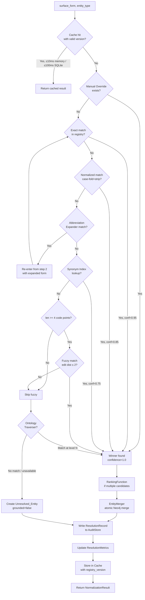

# Design Document: Deterministic Entity Resolution Pipeline

## Overview

This design specifies the Deterministic Entity Resolution Pipeline (Spec 2) for the Scientific Knowledge Graph microbiome research system. It replaces the basic entity normalization from Spec 1 (exact match → fuzzy fallback → ungrounded node) with a robust, reproducible, seven-strategy resolution system that ensures every surface form of the same biological entity resolves to a single canonical graph node.

The core problem: the same entity appears under many surface forms across papers ("E. coli", "Escherichia coli", "E.coli", "ATCC 25922"). The current system creates duplicate, unlinked nodes for each variant. This pipeline eliminates that duplication through a deterministic, auditable, multi-strategy approach.

**Key design principles:**
- **Determinism**: identical inputs always produce identical outputs, regardless of invocation order or timing
- **Auditability**: every resolution decision is logged with full strategy trace and confidence scores
- **Drop-in compatibility**: exposes the same `normalize(surface_form, entity_type) -> NormalizationResult` interface as Spec 1
- **Shadow mode**: can run alongside Spec 1 to validate correctness before full cutover
- **Efficiency**: two-tier caching (in-memory LRU + SQLite) with version-based invalidation

The pipeline integrates into Layer 3 of the existing three-layer architecture (Collection → NLP Enrichment → Knowledge Graph) and is invoked by the Graph Builder before creating or linking entity nodes in Neo4j.

## Architecture

### System Context

The Resolution Pipeline sits between the NLP Enrichment layer (which produces surface forms via NER) and the Neo4j Knowledge Graph (which requires canonical entity IDs for node creation). It is invoked synchronously per entity mention during Layer 3 graph construction, with caching ensuring that repeated mentions of the same entity within a batch are resolved in microseconds after the first hit.

```mermaid
graph TB
    subgraph "Layer 2: NLP Enrichment"
        NER[Named Entity Recognition]
    end

    subgraph "Layer 3: Knowledge Graph Construction"
        GB[Graph Builder]
        subgraph "Resolution Pipeline (Spec 2)"
            RP[ResolutionPipeline]
            RC[ResolutionCache]
            subgraph "Strategy Sequence"
                S1[1. ManualOverrideManager]
                S2[2. Exact Match]
                S3[3. Normalized Match]
                S4[4. AbbreviationExpander]
                S5[5. SynonymIndex]
                S6[6. FuzzyMatcher]
                S7[7. OntologyTraverser]
            end
            RF[RankingFunction]
            EM[EntityMerger]
            RA[ResolutionAuditStore]
            RM[ResolutionMetrics]
        end
        subgraph "Persistent Stores"
            CR[CanonicalRegistry - SQLite]
            SI[SynonymIndex - in-memory + SQLite]
            AS[AuditStore - SQLite]
            CS[CacheStore - SQLite]
        end
        NEO[Neo4j Knowledge Graph]
    end

    NER -->|surface_form, entity_type| GB
    GB -->|normalize()| RP
    RP --> RC
    RC -->|cache miss| S1
    S1 --> S2 --> S3 --> S4 --> S5 --> S6 --> S7
    S4 -->|re-entry with expanded form| S2
    S7 --> RF
    RF --> EM
    EM --> NEO
    RP --> RA
    RP --> RM
    CR --- S2
    CR --- S3
    SI --- S5
    AS --- RA
    CS --- RC
```

### Resolution Flow



### Strategy Priority Weights

| Strategy | Priority Weight | Grounding Confidence Source |
|---|---|---|
| Manual Override | 1.00 | Always 1.0 |
| Exact Match | 0.95 | Always 1.0 (exact) |
| Normalized Match | 0.85 | Always 1.0 (after normalization) |
| Abbreviation Expansion | 0.80 | 1.0/N for N candidate expansions |
| Synonym Index | 0.75 | Always 1.0 (registered synonym) |
| Fuzzy Match | 0.60 | 1.0 - (d / max(len_s, len_c)) × 0.5 |
| Ontology Traverser | 0.50 | 0.50 - (N-1) × 0.10 for level N |

**Composite score** = `priority_weight × grounding_confidence`

**Tie-breaking**: higher-priority strategy wins; if equal priority, lexicographically smallest `canonical_id`.

The pipeline accepts the first strategy that produces a candidate with `grounding_confidence >= 0.5` and does not continue to lower-priority strategies. If multiple candidates are produced by a single strategy (e.g., multiple fuzzy matches), the `RankingFunction` selects the winner from that strategy's candidates before comparing across strategies.

## Components and Interfaces

### Component 1: ResolutionPipeline

**Purpose**: Orchestrates the seven-strategy sequence, manages abbreviation re-entry, records the audit trail, and exposes the drop-in `normalize()` interface for Spec 1 compatibility.

```python
from typing import List, Optional
from pydantic import BaseModel, Field
from datetime import datetime, timezone

class NormalizationResult(BaseModel):
    """Drop-in replacement for Spec 1 NormalizationResult"""
    canonical_id: Optional[str]  # None if unresolved
    grounded: bool

class ResolutionResult(BaseModel):
    """Full resolution output including audit fields"""
    surface_form: str
    entity_type: str  # taxon | disease | method
    canonical_id: Optional[str]
    grounded: bool
    winning_strategy: str  # manual_override | exact | normalized | abbreviation | synonym | fuzzy | ontology | none
    grounding_confidence: float = Field(ge=0.0, le=1.0)
    conflict_set: List["CandidateScore"]
    paper_id: str
    timestamp: datetime
    high_conflict: bool = False      # True when 3+ strategies produced candidates
    hierarchy_match: bool = False    # True when ontology traversal was the winner
    hierarchy_level: Optional[int] = None  # 1, 2, or 3 when hierarchy_match=True

class CandidateScore(BaseModel):
    canonical_id: str
    strategy: str
    grounding_confidence: float = Field(ge=0.0, le=1.0)
    composite_score: float = Field(ge=0.0, le=1.0)

class ResolutionPipeline:
    """
    Orchestrates the 7-strategy resolution sequence.

    Preconditions for normalize():
    - surface_form is a non-empty string (after whitespace trimming)
    - entity_type is one of: "taxon", "disease", "method"
    - paper_id is a non-empty string identifying the source paper

    Postconditions for normalize():
    - Returns NormalizationResult with canonical_id and grounded fields
    - A ResolutionRecord is written to the AuditStore (write failures are logged but do not block)
    - ResolutionMetrics are updated for the current run
    - Result is stored in ResolutionCache with current registry_version
    """

    def normalize(self, surface_form: str, entity_type: str) -> NormalizationResult:
        """Drop-in replacement for Spec 1 Entity_Normalizer.normalize()"""
        ...

    def resolve(self, surface_form: str, entity_type: str, paper_id: str) -> ResolutionResult:
        """
        Full resolution with audit trail.

        Preconditions:
        - surface_form trimmed and NFC-normalized before comparison
        - entity_type in {"taxon", "disease", "method"}

        Postconditions:
        - Returns ResolutionResult with all fields populated
        - winning_strategy is "none" if all strategies fail
        - canonical_id is None and grounded=False if unresolved
        - Abbreviation re-entry occurs at most once per call
        """
        ...

    def batch_resolve(
        self, forms: List[tuple[str, str, str]]  # (surface_form, entity_type, paper_id)
    ) -> List[ResolutionResult]:
        """
        Resolve a batch of 1–100,000 surface forms.

        Postconditions:
        - Returns results in the same order as input
        - Each result is identical to calling resolve() individually
        - Cache is consulted and populated for each form
        """
        ...
```

### Component 2: CanonicalRegistry

**Purpose**: SQLite-backed persistent store for canonical entity records. Validates ID formats, maintains the Synonym_Index transactionally, and detects duplicate surface form conflicts.

```python
from typing import Optional, List
from pydantic import BaseModel
from enum import Enum

class EntityType(str, Enum):
    TAXON = "taxon"
    DISEASE = "disease"
    METHOD = "method"

class SynonymProvenance(str, Enum):
    ONTOLOGY = "ontology"      # Sourced from NCBI Taxonomy / MeSH
    PAPER_TEXT = "paper_text"  # Extracted from paper text
    CURATOR = "curator"        # Added manually by a curator

class SynonymRecord(BaseModel):
    surface_form: str          # NFC-normalized, max 500 chars
    provenance: SynonymProvenance
    added_by: Optional[str]    # curator_id if provenance=CURATOR
    added_at: datetime

class CanonicalEntityRecord(BaseModel):
    canonical_id: str          # NCBI Taxonomy int (as str), MeSH "D######", or "METHOD-xxx"
    primary_name: str
    entity_type: EntityType
    ontology_source: str       # "ncbi_taxonomy" | "mesh" | "internal"
    synonyms: List[SynonymRecord]
    created_at: datetime
    updated_at: datetime

class RegistrationError(BaseModel):
    field: str
    message: str

class CanonicalRegistry:
    """
    SQLite-backed persistent store for canonical entity records.

    ID validation rules:
    - taxon: canonical_id must be a positive integer (e.g., "562" for E. coli)
    - disease: canonical_id must match r'^[A-Z]\\d+$' (e.g., "D006262")
    - method: canonical_id must match r'^METHOD-[A-Za-z0-9]+$' (e.g., "METHOD-16S")

    Preconditions for register():
    - canonical_id is non-empty and passes entity_type validation
    - primary_name is non-empty
    - No existing record with the same canonical_id

    Postconditions for register():
    - On success: record is persisted and Synonym_Index is updated atomically
    - On validation failure: no partial record is created; RegistrationError is returned
    - On Synonym_Index update failure: surface form addition is rolled back
    """

    def register(
        self, record: CanonicalEntityRecord
    ) -> tuple[bool, Optional[RegistrationError]]:
        """Register a new canonical entity. Returns (success, error_or_None)."""
        ...

    def lookup_by_surface_form(
        self, surface_form: str
    ) -> Optional[CanonicalEntityRecord]:
        """
        Case-insensitive lookup. Returns None (not exception) if not found.

        Preconditions:
        - surface_form is non-empty

        Postconditions:
        - Comparison is case-insensitive and NFC-normalized
        - Returns None if no match found
        """
        ...

    def add_synonym(
        self,
        canonical_id: str,
        surface_form: str,
        provenance: SynonymProvenance,
        added_by: Optional[str] = None
    ) -> tuple[bool, Optional[str]]:
        """
        Add a synonym to an existing canonical entity.

        Preconditions:
        - canonical_id exists in the registry
        - surface_form length <= 500 characters
        - surface_form is not already registered for a DIFFERENT canonical_id

        Postconditions:
        - On success: synonym added and Synonym_Index updated in same transaction
        - On duplicate conflict: rejected, conflict record logged, returns (False, error_msg)
        - On Synonym_Index failure: entire operation rolled back
        """
        ...

    def get_registry_version(self) -> int:
        """Returns the current monotonically increasing version number."""
        ...
```

### Component 3: SynonymIndex

**Purpose**: In-memory inverted index (`dict[str, str]`) mapping NFC-normalized, lowercased surface forms to canonical entity IDs. Protected by a read-write lock for atomic updates with ≤100ms blocking. Backed by SQLite for persistence across restarts.

```python
import threading
from typing import Optional, List

class SynonymIndexEntry(BaseModel):
    surface_form_normalized: str  # NFC + lowercase
    canonical_id: str
    entity_type: EntityType

class SynonymIndex:
    """
    In-memory inverted index with RW lock for atomic updates.

    Internal structure:
    - _index: dict[str, str]  # normalized_surface_form -> canonical_id
    - _lock: threading.RLock  # reentrant RW lock

    Invariants:
    - All keys are NFC-normalized and lowercased
    - Each surface form maps to exactly one canonical_id
    - Index is consistent with CanonicalRegistry (updated in same transaction)

    Preconditions for lookup():
    - surface_form is non-empty

    Postconditions for lookup():
    - Input is NFC-normalized and lowercased before lookup
    - Returns None if not found (no exception)
    - Read lock held for duration of lookup
    """

    def lookup(self, surface_form: str) -> Optional[str]:
        """Returns canonical_id or None. O(1) average case."""
        ...

    def add(self, surface_form: str, canonical_id: str) -> None:
        """
        Atomically add a surface form mapping.

        Preconditions:
        - surface_form not already mapped to a different canonical_id

        Postconditions:
        - Write lock acquired; concurrent lookups blocked for ≤100ms
        - Index updated atomically (all-or-nothing)
        - SQLite backing store updated in same operation
        """
        ...

    def prefix_lookup(self, prefix: str) -> List[SynonymIndexEntry]:
        """
        Return all entries whose surface form starts with the given prefix.

        Postconditions:
        - Results are capped at 50 entries
        - All returned entries have surface_form starting with normalized prefix
        - Results are sorted lexicographically by surface_form
        """
        ...

    def rebuild_from_registry(self, registry: CanonicalRegistry) -> None:
        """Rebuild the in-memory index from the SQLite registry. Used on startup."""
        ...
```

### Component 4: AbbreviationExpander

**Purpose**: Maintains a curated abbreviation table plus genus-initial pattern matching. Supports hot-reload of new mappings without pipeline restart. Returns confidence = 1.0/N for N candidate expansions.

```python
from typing import List
from pydantic import BaseModel

class ExpansionCandidate(BaseModel):
    expanded_form: str
    confidence: float = Field(ge=0.0, le=1.0)  # 1.0/N for N candidates

class AbbreviationExpander:
    """
    Curated abbreviation table + genus-initial pattern matching.

    Genus-initial pattern: single uppercase letter + '.' + species epithet
    Example: "E. coli" -> ["Escherichia coli", "Enterococcus coli", ...]

    Confidence rules:
    - Unambiguous (1 candidate): confidence = 1.0
    - Ambiguous (N candidates): confidence = 1.0 / N for each candidate

    Preconditions for expand():
    - surface_form is non-empty

    Postconditions for expand():
    - Returns empty list if no match found (no exception)
    - All candidates have equal confidence when ambiguous
    - Genus-initial pattern only matches if genus initial is in the table
    """

    def expand(self, surface_form: str) -> List[ExpansionCandidate]:
        """
        Expand an abbreviated surface form to candidate full forms.

        Returns candidates sorted lexicographically by expanded_form
        (ensures deterministic ordering for pipeline re-entry).
        """
        ...

    def add_mapping(
        self,
        abbreviated_form: str,
        full_form: str,
        added_by: str
    ) -> None:
        """
        Add a new abbreviation mapping. Takes effect immediately (hot-reload).

        Preconditions:
        - abbreviated_form and full_form are non-empty
        - No pipeline restart required

        Postconditions:
        - New mapping is available for all subsequent expand() calls
        - Mapping is persisted to SQLite for durability
        """
        ...
```

### Component 5: FuzzyMatcher

**Purpose**: Levenshtein edit distance matching against all canonical names and registered surface forms. Skips surface forms shorter than 4 Unicode code points. Confidence formula: `1.0 - (d / max(len_s, len_c)) * 0.5`.

```python
from typing import List
from pydantic import BaseModel

class FuzzyCandidate(BaseModel):
    canonical_id: str
    matched_surface_form: str
    edit_distance: int
    grounding_confidence: float = Field(ge=0.0, le=1.0)

class FuzzyMatcher:
    """
    Levenshtein edit distance matching with edit distance ≤ 2 threshold.

    Normalization applied before matching:
    - Unicode NFC normalization
    - Case-folding (lowercase)
    - Punctuation stripping
    - Whitespace collapsing

    Confidence formula:
    confidence = 1.0 - (edit_distance / max(len(normalized_surface), len(normalized_candidate))) * 0.5
    - edit_distance=0 -> confidence=1.0
    - Lengths measured in Unicode code points after normalization

    Preconditions for match():
    - surface_form is non-empty
    - registry is a CanonicalRegistry instance

    Postconditions for match():
    - Returns empty list if len(normalized_surface) < 4 code points
    - Returns empty list if no candidates within edit distance ≤ 2
    - Results sorted by edit_distance ascending, then canonical_id lexicographic
    - All returned candidates have edit_distance in {0, 1, 2}
    """

    def match(
        self,
        surface_form: str,
        entity_type: str,
        registry: "CanonicalRegistry"
    ) -> List[FuzzyCandidate]:
        """
        Find candidates within Levenshtein edit distance ≤ 2.

        Returns empty list (not exception) when:
        - surface_form < 4 code points after normalization
        - No candidates within threshold
        """
        ...

    @staticmethod
    def compute_confidence(
        edit_distance: int,
        len_surface: int,
        len_candidate: int
    ) -> float:
        """
        Compute grounding confidence for a fuzzy match.

        confidence = 1.0 - (edit_distance / max(len_surface, len_candidate)) * 0.5
        """
        ...
```

### Component 6: OntologyTraverser

**Purpose**: Traverses NCBI Taxonomy (for taxa) or MeSH (for diseases) hierarchy up to 3 levels to find the nearest ancestor present in the CanonicalRegistry. Handles service unavailability gracefully.

```python
from typing import Optional, List
from pydantic import BaseModel

class OntologyCandidate(BaseModel):
    canonical_id: str
    hierarchy_level: int  # 1=parent, 2=grandparent, 3=great-grandparent
    grounding_confidence: float  # 0.50 - (level-1)*0.10

class OntologyTraverser:
    """
    NCBI Taxonomy / MeSH hierarchy traversal.

    Confidence by level:
    - Level 1 (parent):           0.50
    - Level 2 (grandparent):      0.40
    - Level 3 (great-grandparent): 0.30

    Preconditions for traverse():
    - surface_form is non-empty
    - entity_type is "taxon" or "disease"
    - registry is a CanonicalRegistry instance

    Postconditions for traverse():
    - Returns empty list if ontology service is unavailable (logs warning)
    - Returns empty list if no ancestor found within 3 levels
    - Returns at most one candidate (nearest ancestor in registry)
    - hierarchy_level is set to the level at which the match was found
    """

    def traverse(
        self,
        surface_form: str,
        entity_type: str,
        registry: "CanonicalRegistry"
    ) -> List[OntologyCandidate]:
        """
        Find nearest ancestor in the ontology hierarchy.

        Graceful degradation: if the ontology service is unavailable,
        logs a warning and returns [] without raising an exception.
        """
        ...

    @staticmethod
    def compute_confidence(hierarchy_level: int) -> float:
        """
        confidence = 0.50 - (hierarchy_level - 1) * 0.10
        Valid for hierarchy_level in {1, 2, 3}.
        """
        return 0.50 - (hierarchy_level - 1) * 0.10
```

### Component 7: RankingFunction

**Purpose**: Deterministic composite scoring to select the winning canonical entity from a conflict set. Tie-breaking by strategy priority then lexicographic canonical_id.

```python
from typing import List, Optional
from pydantic import BaseModel

class RankingFunction:
    """
    Deterministic composite scoring: priority_weight × grounding_confidence.

    Tie-breaking rules (applied in order):
    1. Higher composite score wins
    2. If equal composite score: higher-priority strategy wins
    3. If equal strategy priority: lexicographically smallest canonical_id wins

    These rules guarantee a unique winner for any non-empty conflict set.

    Preconditions for rank():
    - candidates is non-empty
    - Each candidate has a valid strategy name and grounding_confidence in [0.0, 1.0]

    Postconditions for rank():
    - Returns exactly one winner
    - Winner has the highest composite score
    - Tie-breaking is deterministic and consistent across calls
    - If only one candidate: returned directly without scoring
    """

    PRIORITY_WEIGHTS = {
        "manual_override": 1.00,
        "exact":           0.95,
        "normalized":      0.85,
        "abbreviation":    0.80,
        "synonym":         0.75,
        "fuzzy":           0.60,
        "ontology":        0.50,
    }

    def rank(self, candidates: List[CandidateScore]) -> CandidateScore:
        """
        Select the winning candidate from a conflict set.

        Postconditions:
        - composite_score = PRIORITY_WEIGHTS[strategy] × grounding_confidence
        - Winner is unique (tie-breaking guarantees this)
        """
        ...

    def score_all(self, candidates: List[CandidateScore]) -> List[CandidateScore]:
        """
        Compute composite scores for all candidates.
        Returns candidates sorted by composite_score descending,
        then strategy priority descending, then canonical_id ascending.
        """
        ...
```

### Component 8: EntityMerger

**Purpose**: Atomic Neo4j merge operations ensuring all surface forms resolving to the same canonical_id link to a single graph node. Handles relationship deduplication (keep higher confidence), type-safety checks, and rollback on failure.

```python
from typing import List, Optional
from pydantic import BaseModel
from datetime import datetime

class MergeLogEntry(BaseModel):
    source_node_ids: List[str]
    target_canonical_id: str
    triggering_resolution: str  # surface_form that triggered the merge
    timestamp: datetime
    relationships_transferred: int
    relationships_deduplicated: int

class MergeRollbackEntry(BaseModel):
    source_node_ids: List[str]
    target_canonical_id: str
    failed_step: str  # "relationship_transfer" | "node_deletion" | "audit_log_write"
    error_message: str
    timestamp: datetime

class EntityMerger:
    """
    Atomic Neo4j merge operations with rollback.

    Merge algorithm:
    1. Verify source and target nodes have the same entity_type (reject if different)
    2. Transfer all inbound and outbound relationships from source to target
    3. Deduplicate: if a transferred relationship duplicates an existing one
       (same type, same counterpart, same direction), keep the higher-confidence one
    4. Delete the source node
    5. Write MergeLogEntry to audit log

    If any step fails: roll back all changes, write MergeRollbackEntry, return error.

    Preconditions for merge():
    - source_node_id and target_canonical_id exist in Neo4j
    - Both nodes have the same entity_type

    Postconditions for merge():
    - On success: source node deleted, all relationships on target node
    - On failure: graph is in pre-merge state (rollback applied)
    - MergeLogEntry or MergeRollbackEntry written in all cases
    """

    def merge(
        self,
        source_node_id: str,
        target_canonical_id: str,
        triggering_surface_form: str
    ) -> tuple[bool, Optional[str]]:
        """
        Merge source node into target canonical node.
        Returns (success, error_message_or_None).
        """
        ...

    def ensure_canonical_node(
        self,
        canonical_id: str,
        entity_type: str,
        primary_name: str
    ) -> str:
        """
        Get or create the canonical node in Neo4j.
        Returns the Neo4j node ID.
        Uses MERGE to ensure idempotency.
        """
        ...
```

### Component 9: ResolutionCache

**Purpose**: Two-tier cache (in-memory LRU + SQLite persistent) with version-based invalidation. SLAs: ≤10ms for memory hits, ≤100ms for SQLite hits.

```python
from typing import Optional
from pydantic import BaseModel
from datetime import datetime

class CacheEntry(BaseModel):
    surface_form: str
    resolution_result: ResolutionResult
    cache_timestamp: datetime
    registry_version: int  # Version of CanonicalRegistry at time of caching

class ResolutionCache:
    """
    Two-tier cache: in-memory LRU (default 10,000 entries) + SQLite persistent.

    Cache validity: an entry is valid iff entry.registry_version == current_registry_version.
    Invalid entries are treated as cache misses.

    On registry version advance:
    - All entries with old version are removed from both tiers before next request.

    SLAs:
    - In-memory hit: ≤10ms
    - SQLite hit: ≤100ms

    Preconditions for get():
    - surface_form is non-empty and NFC-normalized

    Postconditions for get():
    - Returns None if no valid entry exists (cache miss)
    - Returns cached ResolutionResult if valid entry exists
    - Does not trigger background recomputation
    """

    def __init__(self, capacity: int = 10_000, db_path: str = "resolution_cache.db"):
        ...

    def get(
        self, surface_form: str, current_registry_version: int
    ) -> Optional[ResolutionResult]:
        """Check both tiers. Returns None on miss or version mismatch."""
        ...

    def put(
        self,
        surface_form: str,
        result: ResolutionResult,
        registry_version: int
    ) -> None:
        """Store in both in-memory LRU and SQLite tiers."""
        ...

    def invalidate_version(self, old_version: int) -> int:
        """
        Remove all entries with the given registry version from both tiers.
        Returns count of invalidated entries.
        Called before processing the next request after a registry update.
        """
        ...
```

### Component 10: ResolutionAuditStore

**Purpose**: Physically separate SQLite table for resolution audit records. Write-failure tolerant (logs error, does not block pipeline). Queryable by surface_form, canonical_id, strategy, date range, paper_id.

```python
from typing import List, Optional
from pydantic import BaseModel
from datetime import datetime

class ResolutionRecord(BaseModel):
    """Audit log entry for a single resolution attempt"""
    record_id: str  # UUID
    surface_form: str
    entity_type: str
    timestamp: datetime  # UTC ISO-8601
    winning_strategy: str  # strategy name or "none" if unresolved
    canonical_id: Optional[str]  # None if unresolved
    grounding_confidence: float = Field(ge=0.0, le=1.0)
    conflict_set: List[CandidateScore]
    paper_id: str
    high_conflict: bool
    hierarchy_match: bool
    hierarchy_level: Optional[int]
    curator_override: Optional[str]  # curator_id if winning_strategy="manual_override"

class AuditQuery(BaseModel):
    surface_form: Optional[str] = None
    canonical_id: Optional[str] = None
    winning_strategy: Optional[str] = None
    date_from: Optional[datetime] = None
    date_to: Optional[datetime] = None
    paper_id: Optional[str] = None

class ResolutionAuditStore:
    """
    Physically separate SQLite table for audit records.

    Physical separation: stored in a distinct SQLite database file
    (not co-located with CanonicalRegistry or ResolutionCache).

    Write-failure tolerance: if write fails, logs to system error log
    and returns without blocking the pipeline.

    Preconditions for write():
    - record has all required fields populated
    - record.winning_strategy is non-empty (or "none")

    Postconditions for write():
    - On success: record persisted to SQLite
    - On failure: error logged to system log; pipeline continues
    """

    def write(self, record: ResolutionRecord) -> bool:
        """
        Persist a resolution record.
        Returns True on success, False on failure (failure is logged, not raised).
        """
        ...

    def query(
        self, query: AuditQuery, limit: int = 1000
    ) -> List[ResolutionRecord]:
        """
        Query resolution records.

        Postconditions:
        - Results returned in descending timestamp order
        - Returns empty list (not exception) if no records match
        - All filter fields are ANDed together
        """
        ...
```

### Component 11: ResolutionMetrics

**Purpose**: Per-run and per-entity-type tracking of resolution rates, confidence averages, and unresolved counts. Emits warnings when resolution rate < 70%. Detects 5-point degradation across historical snapshots.

```python
from typing import List, Optional, Dict
from pydantic import BaseModel
from datetime import datetime

class EntityTypeMetrics(BaseModel):
    entity_type: str
    total: int
    resolved: int
    unresolved: int
    resolution_rate: float  # resolved/total; 0.0 when total=0
    avg_grounding_confidence: float  # average over resolved entities
    unresolved_pending_review: int

class RunMetricsSnapshot(BaseModel):
    run_id: str
    timestamp: datetime
    paper_ids_processed: List[str]
    total_surface_forms: int
    resolved_count: int
    unresolved_count: int
    overall_resolution_rate: float
    per_strategy_counts: Dict[str, int]  # strategy_name -> count
    per_entity_type: Dict[str, EntityTypeMetrics]

class ResolutionMetrics:
    """
    Per-run and per-entity-type metrics tracking.

    Warning threshold: resolution_rate < 0.70 for any entity type.
    Degradation threshold: resolution_rate drops > 5 percentage points
    below the average of all prior snapshots in the queried range.

    Preconditions for record_resolution():
    - result is a valid ResolutionResult

    Postconditions for finalize_run():
    - Snapshot persisted to SQLite (failure logged, not raised)
    - Warning emitted to system log if any entity type rate < 0.70
    """

    def record_resolution(self, result: ResolutionResult) -> None:
        """Accumulate metrics for a single resolution result."""
        ...

    def finalize_run(self, run_id: str, paper_ids: List[str]) -> RunMetricsSnapshot:
        """
        Finalize metrics for the current run.

        Postconditions:
        - Snapshot persisted (failure logged, not raised)
        - Warning logged if any entity type resolution_rate < 0.70
        - Returns the snapshot regardless of persistence success
        """
        ...

    def query_snapshots(
        self,
        date_from: datetime,
        date_to: datetime
    ) -> List[RunMetricsSnapshot]:
        """
        Query historical snapshots in ascending timestamp order.
        Includes degradation analysis: flags entity types where
        most recent rate is > 5 points below historical average.
        """
        ...
```

### Component 12: ManualOverrideManager

**Purpose**: Curator-defined mappings that pin surface forms to canonical IDs. CSV bulk import with per-row error handling. Cache invalidation on removal. Justification notes capped at 500 characters.

```python
from typing import List, Optional
from pydantic import BaseModel, Field
from datetime import datetime

class ManualOverride(BaseModel):
    surface_form: str
    canonical_id: str
    entity_type: str
    curator_id: str
    justification: Optional[str] = Field(None, max_length=500)
    created_at: datetime

class BulkImportResult(BaseModel):
    total_rows: int
    imported_count: int
    skipped_count: int
    skipped_rows: List[dict]  # {"row_number": int, "reason": str}

class ManualOverrideManager:
    """
    Curator-defined surface form -> canonical_id mappings.

    Override priority: always checked first (before any automated strategy).
    Grounding confidence for overrides: always 1.0.

    Preconditions for set_override():
    - surface_form is non-empty
    - canonical_id passes entity_type validation
    - justification length <= 500 characters

    Postconditions for set_override():
    - Override persisted to SQLite
    - ResolutionCache invalidated for this surface_form

    Preconditions for remove_override():
    - surface_form has an existing override

    Postconditions for remove_override():
    - Override removed from SQLite
    - ResolutionCache invalidated for this surface_form
    - Next resolution uses automated strategies
    """

    def get_override(self, surface_form: str) -> Optional[ManualOverride]:
        """Returns the override for this surface form, or None if not set."""
        ...

    def set_override(
        self,
        surface_form: str,
        canonical_id: str,
        entity_type: str,
        curator_id: str,
        justification: Optional[str] = None
    ) -> bool:
        """Set a manual override. Returns True on success."""
        ...

    def remove_override(self, surface_form: str, curator_id: str) -> bool:
        """Remove a manual override and invalidate cache. Returns True on success."""
        ...

    def bulk_import_csv(self, csv_path: str) -> BulkImportResult:
        """
        Import overrides from CSV with columns:
        surface_form, canonical_id, entity_type, curator_id, justification

        Per-row error handling:
        - Malformed rows (missing columns, invalid canonical_id, duplicate override
          for different canonical_id) are skipped and logged
        - Processing continues for remaining rows
        - Returns counts of imported and skipped rows
        """
        ...
```

## Data Models

### Core Pydantic Models

```python
from typing import Optional, List, Dict, Any
from pydantic import BaseModel, Field, validator
from datetime import datetime
from enum import Enum
import unicodedata
import re

# --- Entity Types and ID Validation ---

class EntityType(str, Enum):
    TAXON = "taxon"
    DISEASE = "disease"
    METHOD = "method"

def validate_canonical_id(canonical_id: str, entity_type: EntityType) -> bool:
    """
    Validate canonical_id format by entity type.
    - taxon:   positive integer string (e.g., "562")
    - disease: r'^[A-Z]\\d+$' (e.g., "D006262")
    - method:  r'^METHOD-[A-Za-z0-9]+$' (e.g., "METHOD-16S")
    """
    if entity_type == EntityType.TAXON:
        try:
            return int(canonical_id) > 0
        except ValueError:
            return False
    elif entity_type == EntityType.DISEASE:
        return bool(re.match(r'^[A-Z]\d+$', canonical_id))
    elif entity_type == EntityType.METHOD:
        return bool(re.match(r'^METHOD-[A-Za-z0-9]+$', canonical_id))
    return False

def normalize_surface_form(surface_form: str) -> str:
    """
    NFC normalization + lowercase + strip punctuation + collapse whitespace.
    Used consistently across all components for deterministic comparison.
    """
    nfc = unicodedata.normalize('NFC', surface_form.strip())
    lowered = nfc.lower()
    stripped = re.sub(r'[^\w\s]', '', lowered)
    collapsed = re.sub(r'\s+', ' ', stripped).strip()
    return collapsed

# --- Unresolved Entity ---

class UnresolvedEntity(BaseModel):
    """Created when all resolution strategies fail"""
    unresolved_id: str  # Temporary local ID: "UNRESOLVED-{uuid}"
    surface_form: str
    entity_type: EntityType
    paper_id: str
    timestamp: datetime
    strategies_tried: List[str]  # All strategies that were attempted
    added_to_review_queue: bool = True

# --- Shadow Mode Discrepancy Log ---

class ShadowModeDiscrepancy(BaseModel):
    """Logged when Spec 1 and Spec 2 produce different results"""
    surface_form: str
    entity_type: str
    spec1_canonical_id: Optional[str]
    spec1_grounded: bool
    spec2_canonical_id: Optional[str]
    spec2_grounded: bool
    timestamp: datetime

# --- Synonym Conflict Record ---

class SynonymConflictRecord(BaseModel):
    """Logged when a surface form is registered for two different canonical entities"""
    duplicate_surface_form: str
    entity_a_canonical_id: str
    entity_b_canonical_id: str
    conflict_timestamp: datetime
    provenance_source: Optional[str]  # Source of the conflicting submission
```

### SQLite Schema

The pipeline uses three physically separate SQLite databases to maintain isolation between the registry, cache, and audit store:

```sql
-- Database 1: canonical_registry.db
-- CanonicalRegistry + SynonymIndex + ManualOverrides + AbbreviationTable

CREATE TABLE canonical_entities (
    canonical_id    TEXT PRIMARY KEY,
    primary_name    TEXT NOT NULL,
    entity_type     TEXT NOT NULL CHECK(entity_type IN ('taxon','disease','method')),
    ontology_source TEXT NOT NULL,
    created_at      TEXT NOT NULL,  -- ISO-8601 UTC
    updated_at      TEXT NOT NULL
);

CREATE TABLE synonyms (
    id              INTEGER PRIMARY KEY AUTOINCREMENT,
    canonical_id    TEXT NOT NULL REFERENCES canonical_entities(canonical_id),
    surface_form    TEXT NOT NULL,  -- NFC-normalized, max 500 chars
    surface_form_normalized TEXT NOT NULL,  -- lowercase + stripped
    provenance      TEXT NOT NULL CHECK(provenance IN ('ontology','paper_text','curator')),
    added_by        TEXT,
    added_at        TEXT NOT NULL,
    UNIQUE(surface_form_normalized)  -- enforces no duplicate surface forms
);

CREATE INDEX idx_synonyms_normalized ON synonyms(surface_form_normalized);
CREATE INDEX idx_synonyms_canonical_id ON synonyms(canonical_id);

CREATE TABLE manual_overrides (
    surface_form    TEXT PRIMARY KEY,
    canonical_id    TEXT NOT NULL,
    entity_type     TEXT NOT NULL,
    curator_id      TEXT NOT NULL,
    justification   TEXT CHECK(length(justification) <= 500),
    created_at      TEXT NOT NULL
);

CREATE TABLE abbreviation_table (
    abbreviated_form TEXT NOT NULL,
    full_form        TEXT NOT NULL,
    added_by         TEXT NOT NULL,
    added_at         TEXT NOT NULL,
    PRIMARY KEY (abbreviated_form, full_form)
);

CREATE TABLE synonym_conflicts (
    id              INTEGER PRIMARY KEY AUTOINCREMENT,
    duplicate_form  TEXT NOT NULL,
    entity_a_id     TEXT NOT NULL,
    entity_b_id     TEXT NOT NULL,
    conflict_at     TEXT NOT NULL,
    provenance_src  TEXT
);

CREATE TABLE registry_version (
    id      INTEGER PRIMARY KEY CHECK(id = 1),
    version INTEGER NOT NULL DEFAULT 1
);

-- Database 2: resolution_cache.db
CREATE TABLE cache_entries (
    surface_form_normalized TEXT PRIMARY KEY,
    resolution_result_json  TEXT NOT NULL,
    cache_timestamp         TEXT NOT NULL,
    registry_version        INTEGER NOT NULL
);

CREATE INDEX idx_cache_version ON cache_entries(registry_version);

-- Database 3: resolution_audit.db
CREATE TABLE resolution_records (
    record_id           TEXT PRIMARY KEY,
    surface_form        TEXT NOT NULL,
    entity_type         TEXT NOT NULL,
    timestamp           TEXT NOT NULL,
    winning_strategy    TEXT NOT NULL,
    canonical_id        TEXT,
    grounding_confidence REAL NOT NULL,
    conflict_set_json   TEXT NOT NULL,
    paper_id            TEXT NOT NULL,
    high_conflict       INTEGER NOT NULL DEFAULT 0,
    hierarchy_match     INTEGER NOT NULL DEFAULT 0,
    hierarchy_level     INTEGER,
    curator_override    TEXT
);

CREATE INDEX idx_audit_surface_form ON resolution_records(surface_form);
CREATE INDEX idx_audit_canonical_id ON resolution_records(canonical_id);
CREATE INDEX idx_audit_strategy ON resolution_records(winning_strategy);
CREATE INDEX idx_audit_timestamp ON resolution_records(timestamp DESC);
CREATE INDEX idx_audit_paper_id ON resolution_records(paper_id);

CREATE TABLE metrics_snapshots (
    run_id          TEXT PRIMARY KEY,
    timestamp       TEXT NOT NULL,
    paper_ids_json  TEXT NOT NULL,
    snapshot_json   TEXT NOT NULL
);
```

## Correctness Properties

*A property is a characteristic or behavior that should hold true across all valid executions of a system — essentially, a formal statement about what the system should do. Properties serve as the bridge between human-readable specifications and machine-verifiable correctness guarantees.*

This feature is well-suited for property-based testing. The resolution pipeline is a pure function from surface forms to canonical IDs, with clear universal properties: idempotency, synonym completeness, no-spurious-merge, audit completeness, and batch consistency. Input variation (different surface forms, synonym lists, entity types) meaningfully exercises edge cases, and 100+ iterations will find bugs that 2–3 examples would miss.

**Property reflection**: After analyzing all 15 requirements, the following consolidations were made:
- Requirements 2.1, 2.4, 15.1 all test determinism/idempotency → consolidated into Property 1
- Requirements 5.1, 15.2 both test synonym completeness → consolidated into Property 2
- Requirements 3.7, 5.4 both test duplicate surface form rejection → consolidated into Property 4
- Requirements 7.1, 7.2, 15.4 all test audit completeness → consolidated into Property 5
- Requirements 8.1, 15.6 both test batch consistency → consolidated into Property 6
- Requirements 12.3, 13.3 test confidence formulas → kept as separate properties (different formulas)
- Requirements 3.2, 3.3, 3.4 test ID validation → consolidated into Property 9

---

### Property 1: Determinism and Idempotency

*For any* surface form S (after NFC normalization and whitespace trimming), calling `resolve(S)` twice in sequence SHALL return identical `ResolutionResult` objects — same `canonical_id`, same `winning_strategy`, same `grounding_confidence`, and same `conflict_set` — regardless of whether the second call hits the cache or re-executes the full strategy sequence. Furthermore, for any canonical entity C with `canonical_id` = `c`, `resolve(c)` SHALL return `canonical_id = c` and `grounded = True`.

**Validates: Requirements 2.1, 2.4, 15.1**

---

### Property 2: Synonym Completeness

*For any* canonical entity E registered in the `CanonicalRegistry` with synonyms S₁…Sₙ, `resolve(Sᵢ).canonical_id` SHALL equal `E.canonical_id` for all i in 1..n, regardless of the case or Unicode normalization form of Sᵢ.

**Validates: Requirements 5.1, 15.2**

---

### Property 3: No-Spurious-Merge

*For any* two canonical entities E₁ and E₂ with different `canonical_id` values, no surface form that appears exclusively in E₁'s synonym list (and does not appear in E₂'s synonym list) SHALL resolve to E₂'s `canonical_id`.

**Validates: Requirements 15.3, 6.5**

---

### Property 4: Synonym Conflict Rejection

*For any* surface form F that is already registered as a synonym of canonical entity A, attempting to register F as a synonym of a different canonical entity B SHALL be rejected, and a `SynonymConflictRecord` SHALL be written to the conflict log containing F, A's ID, B's ID, and a non-null timestamp.

**Validates: Requirements 3.7, 5.4**

---

### Property 5: Audit Completeness

*For any* call to `resolve(surface_form, entity_type, paper_id)`, a `ResolutionRecord` SHALL exist in the `ResolutionAuditStore` with a non-empty `winning_strategy` field (or the string `"none"` if unresolved), a non-null `timestamp`, and a `paper_id` matching the input. This holds even when the resolution result is unresolved.

**Validates: Requirements 7.1, 7.2, 15.4**

---

### Property 6: Batch Consistency

*For any* list of surface forms [F₁, F₂, …, Fₙ] (n in 1..1000, each of length 1–500 characters), `batch_resolve([F₁…Fₙ])` SHALL return a list of `ResolutionResult` objects where each element at index i is identical to `resolve(Fᵢ)` called individually — same `canonical_id`, `winning_strategy`, `grounding_confidence`, and `conflict_set`.

**Validates: Requirements 8.1, 15.6**

---

### Property 7: Fuzzy Match Confidence Formula

*For any* surface form S and candidate C where the Levenshtein edit distance d = `levenshtein(normalize(S), normalize(C))` is in {0, 1, 2}, the `grounding_confidence` assigned by `FuzzyMatcher` SHALL equal `1.0 - (d / max(len(normalize(S)), len(normalize(C)))) * 0.5`, where lengths are measured in Unicode code points after normalization.

**Validates: Requirements 12.3**

---

### Property 8: Ontology Traversal Confidence Formula

*For any* surface form resolved via `OntologyTraverser` at hierarchy level N (where N ∈ {1, 2, 3}), the `grounding_confidence` SHALL equal `0.50 - (N - 1) * 0.10`, yielding 0.50 for parent, 0.40 for grandparent, and 0.30 for great-grandparent.

**Validates: Requirements 13.3**

---

### Property 9: Canonical ID Format Validation

*For any* registration attempt with an invalid `canonical_id` format — a non-positive integer for taxon, a string not matching `r'^[A-Z]\d+$'` for disease, or a string not matching `r'^METHOD-[A-Za-z0-9]+$'` for method — the `CanonicalRegistry` SHALL reject the registration and return a `RegistrationError` identifying the invalid field, without creating any partial record.

**Validates: Requirements 3.2, 3.3, 3.4**

---

### Property 10: Manual Override Priority

*For any* surface form F that has a `ManualOverride` set, `resolve(F)` SHALL return the override's `canonical_id` with `grounding_confidence = 1.0` and `winning_strategy = "manual_override"`, regardless of what any automated strategy would return for F.

**Validates: Requirements 9.1, 9.2, 9.4**

---

### Property 11: Cache Version Invalidation

*For any* surface form F whose `ResolutionResult` is cached under registry version V, after the `CanonicalRegistry` advances to version V+1, the next call to `resolve(F)` SHALL NOT return the cached result from version V; it SHALL re-execute the full resolution strategy sequence and return a fresh result cached under version V+1.

**Validates: Requirements 2.5, 8.5**

---

### Property 12: Abbreviation Confidence Proportionality

*For any* genus-initial abbreviation pattern that matches N genera (N ≥ 1), the `AbbreviationExpander` SHALL return exactly N candidates, each with `confidence = 1.0 / N`. When N = 1, confidence = 1.0 (unambiguous). When N > 1, all candidates have equal confidence summing to 1.0.

**Validates: Requirements 11.2, 11.4**

---

### Property 13: Fuzzy Skip for Short Forms

*For any* surface form S where `len(normalize(S))` < 4 Unicode code points, the `FuzzyMatcher` SHALL return an empty list without performing any edit distance computation, and the pipeline SHALL proceed directly to the `OntologyTraverser` step.

**Validates: Requirements 12.5**

---

### Property 14: Resolution Rate Warning Threshold

*For any* pipeline run where at least one surface form was processed and the resolution rate for any entity type falls below 0.70, the `ResolutionMetrics` SHALL emit a warning event to the system operator log containing the `run_id`, the affected entity type, the observed resolution rate, and the 0.70 threshold.

**Validates: Requirements 10.5**

---

### Property 15: Ranking Composite Score Correctness

*For any* conflict set containing candidates from multiple strategies, the `RankingFunction` SHALL assign each candidate a composite score equal to `PRIORITY_WEIGHTS[strategy] × grounding_confidence`, and the winner SHALL be the candidate with the strictly highest composite score. When two candidates have equal composite scores, the winner SHALL be from the higher-priority strategy; if strategy priority is also equal, the winner SHALL have the lexicographically smallest `canonical_id`.

**Validates: Requirements 4.1, 4.2, 4.3, 2.3**

## Error Handling

### Strategy-Level Failures

| Failure Scenario | Behavior |
|---|---|
| `OntologyTraverser` service unavailable | Log warning, return empty candidates, proceed to unresolved path |
| `SynonymIndex` write lock timeout (>100ms) | Log warning, retry once; if still blocked, raise `SynonymIndexTimeoutError` |
| `CanonicalRegistry` SQLite connection failure | Raise `RegistryUnavailableError`; pipeline cannot proceed without registry |
| `FuzzyMatcher` receives surface form < 4 code points | Skip silently, proceed to `OntologyTraverser` |
| `AbbreviationExpander` finds no genus for initial letter | Return empty candidates, proceed to `SynonymIndex` |
| Abbreviation re-entry produces no match | Continue to `SynonymIndex` with original surface form |

### Audit Store Failures

Write failures to `ResolutionAuditStore` are **non-blocking**. The pipeline:
1. Logs the failure to the system error log with `surface_form` and `paper_id`
2. Continues processing without retrying the failed write
3. Does not raise an exception to the caller

This design choice prioritizes pipeline throughput over audit completeness. Operators can detect audit gaps by comparing resolution counts against audit record counts.

### Entity Merger Failures

The `EntityMerger` uses Neo4j transactions with explicit rollback:

```python
# Pseudocode for atomic merge with rollback
with neo4j_session.begin_transaction() as tx:
    try:
        transfer_relationships(tx, source_id, target_id)
        deduplicate_relationships(tx, target_id)
        delete_source_node(tx, source_id)
        write_merge_log(tx, source_id, target_id)
        tx.commit()
    except Exception as e:
        tx.rollback()
        write_rollback_log(source_id, target_id, failed_step, str(e))
        raise MergeFailedError(source_id, target_id, str(e))
```

### Cache Failures

SQLite cache failures are non-blocking. If the persistent cache tier is unavailable:
- In-memory LRU continues to function
- Cache misses fall through to full resolution
- Warning logged to system error log

### Shadow Mode

When shadow mode is enabled, the pipeline runs both Spec 1 and Spec 2 normalizers:

```python
def normalize_shadow_mode(surface_form: str, entity_type: str) -> NormalizationResult:
    spec1_result = spec1_normalizer.normalize(surface_form, entity_type)
    spec2_result = self.resolve(surface_form, entity_type, paper_id=current_paper_id)
    
    # Log discrepancy regardless of shadow mode configuration
    if spec1_result.canonical_id != spec2_result.canonical_id or \
       spec1_result.grounded != spec2_result.grounded:
        log_discrepancy(ShadowModeDiscrepancy(
            surface_form=surface_form,
            entity_type=entity_type,
            spec1_canonical_id=spec1_result.canonical_id,
            spec1_grounded=spec1_result.grounded,
            spec2_canonical_id=spec2_result.canonical_id,
            spec2_grounded=spec2_result.grounded,
            timestamp=datetime.now(timezone.utc)
        ))
    
    # Return Spec 1 result during shadow mode
    return spec1_result
```

## Testing Strategy

### Property-Based Testing with Hypothesis

The pipeline uses [Hypothesis](https://hypothesis.readthedocs.io/) for property-based testing. Each property test runs a minimum of 100 generated examples (`@settings(max_examples=100)`).

**Tag format**: `# Feature: deterministic-entity-resolution, Property {N}: {property_text}`

#### Property Test Implementations

```python
from hypothesis import given, settings, assume
from hypothesis import strategies as st
import unicodedata

# Shared strategies
surface_form_st = st.text(min_size=1, max_size=500).map(
    lambda s: unicodedata.normalize('NFC', s.strip())
).filter(lambda s: len(s) > 0)

entity_type_st = st.sampled_from(["taxon", "disease", "method"])

# Feature: deterministic-entity-resolution, Property 1: Determinism and Idempotency
@given(surface_form=surface_form_st, entity_type=entity_type_st)
@settings(max_examples=100)
def test_property_1_determinism(surface_form, entity_type, pipeline, registry):
    """
    Calling resolve() twice returns identical results.
    Also verifies that resolve(canonical_id) returns that canonical_id.
    """
    result1 = pipeline.resolve(surface_form, entity_type, paper_id="test-paper")
    result2 = pipeline.resolve(surface_form, entity_type, paper_id="test-paper")
    assert result1.canonical_id == result2.canonical_id
    assert result1.winning_strategy == result2.winning_strategy
    assert result1.grounding_confidence == result2.grounding_confidence
    assert result1.conflict_set == result2.conflict_set

# Feature: deterministic-entity-resolution, Property 2: Synonym Completeness
@given(
    entity=st.builds(CanonicalEntityRecord, ...),
    synonym_index=st.integers(min_value=0).flatmap(
        lambda n: st.lists(surface_form_st, min_size=1, max_size=min(n+1, 100))
    )
)
@settings(max_examples=100)
def test_property_2_synonym_completeness(entity, synonyms, pipeline, registry):
    """All registered synonyms resolve to the correct canonical_id."""
    registry.register(entity)
    for synonym in synonyms:
        registry.add_synonym(entity.canonical_id, synonym, SynonymProvenance.CURATOR)
    for synonym in synonyms:
        result = pipeline.resolve(synonym, entity.entity_type, paper_id="test")
        assert result.canonical_id == entity.canonical_id

# Feature: deterministic-entity-resolution, Property 3: No-Spurious-Merge
@given(
    entity1=st.builds(CanonicalEntityRecord, entity_type=st.just("taxon")),
    entity2=st.builds(CanonicalEntityRecord, entity_type=st.just("taxon")),
    synonyms1=st.lists(surface_form_st, min_size=1, max_size=20),
    synonyms2=st.lists(surface_form_st, min_size=1, max_size=20),
)
@settings(max_examples=100)
def test_property_3_no_spurious_merge(entity1, entity2, synonyms1, synonyms2, pipeline, registry):
    """Synonyms of E1 never resolve to E2's canonical_id."""
    assume(entity1.canonical_id != entity2.canonical_id)
    assume(set(synonyms1).isdisjoint(set(synonyms2)))
    registry.register(entity1)
    registry.register(entity2)
    for s in synonyms1:
        registry.add_synonym(entity1.canonical_id, s, SynonymProvenance.CURATOR)
    for s in synonyms2:
        registry.add_synonym(entity2.canonical_id, s, SynonymProvenance.CURATOR)
    for s in synonyms1:
        result = pipeline.resolve(s, "taxon", paper_id="test")
        assert result.canonical_id != entity2.canonical_id

# Feature: deterministic-entity-resolution, Property 5: Audit Completeness
@given(surface_form=surface_form_st, entity_type=entity_type_st)
@settings(max_examples=100)
def test_property_5_audit_completeness(surface_form, entity_type, pipeline, audit_store):
    """Every resolve() call produces a ResolutionRecord in the audit store."""
    paper_id = "test-paper-audit"
    pipeline.resolve(surface_form, entity_type, paper_id=paper_id)
    records = audit_store.query(AuditQuery(
        surface_form=surface_form, paper_id=paper_id
    ))
    assert len(records) >= 1
    record = records[0]
    assert record.winning_strategy is not None and len(record.winning_strategy) > 0
    assert record.timestamp is not None
    assert record.paper_id == paper_id

# Feature: deterministic-entity-resolution, Property 6: Batch Consistency
@given(
    forms=st.lists(
        st.tuples(surface_form_st, entity_type_st, st.just("test-paper")),
        min_size=1, max_size=1000
    )
)
@settings(max_examples=100)
def test_property_6_batch_consistency(forms, pipeline):
    """batch_resolve() == [resolve(f) for f in forms]"""
    batch_results = pipeline.batch_resolve(forms)
    individual_results = [
        pipeline.resolve(sf, et, pid) for sf, et, pid in forms
    ]
    assert len(batch_results) == len(individual_results)
    for batch, individual in zip(batch_results, individual_results):
        assert batch.canonical_id == individual.canonical_id
        assert batch.winning_strategy == individual.winning_strategy
        assert batch.grounding_confidence == individual.grounding_confidence

# Feature: deterministic-entity-resolution, Property 7: Fuzzy Confidence Formula
@given(
    edit_distance=st.integers(min_value=0, max_value=2),
    len_surface=st.integers(min_value=4, max_value=100),
    len_candidate=st.integers(min_value=4, max_value=100),
)
@settings(max_examples=100)
def test_property_7_fuzzy_confidence_formula(edit_distance, len_surface, len_candidate):
    """Fuzzy confidence = 1.0 - (d / max(len_s, len_c)) * 0.5"""
    expected = 1.0 - (edit_distance / max(len_surface, len_candidate)) * 0.5
    actual = FuzzyMatcher.compute_confidence(edit_distance, len_surface, len_candidate)
    assert abs(actual - expected) < 1e-9

# Feature: deterministic-entity-resolution, Property 9: Canonical ID Validation
@given(
    canonical_id=st.text(min_size=1, max_size=50),
    entity_type=entity_type_st,
)
@settings(max_examples=100)
def test_property_9_canonical_id_validation(canonical_id, entity_type, registry):
    """Invalid canonical_ids are rejected without creating partial records."""
    is_valid = validate_canonical_id(canonical_id, EntityType(entity_type))
    record = CanonicalEntityRecord(
        canonical_id=canonical_id,
        primary_name="Test Entity",
        entity_type=EntityType(entity_type),
        ontology_source="test",
        synonyms=[],
        created_at=datetime.now(timezone.utc),
        updated_at=datetime.now(timezone.utc),
    )
    success, error = registry.register(record)
    if is_valid:
        assert success
        assert error is None
    else:
        assert not success
        assert error is not None
        # Verify no partial record was created
        assert registry.lookup_by_surface_form("Test Entity") is None or \
               registry.lookup_by_surface_form("Test Entity").canonical_id != canonical_id

# Feature: deterministic-entity-resolution, Property 10: Manual Override Priority
@given(
    surface_form=surface_form_st,
    entity_type=entity_type_st,
)
@settings(max_examples=100)
def test_property_10_manual_override_priority(surface_form, entity_type, pipeline, override_manager, registry):
    """Manual overrides always take precedence over automated strategies."""
    # Register a canonical entity that automated strategies could find
    canonical_id = "562" if entity_type == "taxon" else "D006262" if entity_type == "disease" else "METHOD-TEST"
    override_manager.set_override(surface_form, canonical_id, entity_type, "test-curator")
    result = pipeline.resolve(surface_form, entity_type, paper_id="test")
    assert result.canonical_id == canonical_id
    assert result.winning_strategy == "manual_override"
    assert result.grounding_confidence == 1.0

# Feature: deterministic-entity-resolution, Property 15: Ranking Composite Score
@given(
    candidates=st.lists(
        st.builds(CandidateScore, ...),
        min_size=2, max_size=10
    )
)
@settings(max_examples=100)
def test_property_15_ranking_composite_score(candidates, ranking_function):
    """Winner has highest composite score; tie-breaking is deterministic."""
    scored = ranking_function.score_all(candidates)
    winner = ranking_function.rank(candidates)
    # Winner has highest composite score
    assert all(winner.composite_score >= c.composite_score for c in scored)
    # Tie-breaking: if equal score, higher priority strategy wins
    tied = [c for c in scored if c.composite_score == winner.composite_score]
    if len(tied) > 1:
        winner_priority = RankingFunction.PRIORITY_WEIGHTS[winner.strategy]
        assert all(
            RankingFunction.PRIORITY_WEIGHTS[c.strategy] <= winner_priority
            for c in tied
        )
```

### Unit Tests (Example-Based)

Unit tests cover specific scenarios and edge cases not well-suited for property generation:

- **Manual override CSV import**: valid CSV, malformed rows, duplicate overrides
- **Shadow mode discrepancy logging**: known Spec 1 vs Spec 2 differences
- **Ontology traversal with unavailable service**: graceful degradation
- **Merge rollback**: injected failure at each step verifies graph unchanged
- **Abbreviation re-entry**: "E. coli" expands to "Escherichia coli", re-enters from step 2
- **High-conflict flagging**: surface form matching 3+ strategies gets `high_conflict=True`
- **Hierarchy match flagging**: ontology winner sets `hierarchy_match=True` and `hierarchy_level`
- **Prefix lookup cap**: 100 synonyms with same prefix returns exactly 50 results
- **Resolution rate warning**: run with 65% taxon resolution rate emits warning log

### Integration Tests

- **End-to-end batch**: 1,000 surface forms through full pipeline, verify Neo4j node counts
- **Cache SLA**: measure p99 latency for in-memory hits (≤10ms) and SQLite hits (≤100ms)
- **Concurrent synonym updates**: 10 concurrent threads adding synonyms, verify no partial states
- **Registry version invalidation**: update registry, verify all cache entries invalidated before next request
- **Shadow mode**: run both pipelines on 100 known entities, verify discrepancy log completeness

### Test Configuration

```python
# conftest.py
import pytest
from hypothesis import settings

settings.register_profile("ci", max_examples=100)
settings.register_profile("dev", max_examples=20)
settings.load_profile("ci")  # Always use 100+ examples in CI
```
