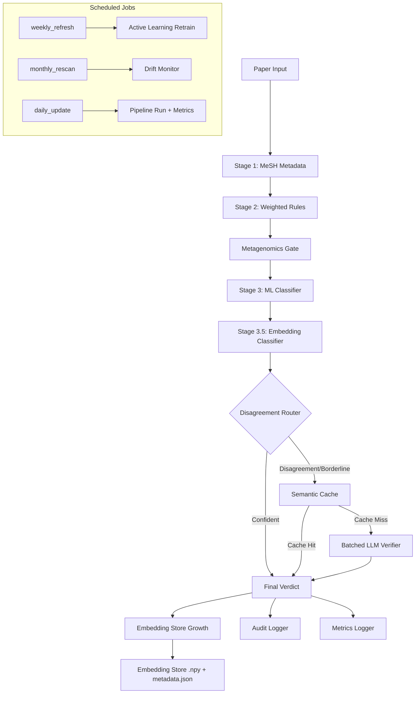

# Design Document: Layer 1 Scale Roadmap

## Overview

This design specifies the architecture for scaling the Layer 1 relevance-filtering pipeline from its current ~5,000-paper capacity to ~100,000 papers by progressively reducing LLM verification calls. The strategy introduces embedding-based similarity classification (Stage 3.5), intelligent LLM routing, batched verification, semantic caching, and learning-loop feedback into the existing 4-stage pipeline.

**Key design goals:**
- Reduce LLM calls by 60–80% as the Embedding Store accumulates knowledge
- Maintain or improve classification precision (target: ≥0.90 F1)
- Preserve the existing pipeline's audit trail and graceful degradation patterns
- Enable future swap from brute-force cosine search to FAISS without interface changes
- All LLM operations remain Ollama-only — no cloud API fallbacks

**Pipeline flow after integration:**

```
Stage 1 (MeSH) → Stage 2 (Rules) → Metagenomics Gate → Stage 3 (ML Classifier)
    → Stage 3.5 (Embedding Classifier) → Disagreement Router → Stage 4 (Batched LLM w/ Semantic Cache)
```

## Architecture



### Architectural Decisions

1. **NumPy brute-force over FAISS initially**: At <100k embeddings (384-dim), brute-force cosine similarity completes in <50ms. FAISS adds complexity without payoff until >500k vectors. The interface abstracts storage so the swap is non-breaking.

2. **Stacked meta-classifier activation threshold (2000 papers)**: Below 2000 papers the individual stage signals are more reliable than a stacked model trained on insufficient data. The pipeline uses per-stage routing until this threshold is met.

3. **Batch size of 16 for LLM calls**: Ollama's context window with llama3 supports ~4096 tokens per paper summary × 16 papers ≈ 65k tokens — within the 128k context window. Larger batches risk JSON parsing failures.

4. **Semantic cache threshold at 0.97 cosine similarity**: Papers above this threshold are near-duplicates (e.g., preprint vs. published version). Lower thresholds risk reusing verdicts across genuinely different papers.

5. **Separate positive/negative partitions**: Enables independent similarity queries that produce two distinct signals (affinity to known-relevant vs. affinity to known-irrelevant), which the meta-classifier combines for higher accuracy than a single mixed store.

## Components and Interfaces

### New Modules

#### 1. `collectors/embedding_model.py`

Wraps a sentence-transformer model with domain-tuned defaults and fallback logic.

```python
from typing import Protocol, List
import numpy as np

class EmbeddingModelInterface(Protocol):
    """Swappable interface for embedding models."""
    @property
    def dimension(self) -> int: ...
    def encode(self, texts: List[str], batch_size: int = 32) -> np.ndarray: ...

class EmbeddingModel:
    """
    Domain-tuned embedding model with graceful fallback.
    Primary: SPECTER2 (allenai/specter2)
    Fallback: all-MiniLM-L6-v2 (already in project deps)
    """
    PRIMARY_MODEL = "allenai/specter2"
    FALLBACK_MODEL = "all-MiniLM-L6-v2"

    def __init__(self, model_name: str | None = None, batch_size: int = 64):
        self._model = None
        self._model_name: str = ""
        self._batch_size = batch_size
        self._load(model_name)

    @property
    def dimension(self) -> int:
        """Returns embedding dimensionality (e.g. 768 for SPECTER2, 384 for MiniLM)."""
        ...

    def encode(self, texts: List[str], batch_size: int | None = None) -> np.ndarray:
        """Encode texts into dense vectors. Returns shape (n, dimension)."""
        ...

    def encode_paper(self, title: str, abstract: str | None) -> np.ndarray:
        """Convenience: encode a single paper's title+abstract. Returns shape (dimension,)."""
        ...
```

#### 2. `collectors/embedding_store.py`

Persistent storage for paper embeddings with positive/negative partitions.

```python
from typing import Protocol, List, Tuple, Optional
from dataclasses import dataclass
import numpy as np

@dataclass
class EmbeddingMetadata:
    """Metadata stored alongside each embedding vector."""
    doi: Optional[str]
    pmid: Optional[str]
    title: str
    partition: str  # "positive" | "negative"
    added_at: str   # ISO timestamp

class SimilarityResult:
    """Single result from a similarity query."""
    score: float          # cosine similarity [0, 1]
    metadata: EmbeddingMetadata

class EmbeddingStoreInterface(Protocol):
    """
    Abstract interface for embedding storage.
    Permits future swap to FAISS without modifying calling code.
    """
    def query_similar(
        self, vector: np.ndarray, partition: str, top_k: int = 5
    ) -> List[SimilarityResult]: ...

    def append(
        self, vector: np.ndarray, metadata: EmbeddingMetadata
    ) -> None: ...

    def contains(self, doi: Optional[str], pmid: Optional[str]) -> bool: ...

    @property
    def positive_count(self) -> int: ...

    @property
    def negative_count(self) -> int: ...

class EmbeddingStore:
    """
    NumPy-backed brute-force embedding store.
    Storage layout:
      data/embeddings/positive.npy       — (N, dim) float32 matrix
      data/embeddings/positive_meta.json  — List[EmbeddingMetadata]
      data/embeddings/negative.npy       — (M, dim) float32 matrix
      data/embeddings/negative_meta.json  — List[EmbeddingMetadata]
    
    Thread safety: Uses filelock for atomic append operations.
    """
    STORE_DIR = Path("data/embeddings")

    def __init__(self, store_dir: Path | None = None): ...
    def query_similar(self, vector: np.ndarray, partition: str, top_k: int = 5) -> List[SimilarityResult]: ...
    def append(self, vector: np.ndarray, metadata: EmbeddingMetadata) -> None: ...
    def contains(self, doi: Optional[str] = None, pmid: Optional[str] = None) -> bool: ...
    def query_latency_stats(self) -> dict: ...
```

#### 3. `collectors/embedding_filter.py`

Stage 3.5 classification logic using embedding similarity.

```python
from dataclasses import dataclass

@dataclass
class EmbeddingVerdict:
    """Result from Stage 3.5 embedding classifier."""
    decision: str      # "KEEP" | "REJECT" | "BORDERLINE" | "INSUFFICIENT_DATA"
    pos_similarity: float
    neg_similarity: float
    reason: str
    stage: str = "stage3_5_embedding"

class EmbeddingFilter:
    """
    Stage 3.5: Embedding-based similarity classification.
    
    Thresholds:
      KEEP:   pos_sim >= 0.85 AND neg_sim < 0.60
      REJECT: neg_sim >= 0.85 AND pos_sim < 0.60
      BORDERLINE: everything else → routes to Stage 4
    
    Minimum store size: 50 embeddings per partition before making decisions.
    """
    POS_KEEP_THRESHOLD = 0.85
    NEG_REJECT_THRESHOLD = 0.85
    CROSS_CEILING = 0.60
    MIN_PARTITION_SIZE = 50

    def __init__(self, embedding_model: EmbeddingModel, embedding_store: EmbeddingStore): ...
    def evaluate(self, paper: PaperRecord) -> EmbeddingVerdict: ...
```

#### 4. `collectors/hybrid_classifier.py`

Stacked meta-classifier combining all signal sources.

```python
from dataclasses import dataclass
import numpy as np

@dataclass
class HybridVerdict:
    """Result from the stacked meta-classifier."""
    confidence: float       # Calibrated probability [0, 1]
    keep: bool
    raw_logit: float        # Pre-calibration logit
    feature_vector: list    # [rule_score, pos_sim, neg_sim, ml_prob]
    reason: str

class HybridClassifier:
    """
    Stacked meta-classifier (LogisticRegression or GradientBoosting).
    Combines: rule_score, embedding_pos_similarity, embedding_neg_similarity, ml_probability.
    
    Activation: requires >= 2000 papers in Embedding Store.
    Training data: LLM-verified papers as ground truth labels.
    Output: Platt-scaled calibrated probability.
    
    Model persistence: data/models/hybrid_classifier.pkl
    """
    MODEL_PATH = Path("data/models/hybrid_classifier.pkl")
    MIN_STORE_SIZE = 2000
    MIN_TRAINING_SAMPLES = 200

    def __init__(self): ...
    
    @property
    def is_active(self) -> bool:
        """True when trained model exists and store has >= 2000 papers."""
        ...

    def predict(
        self, rule_score: float, pos_sim: float, neg_sim: float, ml_prob: float
    ) -> HybridVerdict: ...

    def train(self, features: np.ndarray, labels: np.ndarray) -> dict:
        """
        Train on LLM-verified papers. Returns metrics dict.
        Discards model if F1 < 0.80.
        """
        ...
```

#### 5. `collectors/calibration.py`

Platt scaling calibration for the hybrid classifier.

```python
import numpy as np
from dataclasses import dataclass

@dataclass
class CalibrationResult:
    """Calibration fitting result."""
    slope: float
    intercept: float
    calibration_error: float   # Expected Calibration Error (ECE)
    n_samples: int

class PlattCalibrator:
    """
    Platt scaling: fits a logistic regression on held-out logits to produce
    calibrated probabilities. P(y=1|logit) = 1 / (1 + exp(-(slope*logit + intercept)))
    
    Persistence: parameters saved alongside hybrid_classifier.pkl
    Minimum data: 200 LLM-verified papers for reliable calibration.
    """
    MIN_CALIBRATION_SAMPLES = 200

    def __init__(self): ...

    def fit(self, logits: np.ndarray, labels: np.ndarray) -> CalibrationResult:
        """Fit Platt scaling on validation set."""
        ...

    def calibrate(self, raw_logit: float) -> float:
        """Transform a raw logit into a calibrated probability."""
        ...

    @property
    def is_fitted(self) -> bool: ...
```

### Modified Modules

#### 6. `collectors/relevance_filter.py` — Modifications

**Changes to `_evaluate()` method:**
- After Stage 3 ML classifier returns BORDERLINE or passes through, invoke Stage 3.5 (EmbeddingFilter)
- After Stage 3.5, apply Disagreement Router logic before Stage 4
- Replace direct `_stage4_llm()` call with batched queue + semantic cache
- After final verdict, invoke Embedding Store growth (append confident decisions)
- Record per-stage metrics for the new stages

**New instance variables in `RelevanceFilter.__init__()`:**
```python
self._embedding_model = EmbeddingModel()
self._embedding_store = EmbeddingStore()
self._embedding_filter = EmbeddingFilter(self._embedding_model, self._embedding_store)
self._hybrid_classifier = HybridClassifier()
self._semantic_cache = SemanticCache(self._embedding_model, self._embedding_store)
self._batched_verifier = BatchedVerifier()
self._metrics_logger = MetricsLogger()
```

**New method: `_stage3_5_embedding()`** — delegates to `EmbeddingFilter.evaluate()`

**New method: `_disagreement_router()`** — compares Stage 2 verdict with Stage 3.5 verdict:
- If verdicts disagree (one keeps, other rejects): route to LLM
- If Blended Confidence in [0.40, 0.70]: route to LLM
- Otherwise: accept Stage 3.5 verdict as final

**Modified `filter()` method:**
- Collect papers needing LLM into a batch queue
- After iterating all papers, process the batch queue through SemanticCache → BatchedVerifier
- Append pipeline run metrics at end

#### 7. `collectors/llm_verifier.py` — Modifications

**New class: `BatchedVerifier`** (can live in same file or separate `batched_verifier.py`):
```python
@dataclass
class BatchVerdict:
    """One paper's verdict from a batch LLM call."""
    title: str
    keep: bool
    confidence: float
    reason: str

class BatchedVerifier:
    """
    Groups papers into batches of up to 16, sends structured JSON prompts to Ollama.
    Retry strategy: split failed batch in half, retry sub-batches.
    Falls back to single-paper for persistent failures → marks for review.
    """
    MAX_BATCH_SIZE = 16

    def __init__(self): ...
    def verify_batch(self, papers: List[PaperRecord]) -> List[BatchVerdict]: ...
```

**New class: `SemanticCache`**:
```python
class SemanticCache:
    """
    Cosine-similarity cache for LLM verdicts.
    Threshold: 0.97 similarity → reuse cached verdict.
    Independent from content-hash cache in data/processed/llm_cache.json.
    Storage: data/embeddings/llm_verdict_cache.npy + llm_verdict_cache_meta.json
    """
    SIMILARITY_THRESHOLD = 0.97

    def __init__(self, embedding_model: EmbeddingModel, store: EmbeddingStore): ...
    def lookup(self, paper_embedding: np.ndarray) -> Optional[LLMVerdict]: ...
    def store_verdict(self, paper_embedding: np.ndarray, verdict: LLMVerdict, paper: PaperRecord) -> None: ...
```

#### 8. `collectors/audit_logger.py` — Modifications

**Enhanced `log()` method** — adds DOI, PMID, and truncated abstract:
```python
item = {
    "title": paper.title,
    "source": paper.source,
    "year": getattr(paper, "publication_year", ...),
    "decision": decision,
    "stage": verdict.stage,
    "score": verdict.score,
    "reason": verdict.reason,
    # NEW FIELDS (backward compatible — additive only)
    "doi": paper.doi,
    "pmid": paper.pmid,
    "abstract": (paper.abstract or "")[:2000],
}
```

No existing fields removed or renamed. JSON schema remains a superset.

#### 9. `scheduler/jobs.py` — Modifications

```python
def daily_update():
    """Run pipeline on new papers, append metrics."""
    from collectors.orchestrator import CollectionOrchestrator
    orch = CollectionOrchestrator()
    orch.run()  # existing pipeline flow (now includes Stage 3.5)

def weekly_refresh():
    """Active learning retrain of HybridClassifier."""
    from collectors.hybrid_classifier import HybridClassifier
    from collectors.embedding_store import EmbeddingStore
    clf = HybridClassifier()
    store = EmbeddingStore()
    # Only retrain if >= 100 new LLM-verified papers since last train
    clf.retrain_if_needed(store)

def monthly_rescan():
    """Drift monitoring — sample automated decisions for review."""
    from scripts.drift_monitor import DriftMonitor
    monitor = DriftMonitor()
    monitor.run()
```

#### 10. `main.py` — Modifications

- Add `RUN_LAYER=seed` entry point for `seed_embedding_store.py`
- Add `RUN_LAYER=drift` entry point for drift monitoring
- Ensure new dependencies (sentence-transformers) are checked on startup for Layer 1

### New Scripts

#### 11. `scripts/seed_embedding_store.py`

One-time backfill utility that populates the Embedding Store from historical audit data.

```python
class BackfillSeeder:
    """
    Reads data/audit/{kept,rejected,llm_verified}.json
    Encodes papers with non-empty abstracts using EmbeddingModel.
    Places into positive/negative partitions.
    Idempotent: deduplicates by DOI/PMID before inserting.
    """
    def __init__(self): ...
    def run(self) -> dict:
        """Returns: {"positive_added": int, "negative_added": int, "skipped_no_abstract": int, "skipped_duplicate": int}"""
        ...
```

#### 12. `scripts/drift_monitor.py`

Monthly drift detection script.

```python
class DriftMonitor:
    """
    Samples 1% of automated (non-LLM-verified) decisions from the past month.
    Minimum 10 papers in sample. Writes to data/audit/drift_review_YYYYMM.json.
    """
    MIN_SAMPLE_SIZE = 10
    SAMPLE_RATE = 0.01

    def __init__(self): ...
    def run(self) -> dict:
        """Returns: {"sample_size": int, "keep_count": int, "reject_count": int}"""
        ...
```

### Metrics and Monitoring

#### 13. `collectors/metrics_logger.py`

```python
from dataclasses import dataclass
from pathlib import Path

METRICS_PATH = Path("data/metrics/pipeline_runs.jsonl")

@dataclass
class PipelineMetrics:
    """One pipeline run's metrics — appended as JSONL."""
    timestamp: str
    total_papers: int
    stage1_resolved: int
    stage2_resolved: int
    gate_resolved: int
    stage3_resolved: int
    stage3_5_resolved: int
    stage4_resolved: int
    llm_calls: int
    semantic_cache_hits: int
    batch_count: int
    batch_retries: int
    embedding_store_positive: int
    embedding_store_negative: int
    avg_embedding_latency_ms: float
    p95_embedding_latency_ms: float

class MetricsLogger:
    def __init__(self): ...
    def record(self, metrics: PipelineMetrics) -> None:
        """Append one JSON record to the JSONL file."""
        ...
```

## Data Models

### Embedding Store File Layout

```
data/
├── embeddings/
│   ├── positive.npy              # shape (N, dim), float32
│   ├── positive_meta.json        # List[EmbeddingMetadata]
│   ├── negative.npy              # shape (M, dim), float32
│   ├── negative_meta.json        # List[EmbeddingMetadata]
│   ├── llm_verdict_cache.npy     # shape (K, dim), float32 — semantic cache vectors
│   └── llm_verdict_cache_meta.json  # List[{doi, pmid, title, verdict, similarity}]
├── models/
│   └── hybrid_classifier.pkl     # Stacked classifier + Platt params
└── metrics/
    └── pipeline_runs.jsonl       # One JSON record per pipeline run
```

### Metadata JSON Schema

**positive_meta.json / negative_meta.json:**
```json
[
  {
    "doi": "10.1038/s41586-024-07999-z",
    "pmid": "38765432",
    "title": "Gut microbiome in IBD patients...",
    "partition": "positive",
    "added_at": "2024-11-15T02:30:00Z",
    "source_stage": "stage2_rules",
    "confidence_score": 0.92
  }
]
```

**llm_verdict_cache_meta.json:**
```json
[
  {
    "doi": "10.1234/example",
    "pmid": "12345678",
    "title": "Paper title...",
    "verdict": {"keep": true, "confidence": 0.95, "reason": "human IBD 16S"},
    "verified_at": "2024-11-15T03:00:00Z"
  }
]
```

**hybrid_classifier.pkl contents:**
```python
{
    "model": <sklearn LogisticRegression or GradientBoostedClassifier>,
    "feature_names": ["rule_score", "pos_sim", "neg_sim", "ml_prob"],
    "n_training_samples": 500,
    "f1": 0.91,
    "auc": 0.95,
    "calibration": {
        "slope": 1.23,
        "intercept": -0.45,
        "ece": 0.03
    },
    "trained_at": "2024-11-15T04:00:00Z",
    "min_samples_since_last_train": 100
}
```

### Pipeline Metrics JSONL Schema

Each line in `data/metrics/pipeline_runs.jsonl`:
```json
{
  "timestamp": "2024-11-15T02:35:00Z",
  "total_papers": 1200,
  "stage1_resolved": 340,
  "stage2_resolved": 280,
  "gate_resolved": 45,
  "stage3_resolved": 150,
  "stage3_5_resolved": 220,
  "stage4_resolved": 165,
  "llm_calls": 85,
  "semantic_cache_hits": 80,
  "batch_count": 6,
  "batch_retries": 1,
  "embedding_store_positive": 4500,
  "embedding_store_negative": 6200,
  "avg_embedding_latency_ms": 12.3,
  "p95_embedding_latency_ms": 45.7
}
```

### Configuration Additions

New environment variables (added to `.env` and read in `config.py`):

```python
# ── Embedding Model Configuration ─────────────────────────────────────────────
EMBEDDING_MODEL_NAME = os.getenv("EMBEDDING_MODEL_NAME", "allenai/specter2")
EMBEDDING_FALLBACK_MODEL = os.getenv("EMBEDDING_FALLBACK_MODEL", "all-MiniLM-L6-v2")
EMBEDDING_BATCH_SIZE = int(os.getenv("EMBEDDING_BATCH_SIZE", "64"))

# ── Embedding Store Configuration ─────────────────────────────────────────────
EMBEDDING_STORE_DIR = Path(os.getenv("EMBEDDING_STORE_DIR", str(DATA_DIR / "embeddings")))

# ── Stage 3.5 Thresholds ──────────────────────────────────────────────────────
EMBEDDING_POS_KEEP_THRESHOLD = float(os.getenv("EMBEDDING_POS_KEEP_THRESHOLD", "0.85"))
EMBEDDING_NEG_REJECT_THRESHOLD = float(os.getenv("EMBEDDING_NEG_REJECT_THRESHOLD", "0.85"))
EMBEDDING_CROSS_CEILING = float(os.getenv("EMBEDDING_CROSS_CEILING", "0.60"))
EMBEDDING_MIN_PARTITION_SIZE = int(os.getenv("EMBEDDING_MIN_PARTITION_SIZE", "50"))

# ── Semantic Cache ─────────────────────────────────────────────────────────────
SEMANTIC_CACHE_THRESHOLD = float(os.getenv("SEMANTIC_CACHE_THRESHOLD", "0.97"))

# ── Batched Verifier ──────────────────────────────────────────────────────────
BATCH_LLM_SIZE = int(os.getenv("BATCH_LLM_SIZE", "16"))

# ── Hybrid Classifier ─────────────────────────────────────────────────────────
HYBRID_MIN_STORE_SIZE = int(os.getenv("HYBRID_MIN_STORE_SIZE", "2000"))
HYBRID_MIN_TRAIN_SAMPLES = int(os.getenv("HYBRID_MIN_TRAIN_SAMPLES", "200"))
HYBRID_MIN_RETRAIN_NEW = int(os.getenv("HYBRID_MIN_RETRAIN_NEW", "100"))

# ── Disagreement Router ────────────────────────────────────────────────────────
BLENDED_CONFIDENCE_LOW = float(os.getenv("BLENDED_CONFIDENCE_LOW", "0.40"))
BLENDED_CONFIDENCE_HIGH = float(os.getenv("BLENDED_CONFIDENCE_HIGH", "0.70"))

# ── Embedding Store Growth ─────────────────────────────────────────────────────
GROWTH_KEEP_THRESHOLD = float(os.getenv("GROWTH_KEEP_THRESHOLD", "0.80"))
GROWTH_REJECT_THRESHOLD = float(os.getenv("GROWTH_REJECT_THRESHOLD", "0.20"))

# ── Latency Monitoring ─────────────────────────────────────────────────────────
EMBEDDING_LATENCY_WARN_MS = float(os.getenv("EMBEDDING_LATENCY_WARN_MS", "200.0"))

# ── Drift Monitor ─────────────────────────────────────────────────────────────
DRIFT_SAMPLE_RATE = float(os.getenv("DRIFT_SAMPLE_RATE", "0.01"))
DRIFT_MIN_SAMPLE = int(os.getenv("DRIFT_MIN_SAMPLE", "10"))
```

### FAISS-Swap Interface Design

The `EmbeddingStoreInterface` protocol enables a future FAISS implementation:

```python
class FAISSEmbeddingStore:
    """
    Drop-in replacement for EmbeddingStore using FAISS IndexFlatIP.
    Same interface, same file layout for metadata, but .faiss index files
    replace .npy files for the vector data.
    """
    def __init__(self, store_dir: Path | None = None): ...
    def query_similar(self, vector: np.ndarray, partition: str, top_k: int = 5) -> List[SimilarityResult]: ...
    def append(self, vector: np.ndarray, metadata: EmbeddingMetadata) -> None: ...
    def contains(self, doi: Optional[str] = None, pmid: Optional[str] = None) -> bool: ...
    def rebuild_index(self) -> None:
        """Rebuild FAISS index from stored vectors. Call after bulk inserts."""
        ...
```

The swap is controlled by a config flag:
```python
EMBEDDING_STORE_BACKEND = os.getenv("EMBEDDING_STORE_BACKEND", "numpy")  # "numpy" | "faiss"
```

## Correctness Properties

*A property is a characteristic or behavior that should hold true across all valid executions of a system — essentially, a formal statement about what the system should do. Properties serve as the bridge between human-readable specifications and machine-verifiable correctness guarantees.*

### Property 1: Embedding Model Output Consistency

*For any* non-empty string pair (title, abstract), the Embedding Model SHALL return a NumPy array of shape `(dimension,)` where `dimension` is fixed for a given model instance, all values are finite floats, and the vector has non-zero norm.

**Validates: Requirements 1.3**

### Property 2: Batch Encoding Equivalence

*For any* list of texts and any batch size, encoding the list in one batch call SHALL produce vectors identical (within float32 tolerance) to encoding each text individually and stacking the results.

**Validates: Requirements 1.5**

### Property 3: Embedding Store Round-Trip

*For any* valid embedding vector and metadata (doi, pmid, title), after appending to the store and reloading from disk, the retrieved vector SHALL be equal to the original (within float32 tolerance) and the metadata fields SHALL be identical.

**Validates: Requirements 2.1, 2.6**

### Property 4: Partition Isolation

*For any* embedding appended to the "positive" partition, querying the "negative" partition SHALL never return that embedding in results, and vice versa. The partitions are strictly disjoint.

**Validates: Requirements 2.2**

### Property 5: Cosine Similarity Correctness

*For any* query vector and set of stored vectors in a partition, the top-k results returned by `query_similar` SHALL be the k vectors with the highest cosine similarity to the query, ordered descending by similarity score, where each score matches the manually computed cosine similarity within float32 tolerance.

**Validates: Requirements 2.3**

### Property 6: Audit Logger Field Completeness

*For any* PaperRecord with doi, pmid, and abstract fields, the audit log record produced by `AuditLogger.log()` SHALL contain the paper's DOI, PMID, and abstract truncated to at most 2000 characters, while preserving all previously existing fields (title, source, year, decision, stage, score, reason).

**Validates: Requirements 3.1, 3.2, 3.3**

### Property 7: Backfill Partition Correctness

*For any* set of audit records where each has a decision (keep/reject) and an abstract, the Backfill Script SHALL encode only records with non-empty abstracts, place kept papers in the positive partition and rejected papers in the negative partition, and the count of skipped records SHALL equal the count of records with empty or missing abstracts.

**Validates: Requirements 4.2, 4.3, 4.4**

### Property 8: Backfill Idempotence

*For any* set of audit records, running the Backfill Script twice on identical input SHALL produce an Embedding Store of the same size after both runs — the second run adds zero new embeddings.

**Validates: Requirements 4.5**

### Property 9: Stage 3.5 Classification Threshold Invariant

*For any* pair of similarity scores (pos_similarity, neg_similarity) where both partitions have ≥50 embeddings:
- If pos_similarity ≥ 0.85 AND neg_similarity < 0.60 → decision SHALL be KEEP
- If neg_similarity ≥ 0.85 AND pos_similarity < 0.60 → decision SHALL be REJECT
- Otherwise → decision SHALL be BORDERLINE

**Validates: Requirements 5.3, 5.4, 5.5**

### Property 10: Disagreement Router Decision Logic

*For any* pair of stage verdicts (stage2_keep: bool, stage3_5_keep: bool) and a blended confidence score:
- If stage2_keep ≠ stage3_5_keep → route to LLM
- If 0.40 ≤ blended_confidence ≤ 0.70 → route to LLM
- Otherwise → accept Stage 3.5 verdict without LLM

**Validates: Requirements 6.1, 6.2, 6.3**

### Property 11: Batch Size Invariant

*For any* list of N papers requiring LLM verification, the Batched Verifier SHALL partition them into ceil(N/16) batches where each batch contains at most 16 papers, and the union of all batches equals the original set.

**Validates: Requirements 7.1**

### Property 12: Semantic Cache Threshold Correctness

*For any* pair of embeddings (query, stored) where cosine_similarity(query, stored) > 0.97, the Semantic Cache SHALL return the stored verdict as a cache hit. For any pair where cosine_similarity ≤ 0.97, the cache SHALL return a miss.

**Validates: Requirements 8.1, 8.2**

### Property 13: Semantic Cache Growth

*For any* LLM-verified paper, after verification completes the Semantic Cache size SHALL increase by exactly one entry containing that paper's embedding and verdict.

**Validates: Requirements 8.4**

### Property 14: Embedding Store Growth Threshold Logic

*For any* paper with a final verdict score:
- If score ≥ 0.80 and paper not already in store → append to positive partition
- If score ≤ 0.20 and paper not already in store → append to negative partition
- If 0.20 < score < 0.80 → do NOT append to either partition
- If paper already in store (by DOI or PMID) → do NOT append regardless of score

**Validates: Requirements 9.1, 9.2, 9.3, 9.4**

### Property 15: Platt Scaling Monotonicity and Range

*For any* sequence of raw logits where logit_a < logit_b, the calibrated probability for logit_a SHALL be less than or equal to the calibrated probability for logit_b (monotonicity), and all calibrated outputs SHALL be in the range [0.0, 1.0].

**Validates: Requirements 10.3, 11.2**

### Property 16: Active Learning Retrain Guard

*For any* count of new LLM-verified papers since last training, the Active Learning Job SHALL retrain only when count ≥ 100. If the resulting model has F1 < 0.80, the previous model SHALL be retained unchanged.

**Validates: Requirements 12.2, 12.5**

### Property 17: Embedding Query Latency Recording

*For any* similarity query executed against the Embedding Store, the recorded wall-clock duration SHALL be a positive float (in milliseconds), and when the rolling average of recorded latencies exceeds 200ms, a warning log SHALL be emitted.

**Validates: Requirements 13.1, 13.2**

### Property 18: Drift Monitor Sampling Guarantee

*For any* population of automated decisions from the past month, the Drift Monitor SHALL select a sample of size max(ceil(population_size * 0.01), 10), ensuring at least 10 papers are always selected when the population has ≥10 papers.

**Validates: Requirements 14.1, 14.4**

### Property 19: Pipeline Metrics Record Completeness

*For any* pipeline run processing N papers, the appended JSONL record SHALL contain: timestamp, total_papers equal to N, per-stage resolution counts that sum to N, llm_calls count, semantic_cache_hits count, batch stats, and embedding store sizes (positive_count, negative_count).

**Validates: Requirements 15.1, 15.2, 15.3, 15.4**

## Error Handling

### Embedding Model Errors

| Scenario | Behavior |
|----------|----------|
| Primary model (SPECTER2) fails to load | Fall back to all-MiniLM-L6-v2, log warning, continue |
| Fallback model also fails | Raise `RuntimeError` at startup — pipeline cannot operate without embeddings |
| Encoding produces NaN/Inf values | Discard the vector, log warning, skip paper for embedding operations |
| Out-of-memory during batch encoding | Halve batch size, retry; if still OOM, encode one-at-a-time |

### Embedding Store Errors

| Scenario | Behavior |
|----------|----------|
| .npy file corrupted or unreadable | Log error, initialize empty partition, continue (loses historical data but doesn't crash) |
| Metadata JSON parse failure | Same as above — reset that partition |
| Disk full on append | Log error, skip append, continue pipeline without growth for this run |
| Concurrent write conflict (filelock timeout) | Retry 3 times with exponential backoff, then skip append |

### Batched Verifier Errors

| Scenario | Behavior |
|----------|----------|
| Ollama returns unparseable JSON for batch | Split batch in half, retry each sub-batch |
| Sub-batch still fails | Split to single papers, retry each individually |
| Single-paper call fails after MAX_RETRIES | Mark paper for human review, continue with remaining papers |
| Ollama connection refused | All papers in queue marked for review, log warning |
| Ollama timeout | Retry with exponential backoff per BackendConfig settings |

### Semantic Cache Errors

| Scenario | Behavior |
|----------|----------|
| Cache file corrupted | Log warning, reinitialize empty cache, proceed without cache benefits |
| Cache lookup takes >500ms | Log warning, proceed with LLM call (don't block pipeline on slow cache) |

### Hybrid Classifier / Calibration Errors

| Scenario | Behavior |
|----------|----------|
| Training data insufficient (<200 samples) | Skip Platt scaling, use raw probabilities, log warning |
| Training produces F1 < 0.80 | Discard new model, retain previous, log warning |
| Calibration fit fails (singular matrix) | Skip calibration, use raw logits, log warning |
| Model file corrupted on load | Initialize as inactive, fall back to per-stage routing |

### Drift Monitor Errors

| Scenario | Behavior |
|----------|----------|
| No automated decisions in past month | Log info message "no decisions to sample", exit cleanly |
| Audit files unreadable | Log error, exit with non-zero code |
| Output directory not writable | Log error, exit with non-zero code |

## Testing Strategy

### Property-Based Testing (Hypothesis)

The project already uses pytest + Hypothesis. All correctness properties above will be implemented as Hypothesis property tests with minimum 100 iterations each.

**Library:** `hypothesis` (already in project)
**Configuration:** Each property test decorated with `@settings(max_examples=100)`
**Tagging:** Each test annotated with a comment referencing its design property

**Test file structure:**
```
tests/
├── test_embedding_model_properties.py    # Properties 1, 2
├── test_embedding_store_properties.py    # Properties 3, 4, 5
├── test_audit_logger_properties.py       # Property 6
├── test_backfill_properties.py           # Properties 7, 8
├── test_embedding_filter_properties.py   # Property 9
├── test_disagreement_router_properties.py # Property 10
├── test_batched_verifier_properties.py   # Property 11
├── test_semantic_cache_properties.py     # Properties 12, 13
├── test_store_growth_properties.py       # Property 14
├── test_calibration_properties.py        # Property 15
├── test_active_learning_properties.py    # Property 16
├── test_latency_monitoring_properties.py # Property 17
├── test_drift_monitor_properties.py      # Property 18
├── test_metrics_properties.py            # Property 19
```

**Example test (Property 5 — Cosine Similarity Correctness):**
```python
import numpy as np
from hypothesis import given, settings, assume
from hypothesis import strategies as st
from hypothesis.extra.numpy import arrays

# Feature: layer1-scale-roadmap, Property 5: Cosine Similarity Correctness
@settings(max_examples=100)
@given(
    query=arrays(np.float32, (384,), elements=st.floats(-1, 1, allow_nan=False, allow_infinity=False)),
    stored=arrays(np.float32, (10, 384), elements=st.floats(-1, 1, allow_nan=False, allow_infinity=False)),
    top_k=st.integers(min_value=1, max_value=10),
)
def test_cosine_similarity_correctness(query, stored, top_k, tmp_path):
    """For any query vector and stored vectors, top-k results match manual cosine."""
    assume(np.linalg.norm(query) > 1e-6)
    assume(all(np.linalg.norm(v) > 1e-6 for v in stored))
    
    store = EmbeddingStore(store_dir=tmp_path)
    for i, vec in enumerate(stored):
        store.append(vec, EmbeddingMetadata(doi=f"doi_{i}", pmid=None, title=f"paper_{i}", partition="positive", added_at="2024-01-01"))
    
    results = store.query_similar(query, partition="positive", top_k=top_k)
    
    # Manual computation
    norms_stored = stored / np.linalg.norm(stored, axis=1, keepdims=True)
    norm_query = query / np.linalg.norm(query)
    expected_sims = norms_stored @ norm_query
    expected_top_k = np.argsort(expected_sims)[::-1][:top_k]
    
    assert len(results) == min(top_k, len(stored))
    for i, result in enumerate(results):
        assert abs(result.score - expected_sims[expected_top_k[i]]) < 1e-5
```

### Unit Tests (Example-Based)

Unit tests cover specific scenarios, edge cases, and error paths:

- **Embedding Model fallback**: Mock SPECTER2 failure, verify MiniLM loads
- **Batched Verifier retry logic**: Mock Ollama failure, verify split-and-retry
- **Audit Logger backward compatibility**: Verify old schema fields preserved
- **Backfill empty audit**: All records lack abstracts → clear exit message
- **Stage 3.5 insufficient data**: <50 embeddings → INSUFFICIENT_DATA verdict
- **Hybrid Classifier inactive below threshold**: <2000 papers → is_active == False
- **Platt scaling insufficient data**: <200 samples → skipped with warning

### Integration Tests

- **Full pipeline flow**: Process 10 papers through all stages, verify correct stage ordering
- **Concurrent append safety**: Multiple threads appending to Embedding Store
- **Scheduler job execution**: weekly_refresh triggers retrain with mock data
- **Drift Monitor output**: Verify review file written with correct format

### Performance Benchmarks

- **Embedding Store query at scale**: 100k stored vectors, measure query latency
- **Batch encoding throughput**: 1000 papers encoded in single batch
- **Pipeline end-to-end**: 1000 papers through full pipeline, measure LLM call reduction

### New Dependency

```
sentence-transformers>=2.2.0  # For SPECTER2 and embedding models
filelock>=3.12.0              # For atomic append operations
```

Both NumPy and scikit-learn are already in project dependencies.
