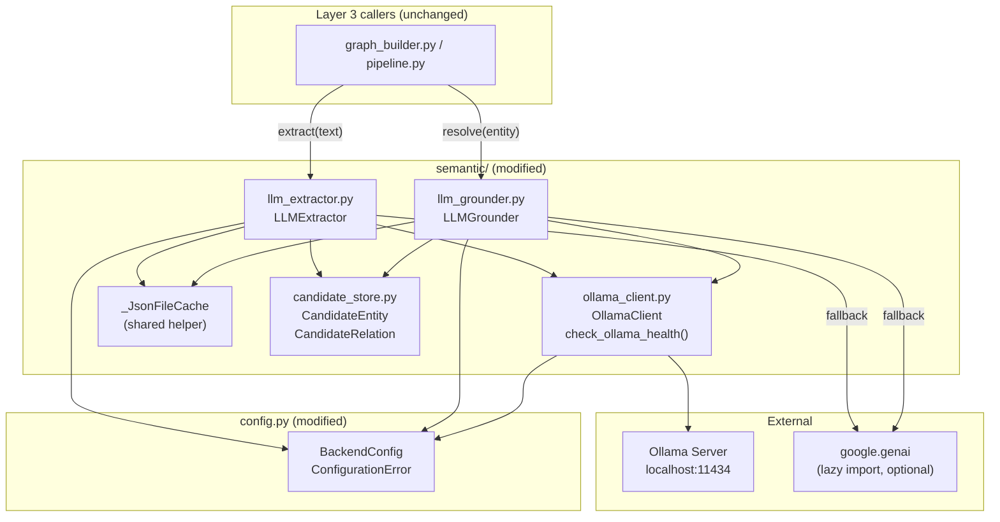

# Design Document: Ollama LLM Integration

## Overview

This design replaces the Google Gemini cloud API backend in `semantic/llm_extractor.py` and `semantic/llm_grounder.py` with a local Ollama inference backend. The migration preserves the existing Python interfaces (`LLMExtractor.extract()` and `LLMGrounder.resolve()`) so all upstream callers in Layer 3 are unaffected.

Key improvements over the current implementation:
- **No cloud dependency**: Ollama runs locally; no API keys required for the primary path
- **Structured JSON output**: Ollama's `format: "json"` parameter eliminates markdown fence stripping
- **Retry logic**: Exponential backoff handles transient model-loading delays
- **Grounding cache**: `LLMGrounder` gains the same file-based cache that `LLMExtractor` already has
- **Atomic writes**: Both caches use a write-to-temp-then-rename pattern to prevent corruption
- **Optional Gemini fallback**: Lazy import of `google.genai` keeps it optional when `LLM_BACKEND=ollama`

### Research Findings

Ollama exposes a REST API at `http://localhost:11434`. The relevant endpoints are:

- `POST /api/generate` — submit a prompt; returns `{"response": "..."}` when `stream: false`
- `GET /api/tags` — list available models; returns `{"models": [{"name": "llama3", ...}, ...]}`

Setting `"format": "json"` in the generate request body instructs the model to produce only valid JSON, eliminating the need to strip markdown fences. This is the primary mechanism for structured output enforcement.

The `requests` library (already in `requirements.txt` at `2.31.0`) is sufficient for all HTTP communication. No additional `ollama` Python SDK is needed.

Sources: [Ollama REST API docs](https://github.com/ollama/ollama/blob/main/docs/api.md)

## Architecture

### Module Relationship Diagram



### Data Flow: Extraction

```mermaid
sequenceDiagram
    participant Caller
    participant LLMExtractor
    participant Cache as _JsonFileCache
    participant OllamaClient
    participant Ollama as Ollama Server
    participant Gemini as Gemini (optional)

    Caller->>LLMExtractor: extract(text)
    LLMExtractor->>LLMExtractor: text empty? → return ([], [])
    LLMExtractor->>Cache: load(); key = MD5(text)
    alt Cache hit
        Cache-->>LLMExtractor: cached data
        LLMExtractor-->>Caller: (entities, relations)
    else Cache miss
        LLMExtractor->>OllamaClient: generate(prompt)
        loop Retry up to MAX_RETRIES
            OllamaClient->>Ollama: POST /api/generate
            alt HTTP 200 + valid response field
                Ollama-->>OllamaClient: {"response": "..."}
                OllamaClient-->>LLMExtractor: response string
            else Error / timeout
                OllamaClient->>OllamaClient: backoff sleep; log WARNING
            end
        end
        alt All retries exhausted
            OllamaClient-->>LLMExtractor: raise OllamaUnavailableError / OllamaTimeoutError
            alt FALLBACK_TO_GEMINI=true
                LLMExtractor->>Gemini: generate_content(prompt)
                Gemini-->>LLMExtractor: response text
            else
                LLMExtractor-->>Caller: ([], [])
            end
        end
        LLMExtractor->>LLMExtractor: parse JSON → CandidateEntity/Relation
        LLMExtractor->>Cache: atomic write
        LLMExtractor-->>Caller: (entities, relations)
    end
```

## Components and Interfaces

### `config.py` — `BackendConfig` and `ConfigurationError`

```python
class ConfigurationError(Exception):
    """Raised at import time when environment variable configuration is invalid."""
    pass

@dataclass(frozen=True)
class BackendConfig:
    llm_backend: str                  # "ollama" | "gemini"
    ollama_base_url: str              # e.g. "http://localhost:11434"
    ollama_extraction_model: str      # e.g. "llama3"
    ollama_grounding_model: str       # e.g. "llama3"
    ollama_timeout_seconds: int       # ≥ 1
    ollama_max_retries: int           # ≥ 0
    ollama_retry_backoff_base: float  # ≥ 1.0
    ollama_fallback_to_gemini: bool
    gemini_extraction_model: str      # e.g. "gemini-2.0-flash"
    gemini_grounding_model: str       # e.g. "gemini-2.5-flash"

def _load_backend_config() -> BackendConfig:
    """
    Reads env vars, validates types and accepted values, raises ConfigurationError
    on any violation. Called once at module import; result stored as BACKEND_CONFIG.
    """
    ...

BACKEND_CONFIG: BackendConfig = _load_backend_config()
```

**Validation rules** (all enforced at import time):
- `LLM_BACKEND` must be `"ollama"` or `"gemini"` → `ConfigurationError` otherwise
- `OLLAMA_TIMEOUT_SECONDS`, `OLLAMA_MAX_RETRIES` must parse as `int` → `ConfigurationError` with variable name + bad value
- `OLLAMA_RETRY_BACKOFF_BASE` must parse as `float` → same
- If `LLM_BACKEND == "gemini"` and `GEMINI_API_KEY` absent → `ConfigurationError`
- If `OLLAMA_FALLBACK_TO_GEMINI == "true"` and `GEMINI_API_KEY` absent → `ConfigurationError`

### `semantic/ollama_client.py`

```python
class OllamaUnavailableError(Exception):
    """Raised when all retry attempts fail with network/HTTP errors."""
    def __init__(self, message: str, attempts: int): ...

class OllamaTimeoutError(Exception):
    """Raised when all retry attempts time out."""
    def __init__(self, timeout_seconds: int): ...

class OllamaClient:
    def __init__(self, config: BackendConfig): ...

    def generate(self, model: str, prompt: str) -> str:
        """
        POST {base_url}/api/generate with format:"json", stream:false.
        Returns the response string on success.
        Raises OllamaUnavailableError or OllamaTimeoutError after all retries.
        """
        ...

def check_ollama_health(config: BackendConfig | None = None) -> bool:
    """
    GET {base_url}/api/tags, verify both extraction and grounding models are present.
    Returns True on success, False on any failure. Logs INFO or ERROR accordingly.
    If LLM_BACKEND is "gemini", skips probe and returns True immediately.
    """
    ...
```

### `semantic/_cache.py` — `_JsonFileCache` (shared helper)

```python
class _JsonFileCache:
    def __init__(self, path: Path): ...

    def load(self) -> dict:
        """
        Load JSON from path. Returns {} if file missing or JSON invalid.
        Never raises.
        """
        ...

    def save(self, data: dict) -> None:
        """
        Atomic write: serialize to a .tmp file in the same directory,
        then os.replace() to the target path. Guarantees the cache file
        is never partially written.
        """
        ...
```

**Atomic write pattern:**
```python
def save(self, data: dict) -> None:
    tmp = self.path.with_suffix(".tmp")
    tmp.write_text(json.dumps(data, indent=2), encoding="utf-8")
    os.replace(tmp, self.path)  # atomic on POSIX and Windows (same filesystem)
```

### `semantic/llm_extractor.py` — `LLMExtractor`

```python
class LLMExtractor:
    def __init__(self): ...

    def extract(self, text: str) -> tuple[list[CandidateEntity], list[CandidateRelation]]:
        """
        1. Return ([], []) if text is empty/whitespace/None.
        2. Check extraction cache (MD5 key). Return cached result if hit.
        3. Route to Ollama or Gemini based on BACKEND_CONFIG.llm_backend.
        4. Parse JSON response → CandidateEntity / CandidateRelation lists.
        5. On success: write to cache (atomic). Return result.
        6. On Ollama error + fallback enabled: invoke Gemini, log WARNING.
        7. On any unrecoverable error: return ([], []), log ERROR.
        """
        ...
```

### `semantic/llm_grounder.py` — `LLMGrounder`

```python
class LLMGrounder:
    def __init__(self): ...

    def resolve(self, entity: CandidateEntity) -> dict:
        """
        Returns dict with exactly keys "canonical" (str) and "ontology" (str).
        1. Check grounding cache (MD5 of name+entity_type). Return if hit.
        2. Route to Ollama or Gemini based on BACKEND_CONFIG.llm_backend.
        3. Parse JSON response → {"canonical": str, "ontology": str}.
        4. Substitute entity.name if canonical is empty string.
        5. On success: write to cache (atomic). Return result.
        6. On error: return {"canonical": entity.name, "ontology": "unknown"}.
        """
        ...
```

## Data Models

### Environment Variables → `BackendConfig` Mapping

| Env Var | Type | Default | Validation |
|---|---|---|---|
| `LLM_BACKEND` | `str` | `"ollama"` | Must be `"ollama"` or `"gemini"` |
| `OLLAMA_BASE_URL` | `str` | `"http://localhost:11434"` | No validation |
| `OLLAMA_EXTRACTION_MODEL` | `str` | `"llama3"` | No validation |
| `OLLAMA_GROUNDING_MODEL` | `str` | `"llama3"` | No validation |
| `OLLAMA_TIMEOUT_SECONDS` | `int` | `30` | Must parse as int ≥ 1 |
| `OLLAMA_MAX_RETRIES` | `int` | `3` | Must parse as int ≥ 0 |
| `OLLAMA_RETRY_BACKOFF_BASE` | `float` | `2.0` | Must parse as float ≥ 1.0 |
| `OLLAMA_FALLBACK_TO_GEMINI` | `bool` | `False` | `"true"` → True, anything else → False |
| `GEMINI_EXTRACTION_MODEL` | `str` | `"gemini-2.0-flash"` | No validation |
| `GEMINI_GROUNDING_MODEL` | `str` | `"gemini-2.5-flash"` | No validation |

### Extraction Schema (JSON)

```json
{
  "entities": [
    {"name": "Lactobacillus reuteri", "type": "taxon", "confidence": 0.95, "novel": false}
  ],
  "relations": [
    {"subject": "Lactobacillus reuteri", "predicate": "modulates", "object": "gut barrier", "confidence": 0.85}
  ],
  "evidence": {
    "sample_size": 42,
    "study_design": "RCT",
    "population": "adult humans"
  }
}
```

### Grounding Schema (JSON)

```json
{
  "canonical": "Lactobacillus reuteri DSM 17938",
  "ontology": "NCBI:1598"
}
```

### Cache File Locations

| Cache | Path | Key | Value |
|---|---|---|---|
| Extraction | `semantic/cache/llm_extract_cache.json` | `MD5(text)` | Raw extraction schema dict |
| Grounding | `semantic/cache/llm_ground_cache.json` | `MD5(name + entity_type)` | `{"canonical": str, "ontology": str}` |

### Retry / Backoff Algorithm

```
total_attempts = OLLAMA_MAX_RETRIES + 1
last_error = None
last_was_timeout = False

for attempt in range(total_attempts):
    try:
        response = requests.post(url, json=body, timeout=OLLAMA_TIMEOUT_SECONDS)
        if response.status_code == 200:
            data = response.json()
            if "response" in data:
                return data["response"]
            raise ValueError("Missing 'response' field")
        raise requests.HTTPError(f"HTTP {response.status_code}")
    except requests.Timeout as e:
        last_error = e
        last_was_timeout = True
    except Exception as e:
        last_error = e
        last_was_timeout = False

    if attempt < total_attempts - 1:
        backoff = min(
            OLLAMA_RETRY_BACKOFF_BASE ** (attempt + 1),
            OLLAMA_RETRY_BACKOFF_BASE ** OLLAMA_MAX_RETRIES
        )
        log.warning(f"Attempt {attempt+1}/{total_attempts} failed: {e}. Retrying in {backoff}s")
        time.sleep(backoff)
    else:
        log.warning(f"Attempt {attempt+1}/{total_attempts} failed: {e}. No more retries.")

if last_was_timeout:
    raise OllamaTimeoutError(OLLAMA_TIMEOUT_SECONDS)
raise OllamaUnavailableError(str(last_error), total_attempts)
```

**Backoff cap example** (base=2, max_retries=3):

| Attempt | Backoff before next attempt |
|---|---|
| 1 (initial) | 2^1 = 2s |
| 2 | 2^2 = 4s |
| 3 | 2^3 = 8s (cap = 2^3 = 8s) |
| 4 (final) | — (no sleep, raise error) |

## Correctness Properties

*A property is a characteristic or behavior that should hold true across all valid executions of a system — essentially, a formal statement about what the system should do. Properties serve as the bridge between human-readable specifications and machine-verifiable correctness guarantees.*

**Property Reflection:** After prework analysis, the following consolidations were made:
- Requirements 12.4 (extract idempotence) and 7.5 (cache hit returns same result) are the same property — merged into Property 4.
- Requirements 13.3 (resolve idempotence) and 6.6 (cache hit on subsequent calls) are the same property — merged into Property 7.
- Requirements 12.1 (return type) and 12.2 (entity field validity) and 12.3 (confidence bounds) are all structural output properties — kept separate as they test distinct invariants.
- Requirements 13.1 (key set) and 13.2 (canonical non-empty) are kept separate as they test distinct invariants.
- Requirements 1.2 (numeric validation) and 1.3 (backend enum validation) are both config error-condition properties — kept separate as they cover different fields.

---

### Property 1: Extraction always returns a two-element tuple of lists

*For any* non-empty string input (containing at least one non-whitespace character), `LLMExtractor.extract(text)` SHALL return a tuple of exactly two elements where both elements are lists — regardless of whether the LLM backend returns a valid response, an error, or raises an exception.

**Validates: Requirements 12.1, 4.1**

---

### Property 2: Every extracted entity has non-whitespace name and entity_type

*For any* non-empty text input and any mocked LLM response that produces a non-empty entity list, every element in the first returned list SHALL be a `CandidateEntity` instance whose `name` field and `entity_type` field each contain at least one non-whitespace character.

**Validates: Requirements 12.2, 3.4**

---

### Property 3: Every extracted relation has confidence in [0.0, 1.0]

*For any* non-empty text input and any mocked LLM response that produces a non-empty relation list, every element in the second returned list SHALL be a `CandidateRelation` instance whose `confidence` field is a float in the closed interval [0.0, 1.0].

**Validates: Requirements 12.3, 3.5**

---

### Property 4: Extraction is idempotent (cache round-trip)

*For any* non-empty text input, calling `LLMExtractor.extract(text)` a second time (within the same process, with the cache file persisting between calls) SHALL return a result with the same number of entities, the same set of entity names (order-insensitive), and the same number of relations as the first call.

**Validates: Requirements 12.4, 7.5, 4.3**

---

### Property 5: Extraction schema JSON round-trip preserves all fields

*For any* Python dict that is a valid Extraction Schema (containing `"entities"` as a list, `"relations"` as a list, and `"evidence"` as a dict), serializing it to a JSON string and then parsing that string back to a dict SHALL produce a dict with field-by-field equal values for all keys present in the original.

**Validates: Requirements 12.5**

---

### Property 6: Grounding always returns a dict with exactly the keys "canonical" and "ontology"

*For any* `CandidateEntity` input (with any name and entity_type), `LLMGrounder.resolve(entity)` SHALL return a dict containing exactly the keys `"canonical"` and `"ontology"` with string values and no additional keys — regardless of whether the LLM backend returns a valid response, an error, or raises an exception.

**Validates: Requirements 13.1, 5.1**

---

### Property 7: Grounding is idempotent (cache round-trip)

*For any* `CandidateEntity` input, calling `LLMGrounder.resolve(entity)` a second time (within the same process, with the cache file persisting between calls) SHALL return a dict with identical `"canonical"` and `"ontology"` values as the first call.

**Validates: Requirements 13.3, 6.6, 5.2**

---

### Property 8: Grounding canonical is always a non-empty string

*For any* `CandidateEntity` input whose `name` field is a non-empty string, the `"canonical"` value in the dict returned by `LLMGrounder.resolve(entity)` SHALL be a non-empty string (containing at least one non-whitespace character). When the LLM returns an empty or missing canonical, the system SHALL substitute `entity.name`.

**Validates: Requirements 13.2, 3.6**

---

### Property 9: Grounding schema JSON round-trip preserves all fields

*For any* Python dict that is a valid Grounding Schema (containing `"canonical"` as a non-empty string and `"ontology"` as a string), serializing it to a JSON string and then parsing that string back to a dict SHALL produce a dict with field-by-field equal values for both keys.

**Validates: Requirements 13.4**

---

### Property 10: Invalid LLM grounding response falls back to entity.name

*For any* `CandidateEntity` input and any mocked LLM response that is not valid JSON, is missing the `"canonical"` key, or has a non-string `"canonical"` value, `LLMGrounder.resolve(entity)` SHALL return a dict where `"canonical"` equals `entity.name` and `"ontology"` equals `"unknown"`.

**Validates: Requirements 13.5, 3.2**

---

### Property 11: Whitespace-only and empty text returns empty lists without LLM call

*For any* string composed entirely of whitespace characters (including the empty string), `LLMExtractor.extract(text)` SHALL return `([], [])` without invoking the Ollama client or Gemini backend.

**Validates: Requirements 4.2**

---

### Property 12: BackendConfig raises ConfigurationError for non-numeric env vars

*For any* string that cannot be parsed as an integer passed as `OLLAMA_TIMEOUT_SECONDS` or `OLLAMA_MAX_RETRIES`, or any string that cannot be parsed as a float passed as `OLLAMA_RETRY_BACKOFF_BASE`, `_load_backend_config()` SHALL raise a `ConfigurationError` that includes the variable name and the invalid value.

**Validates: Requirements 1.2**

---

### Property 13: BackendConfig raises ConfigurationError for invalid LLM_BACKEND values

*For any* string that is not in `{"ollama", "gemini"}` passed as `LLM_BACKEND`, `_load_backend_config()` SHALL raise a `ConfigurationError` that lists the accepted values.

**Validates: Requirements 1.3**

---

### Property 14: OllamaClient makes at most MAX_RETRIES + 1 total attempts

*For any* configuration with `OLLAMA_MAX_RETRIES = N` (where N ≥ 0), when the Ollama server consistently returns errors, `OllamaClient.generate()` SHALL make exactly `N + 1` total HTTP attempts before raising `OllamaUnavailableError` or `OllamaTimeoutError`.

**Validates: Requirements 10.2, 2.3**

---

### Property 15: Grounding cache key is MD5 of name concatenated with entity_type

*For any* `CandidateEntity` with fields `name` and `entity_type`, the cache key used by `LLMGrounder` SHALL equal `hashlib.md5((name + entity_type).encode("utf-8")).hexdigest()`.

**Validates: Requirements 6.2**

## Error Handling

### Error Taxonomy

| Error | Raised by | Meaning | Caller response |
|---|---|---|---|
| `ConfigurationError` | `config.py` at import | Invalid env var | Process exits; fix config |
| `OllamaUnavailableError` | `OllamaClient.generate()` | All retries failed (network/HTTP) | Extractor/Grounder: fallback or return empty |
| `OllamaTimeoutError` | `OllamaClient.generate()` | All retries timed out | Same as above |
| `json.JSONDecodeError` | `LLMExtractor` / `LLMGrounder` | LLM returned non-JSON | Log ERROR; return safe default |

### Decision Tree: LLMExtractor.extract()

```
text empty/whitespace/None?
  → return ([], [])

LLM_BACKEND == "gemini"?
  → call Gemini directly
  → on Gemini exception: log ERROR, return ([], [])

LLM_BACKEND == "ollama":
  → call OllamaClient.generate()
  → on success: parse JSON
      → parse fails: log ERROR, return ([], [])
      → parse succeeds: write cache, return (entities, relations)
  → on OllamaUnavailableError / OllamaTimeoutError:
      FALLBACK_TO_GEMINI == true?
        → log WARNING "activating Gemini fallback"
        → call Gemini
        → on Gemini exception: log ERROR, return ([], [])
      FALLBACK_TO_GEMINI == false?
        → log ERROR, return ([], [])
```

### Decision Tree: LLMGrounder.resolve()

```
Cache hit (valid entry)?
  → return cached dict

LLM_BACKEND == "gemini"?
  → call Gemini directly
  → on Gemini exception: log ERROR, return {"canonical": entity.name, "ontology": "unknown"}

LLM_BACKEND == "ollama":
  → call OllamaClient.generate()
  → on success: parse JSON
      → parse fails / missing keys / empty canonical:
          log ERROR, return {"canonical": entity.name, "ontology": "unknown"}
      → parse succeeds: write cache, return result
  → on OllamaUnavailableError / OllamaTimeoutError:
      FALLBACK_TO_GEMINI == true?
        → log WARNING "activating Gemini fallback"
        → call Gemini
        → on Gemini exception: log ERROR, return {"canonical": entity.name, "ontology": "unknown"}
      FALLBACK_TO_GEMINI == false?
        → log ERROR, return {"canonical": entity.name, "ontology": "unknown"}
```

### Lazy Gemini Import

To avoid requiring `google-genai` when `LLM_BACKEND=ollama`, the import is deferred:

```python
def _get_gemini_client():
    try:
        from google import genai
        return genai.Client(api_key=os.getenv("GEMINI_API_KEY"))
    except ImportError:
        raise ImportError("google-genai is required for Gemini backend. pip install google-genai")
```

This function is only called when the Gemini path is actually taken.

### Prompt Design for Structured Output

Both prompts are designed for smaller local models that may not follow complex instructions reliably. Key principles:

1. **Explicit prohibition**: "Return ONLY a JSON object. No preamble, no prose, no code fences."
2. **Populated example**: A concrete example JSON object is included so the model can infer format from pattern-matching, not just instruction-following.
3. **Ollama `format: "json"`**: The API-level enforcement is the primary guard; the prompt instruction is a secondary reinforcement.

**Extraction prompt structure:**
```
You are a biomedical extraction engine. Return ONLY a JSON object.
No text before or after the JSON. No markdown code fences.

Required format (example):
{"entities": [{"name": "Lactobacillus", "type": "taxon", "confidence": 0.9, "novel": false}],
 "relations": [{"subject": "Lactobacillus", "predicate": "modulates", "object": "gut barrier", "confidence": 0.85}],
 "evidence": {"sample_size": 42, "study_design": "RCT", "population": "adult humans"}}

TEXT:
{text[:12000]}
```

**Grounding prompt structure:**
```
You are a biomedical entity normalizer. Return ONLY a JSON object.
No text before or after the JSON. No markdown code fences.

Required format (example):
{"canonical": "Lactobacillus reuteri DSM 17938", "ontology": "NCBI:1598"}

Entity: {entity.name}
Type: {entity.entity_type}
```

## Testing Strategy

### Test File Layout

```
semantic/tests/
├── __init__.py
├── test_backend_config.py          # Unit + property tests for BackendConfig
├── test_ollama_client.py           # Unit + property tests for OllamaClient
├── test_json_file_cache.py         # Unit + property tests for _JsonFileCache
├── test_llm_extractor.py           # Unit + property tests for LLMExtractor
├── test_llm_grounder.py            # Unit + property tests for LLMGrounder
└── test_health_check.py            # Unit tests for check_ollama_health()
```

### Property-Based Testing with Hypothesis

The project already has `hypothesis==6.155.0` in `requirements.txt`. All property tests use `@given` with `@settings(max_examples=100)`.

**Tag format for each property test:**
```python
# Feature: ollama-llm-integration, Property N: <property text>
```

#### Key Strategies

```python
from hypothesis import given, settings, strategies as st
from hypothesis.strategies import composite

# Strategy: arbitrary non-empty text
non_empty_text = st.text(min_size=1).filter(lambda s: s.strip())

# Strategy: whitespace-only text (for Property 11)
whitespace_text = st.text(alphabet=" \t\n\r", min_size=0)

# Strategy: arbitrary CandidateEntity
@composite
def candidate_entity(draw):
    name = draw(st.text(min_size=1).filter(lambda s: s.strip()))
    entity_type = draw(st.text(min_size=1).filter(lambda s: s.strip()))
    return CandidateEntity(name=name, entity_type=entity_type)

# Strategy: valid extraction schema dict
@composite
def extraction_schema(draw):
    entities = draw(st.lists(st.fixed_dictionaries({
        "name": st.text(min_size=1),
        "type": st.text(min_size=1),
        "confidence": st.floats(0.0, 1.0),
        "novel": st.booleans()
    })))
    relations = draw(st.lists(st.fixed_dictionaries({
        "subject": st.text(),
        "predicate": st.text(),
        "object": st.text(),
        "confidence": st.floats(0.0, 1.0)
    })))
    return {"entities": entities, "relations": relations, "evidence": {}}

# Strategy: valid grounding schema dict
@composite
def grounding_schema(draw):
    canonical = draw(st.text(min_size=1).filter(lambda s: s.strip()))
    ontology = draw(st.text())
    return {"canonical": canonical, "ontology": ontology}

# Strategy: invalid LLM response strings (for error condition properties)
invalid_llm_response = st.one_of(
    st.text(),                                    # arbitrary text
    st.just(""),                                  # empty
    st.just("{}"),                                # valid JSON but missing keys
    st.just('{"canonical": 42}'),                 # wrong type
    st.just("```json\n{}\n```"),                  # markdown fence
)

# Strategy: non-numeric strings for config validation (Property 12)
non_numeric_string = st.text(min_size=1).filter(
    lambda s: not s.strip().lstrip("-").replace(".", "", 1).isdigit()
)

# Strategy: invalid backend strings (Property 13)
invalid_backend = st.text().filter(lambda s: s not in {"ollama", "gemini"})
```

### Property Test Examples

```python
# Property 1: Extraction always returns tuple[list, list]
@given(text=non_empty_text)
@settings(max_examples=100)
def test_extract_always_returns_tuple_of_lists(text, mock_ollama_error):
    # Feature: ollama-llm-integration, Property 1: extract always returns tuple[list, list]
    result = extractor.extract(text)
    assert isinstance(result, tuple) and len(result) == 2
    assert isinstance(result[0], list) and isinstance(result[1], list)

# Property 4: Extraction idempotence
@given(text=non_empty_text)
@settings(max_examples=100)
def test_extract_idempotent(text, mock_ollama_valid):
    # Feature: ollama-llm-integration, Property 4: extraction is idempotent
    r1 = extractor.extract(text)
    r2 = extractor.extract(text)
    assert len(r1[0]) == len(r2[0])
    assert {e.name for e in r1[0]} == {e.name for e in r2[0]}

# Property 6: Grounding always returns dict with exactly canonical/ontology
@given(entity=candidate_entity())
@settings(max_examples=100)
def test_resolve_always_returns_canonical_ontology(entity, mock_ollama_error):
    # Feature: ollama-llm-integration, Property 6: resolve returns dict with exactly canonical/ontology
    result = grounder.resolve(entity)
    assert isinstance(result, dict)
    assert set(result.keys()) == {"canonical", "ontology"}
    assert isinstance(result["canonical"], str)
    assert isinstance(result["ontology"], str)
```

### Unit Test Coverage

| Test file | Key unit tests |
|---|---|
| `test_backend_config.py` | Valid env vars produce correct types; each invalid env var raises `ConfigurationError` with correct message; missing `GEMINI_API_KEY` when required |
| `test_ollama_client.py` | HTTP 200 with valid body returns response string; HTTP 500 triggers retry; timeout triggers retry; retry count equals `MAX_RETRIES + 1`; backoff formula correctness |
| `test_json_file_cache.py` | Missing file returns `{}`; invalid JSON returns `{}`; save then load round-trip; atomic write (tmp file cleaned up) |
| `test_llm_extractor.py` | Empty text returns `([], [])`; cache hit skips Ollama call; Ollama error + fallback=true calls Gemini; Ollama error + fallback=false returns `([], [])`; markdown fence stripped with WARNING |
| `test_llm_grounder.py` | Cache hit skips Ollama call; empty canonical substituted with entity.name; Ollama error + fallback=true calls Gemini; invalid JSON returns fallback dict |
| `test_health_check.py` | HTTP 200 with both models present returns True; missing model returns False with pull hint; connection error returns False; `LLM_BACKEND=gemini` returns True without HTTP call |

### Dual Testing Approach

Unit tests handle specific examples, edge cases, and integration points. Property tests verify universal invariants across the full input space. Together they provide:

- **Unit tests**: Verify the Gemini fallback is triggered on the right error types, verify specific log messages, verify cache file paths
- **Property tests**: Verify structural correctness holds for all inputs, verify idempotence, verify JSON round-trips, verify error conditions across arbitrary inputs

Property tests are configured with `max_examples=100` minimum. The Hypothesis database (`.hypothesis/`) is already present in the repo and will accumulate failing examples over time.
