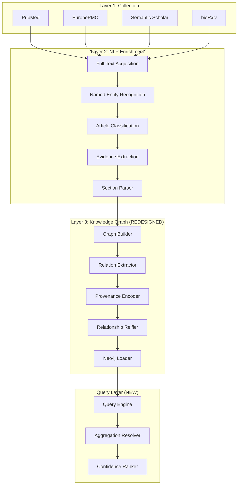
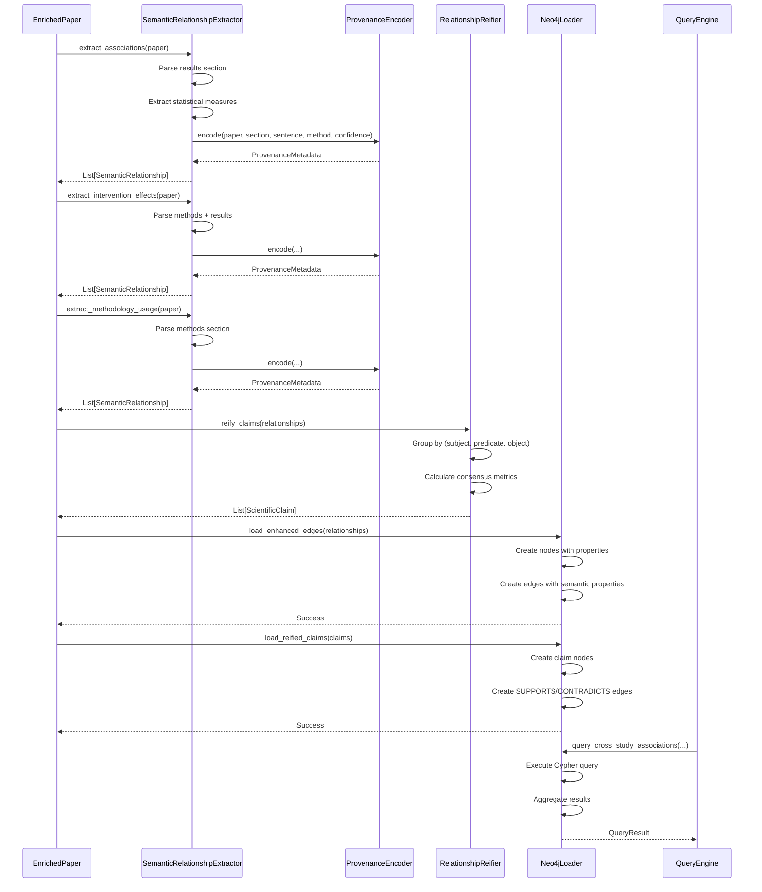

# Design Document: Scientific Knowledge Graph Core

## Overview

This design transforms the microbiome research literature mining system from a "pipeline that stores data in a graph database" into a true "scientific knowledge graph that enables discovery." The current system suffers from five critical problems: (1) no defined scientific questions, (2) relationships that store adjacency rather than scientific semantics, (3) missing provenance tracking, (4) non-deterministic entity creation, and (5) inability to answer research queries.

The redesigned system addresses these problems by: (1) defining three concrete scientific questions the graph must answer, (2) redesigning relationships to carry rich scientific semantics with evidence properties, (3) implementing comprehensive provenance tracking from source sentence to graph edge, (4) introducing relationship reification to support complex scientific claims, and (5) providing five research queries that demonstrate scientific value.

This design maintains the existing three-layer architecture (Collection → NLP Enrichment → Knowledge Graph) but fundamentally reimagines Layer 3 to support scientific discovery rather than mere data storage.

## Three Core Scientific Questions

The knowledge graph is designed to answer these specific research questions:

**Q1: Cross-Study Disease-Microbiome Associations**
"Which gut microbiome taxa show consistent association with Type 2 Diabetes across RCT studies with open sequencing data?"

**Q2: Evidence-Based Intervention Effectiveness**
"What interventions (probiotics, FMT, diet) have RCT-level evidence for modifying specific gut taxa, and what effect directions are reported?"

**Q3: Data Availability and Methodology Landscape**
"Which microbiome studies from 2024-2026 deposited data on SRA/ENA and used shotgun metagenomics vs 16S sequencing?"

These questions drive all design decisions: schema structure, relationship properties, provenance requirements, and query patterns.

## Architecture

### System Overview



### Data Flow Transformation

**Current (Wrong):**
```
EnrichedPaper → Extract entities → Create nodes → Create flat edges → Load to Neo4j
                                                    ↓
                                            (Paper)-[:HAS_TAXON]->(Taxon)
                                            No provenance, no semantics
```

**Redesigned (Correct):**
```
EnrichedPaper → Extract entities → Parse sections → Extract evidence claims
                                                            ↓
                                    Create rich relationships with provenance
                                                            ↓
                        (Paper)-[:REPORTS_ASSOCIATION {
                            direction: "increased",
                            comparison: "T2D vs healthy",
                            statistical_measure: "LDA score",
                            effect_size: 3.2,
                            p_value: 0.001,
                            section: "results",
                            source_sentence: "Bacteroides...",
                            confidence: 0.87,
                            extraction_method: "llm_v1.2"
                        }]->(Taxon)
```


## Components and Interfaces

### Component 1: Provenance Encoder

**Purpose**: Tracks the complete lineage of every graph edge from source text to final relationship

**Interface**:
```python
from typing import Optional, Dict, Any
from pydantic import BaseModel
from datetime import datetime

class ProvenanceMetadata(BaseModel):
    """Complete provenance information for a graph relationship"""
    
    # Source identification
    paper_id: str  # DOI, PMID, or title
    section_type: str  # abstract | methods | results | discussion
    source_sentence: str  # Exact sentence that supports this relationship
    sentence_offset: Optional[int] = None  # Character offset in section
    
    # Extraction metadata
    extraction_method: str  # regex_ner | biobert_ner | llm_extractor_v1.2
    extraction_timestamp: datetime
    extractor_version: str  # Version of the extraction model/method
    llm_prompt_hash: Optional[str] = None  # Hash of LLM prompt if applicable
    
    # Confidence and validation
    confidence_score: float  # 0.0 - 1.0
    validation_status: str  # unvalidated | human_verified | cross_validated
    validator_id: Optional[str] = None  # User ID if human-validated
    
    # Context
    surrounding_context: Optional[str] = None  # ±2 sentences for context
    figure_table_ref: Optional[str] = None  # If claim references a figure/table

class ProvenanceEncoder:
    """Encodes provenance metadata for graph relationships"""
    
    def encode(
        self,
        paper: EnrichedPaperRecord,
        section: ParsedSection,
        sentence: str,
        extraction_method: str,
        confidence: float
    ) -> ProvenanceMetadata:
        """
        Create provenance metadata for a relationship extracted from text
        
        Preconditions:
        - paper is a valid EnrichedPaperRecord with non-null identifier
        - section is a ParsedSection from paper.sections
        - sentence is a non-empty string from section.content
        - extraction_method is a registered extractor identifier
        - confidence is in range [0.0, 1.0]
        
        Postconditions:
        - Returns ProvenanceMetadata with all required fields populated
        - extraction_timestamp is set to current UTC time
        - source_sentence exactly matches input sentence
        """
        pass
    
    def validate_provenance(self, provenance: ProvenanceMetadata) -> bool:
        """
        Verify that provenance metadata is complete and valid
        
        Preconditions:
        - provenance is a ProvenanceMetadata instance
        
        Postconditions:
        - Returns True if all required fields are present and valid
        - Returns False if any field is missing or invalid
        """
        pass
```

**Responsibilities**:
- Create complete provenance records for every extracted relationship
- Track extraction method, version, and timestamp
- Link relationships back to source sentences and sections
- Support validation and human verification workflows
- Enable reproducibility by recording extractor versions and prompts


### Component 2: Relationship Reifier

**Purpose**: Converts complex scientific claims into first-class graph entities to support multi-paper evidence aggregation

**Interface**:
```python
from typing import List, Optional
from pydantic import BaseModel
from enum import Enum

class EvidenceStrength(str, Enum):
    STRONG = "strong"  # RCT, meta-analysis, p < 0.01
    MODERATE = "moderate"  # Observational with controls, p < 0.05
    WEAK = "weak"  # Case reports, p < 0.1
    CONFLICTING = "conflicting"  # Multiple papers with opposite findings

class ScientificClaim(BaseModel):
    """A reified scientific claim that can be supported by multiple papers"""
    
    claim_id: str  # UUID for this claim
    claim_type: str  # association | intervention_effect | methodology_comparison
    
    # Claim content
    subject_entity: str  # e.g., "Bacteroides fragilis"
    predicate: str  # e.g., "associated_with_increased_abundance"
    object_entity: str  # e.g., "Type 2 Diabetes"
    
    # Aggregated evidence
    supporting_papers: List[str]  # List of paper IDs
    contradicting_papers: List[str]  # Papers with opposite findings
    total_sample_size: int  # Sum across all supporting papers
    
    # Consensus metrics
    evidence_strength: EvidenceStrength
    consensus_confidence: float  # 0.0 - 1.0, based on agreement across papers
    effect_direction_consistency: float  # % of papers agreeing on direction
    
    # Temporal tracking
    first_reported: str  # ISO date of earliest supporting paper
    last_updated: str  # ISO date of most recent supporting paper
    
    # Statistical aggregation
    pooled_effect_size: Optional[float] = None
    effect_size_variance: Optional[float] = None
    meta_analysis_performed: bool = False

class RelationshipReifier:
    """Reifies relationships into first-class claim entities"""
    
    def reify_claim(
        self,
        subject: str,
        predicate: str,
        object: str,
        supporting_evidence: List[ProvenanceMetadata]
    ) -> ScientificClaim:
        """
        Create a reified claim from multiple pieces of evidence
        
        Preconditions:
        - subject, predicate, object are non-empty strings
        - supporting_evidence contains at least one ProvenanceMetadata
        - All evidence items have confidence_score >= 0.5
        
        Postconditions:
        - Returns ScientificClaim with unique claim_id
        - supporting_papers list matches evidence sources
        - consensus_confidence reflects agreement across evidence
        - evidence_strength determined by study designs in supporting papers
        """
        pass
    
    def update_claim_with_new_evidence(
        self,
        claim: ScientificClaim,
        new_evidence: ProvenanceMetadata,
        supports: bool
    ) -> ScientificClaim:
        """
        Update an existing claim with new supporting or contradicting evidence
        
        Preconditions:
        - claim is a valid ScientificClaim
        - new_evidence is valid ProvenanceMetadata
        - supports is True if evidence supports claim, False if contradicts
        
        Postconditions:
        - Returns updated ScientificClaim
        - Paper ID added to supporting_papers or contradicting_papers
        - consensus_confidence recalculated
        - last_updated timestamp updated to current time
        """
        pass
    
    def detect_conflicting_claims(
        self,
        claims: List[ScientificClaim]
    ) -> List[tuple[ScientificClaim, ScientificClaim]]:
        """
        Identify pairs of claims that contradict each other
        
        Preconditions:
        - claims is a non-empty list of ScientificClaim objects
        
        Postconditions:
        - Returns list of claim pairs with opposite predicates
        - Only returns pairs with same subject and object
        - Empty list if no conflicts found
        """
        pass
```

**Responsibilities**:
- Convert relationships into first-class claim entities
- Aggregate evidence from multiple papers
- Track consensus and conflicts across studies
- Calculate evidence strength based on study designs
- Support temporal evolution of scientific understanding


### Component 3: Semantic Relationship Extractor

**Purpose**: Extracts rich scientific relationships with semantic properties instead of flat adjacency

**Interface**:
```python
from typing import List, Dict, Any, Optional
from pydantic import BaseModel

class SemanticRelationship(BaseModel):
    """A relationship with rich scientific semantics"""
    
    # Core relationship
    source_entity: str
    target_entity: str
    relation_type: str  # REPORTS_ASSOCIATION | REPORTS_INTERVENTION_EFFECT | USES_METHODOLOGY
    
    # Scientific semantics (relation-type specific)
    properties: Dict[str, Any]
    # For REPORTS_ASSOCIATION:
    #   - direction: "increased" | "decreased" | "no_change"
    #   - comparison: "disease vs healthy" | "pre vs post"
    #   - statistical_measure: "LDA score" | "fold change" | "relative abundance"
    #   - effect_size: float
    #   - p_value: float
    #   - adjusted_p_value: Optional[float]
    # For REPORTS_INTERVENTION_EFFECT:
    #   - intervention_type: "probiotic" | "FMT" | "diet" | "antibiotic"
    #   - effect_direction: "increased" | "decreased"
    #   - duration: "4 weeks" | "6 months"
    #   - dosage: Optional[str]
    # For USES_METHODOLOGY:
    #   - method_name: "16S rRNA" | "shotgun metagenomics"
    #   - sequencing_platform: "Illumina" | "PacBio"
    #   - sample_size: int
    
    # Provenance
    provenance: ProvenanceMetadata
    
    # Quality indicators
    evidence_strength: str  # strong | moderate | weak
    extraction_confidence: float

class SemanticRelationshipExtractor:
    """Extracts relationships with scientific semantics from enriched papers"""
    
    def extract_associations(
        self,
        paper: EnrichedPaperRecord
    ) -> List[SemanticRelationship]:
        """
        Extract taxon-disease associations with statistical properties
        
        Preconditions:
        - paper has non-empty sections list
        - paper.sections contains at least one "results" section
        - paper.entities contains at least one taxon and one disease
        
        Postconditions:
        - Returns list of REPORTS_ASSOCIATION relationships
        - Each relationship has complete provenance
        - properties dict contains direction, comparison, statistical_measure
        - extraction_confidence >= 0.5 for all returned relationships
        """
        pass
    
    def extract_intervention_effects(
        self,
        paper: EnrichedPaperRecord
    ) -> List[SemanticRelationship]:
        """
        Extract intervention-taxon effects from RCT or intervention studies
        
        Preconditions:
        - paper.article_type_normalized in ["original_research", "meta_analysis"]
        - paper.sections contains "methods" and "results" sections
        - paper.entities contains at least one treatment entity
        
        Postconditions:
        - Returns list of REPORTS_INTERVENTION_EFFECT relationships
        - Each relationship has intervention_type, effect_direction, duration
        - Only includes relationships with p_value < 0.05 or explicit significance
        """
        pass
    
    def extract_methodology_usage(
        self,
        paper: EnrichedPaperRecord
    ) -> List[SemanticRelationship]:
        """
        Extract methodology information (sequencing type, sample size, data availability)
        
        Preconditions:
        - paper.sections contains "methods" section
        - paper.methods list is non-empty
        
        Postconditions:
        - Returns list of USES_METHODOLOGY relationships
        - Each relationship links paper to method with sample_size if available
        - Includes data_availability status from paper.data_availability
        """
        pass
```

**Responsibilities**:
- Extract relationships with rich semantic properties
- Parse statistical measures, effect sizes, and p-values from text
- Identify intervention types and effect directions
- Link methodology information to papers
- Ensure all relationships have complete provenance


### Component 4: Research Query Engine

**Purpose**: Executes scientific queries that answer the three core research questions

**Interface**:
```python
from typing import List, Dict, Any, Optional
from pydantic import BaseModel

class QueryResult(BaseModel):
    """Result from a research query"""
    
    query_id: str
    query_description: str
    results: List[Dict[str, Any]]
    result_count: int
    execution_time_ms: float
    
    # Aggregation metadata
    aggregation_method: Optional[str] = None
    confidence_threshold: Optional[float] = None

class ResearchQueryEngine:
    """Executes scientific research queries against the knowledge graph"""
    
    def query_cross_study_associations(
        self,
        disease: str,
        study_type: str = "RCT",
        min_papers: int = 3,
        confidence_threshold: float = 0.7,
        require_open_data: bool = True
    ) -> QueryResult:
        """
        Q1: Find taxa with consistent disease associations across multiple studies
        
        Example: "Which gut microbiome taxa show consistent association with 
        Type 2 Diabetes across RCT studies with open sequencing data?"
        
        Preconditions:
        - disease is a valid disease entity in the graph
        - study_type in ["RCT", "observational", "meta_analysis", "any"]
        - min_papers >= 1
        - confidence_threshold in [0.0, 1.0]
        
        Postconditions:
        - Returns taxa mentioned in >= min_papers papers
        - All results have consensus_confidence >= confidence_threshold
        - If require_open_data=True, only includes papers with data_availability="open"
        - Results sorted by consensus_confidence descending
        
        Cypher Query Pattern:
        MATCH (p:Paper)-[r:REPORTS_ASSOCIATION]->(t:Taxon)
        WHERE r.disease = $disease
          AND r.confidence >= $threshold
          AND p.article_type = $study_type
          AND (NOT $require_open_data OR p.data_availability = "open")
        WITH t, collect(p) as papers, 
             avg(r.confidence) as avg_conf,
             collect(r.direction) as directions
        WHERE size(papers) >= $min_papers
        RETURN t.name, papers, avg_conf, 
               size([d IN directions WHERE d = "increased"]) as increased_count,
               size([d IN directions WHERE d = "decreased"]) as decreased_count
        ORDER BY avg_conf DESC
        """
        pass
    
    def query_intervention_evidence(
        self,
        intervention_types: List[str],
        min_sample_size: int = 50,
        evidence_strength: str = "strong"
    ) -> QueryResult:
        """
        Q2: Find interventions with RCT-level evidence for modifying specific taxa
        
        Example: "What interventions (probiotics, FMT, diet) have RCT-level 
        evidence for modifying specific gut taxa, and what effect directions?"
        
        Preconditions:
        - intervention_types is non-empty list of intervention names
        - min_sample_size >= 1
        - evidence_strength in ["strong", "moderate", "weak", "any"]
        
        Postconditions:
        - Returns interventions with article_type="original_research" or "meta_analysis"
        - All results have total_sample_size >= min_sample_size
        - Results grouped by (intervention, taxon, effect_direction)
        - Includes count of supporting papers for each combination
        
        Cypher Query Pattern:
        MATCH (p:Paper)-[r:REPORTS_INTERVENTION_EFFECT]->(t:Taxon)
        WHERE r.intervention_type IN $intervention_types
          AND r.evidence_strength = $evidence_strength
          AND r.sample_size >= $min_sample_size
        WITH r.intervention_type as intervention,
             t.name as taxon,
             r.effect_direction as direction,
             collect(p) as papers,
             sum(r.sample_size) as total_samples
        RETURN intervention, taxon, direction, 
               size(papers) as paper_count,
               total_samples
        ORDER BY paper_count DESC, total_samples DESC
        """
        pass

    
    def query_methodology_landscape(
        self,
        year_start: int,
        year_end: int,
        sequencing_methods: List[str],
        require_deposited_data: bool = True
    ) -> QueryResult:
        """
        Q3: Survey data availability and methodology across time period
        
        Example: "Which microbiome studies from 2024-2026 deposited data on 
        SRA/ENA and used shotgun metagenomics vs 16S sequencing?"
        
        Preconditions:
        - year_start <= year_end
        - sequencing_methods is non-empty list
        - All methods in sequencing_methods are valid method entities
        
        Postconditions:
        - Returns papers published between year_start and year_end (inclusive)
        - If require_deposited_data=True, only papers with accession_numbers
        - Results grouped by (method, year, repository)
        - Includes counts and percentages
        
        Cypher Query Pattern:
        MATCH (p:Paper)-[r:USES_METHODOLOGY]->(m:Method)
        WHERE p.year >= $year_start AND p.year <= $year_end
          AND m.name IN $sequencing_methods
          AND (NOT $require_deposited_data OR size(p.accession_numbers) > 0)
        WITH m.name as method,
             p.year as year,
             collect(p) as papers,
             [p IN collect(p) WHERE size(p.accession_numbers) > 0] as with_data
        RETURN method, year,
               size(papers) as total_papers,
               size(with_data) as papers_with_data,
               100.0 * size(with_data) / size(papers) as data_availability_pct
        ORDER BY year DESC, method ASC
        """
        pass
    
    def query_top_associations_by_evidence(
        self,
        disease: str,
        top_n: int = 10,
        min_confidence: float = 0.7
    ) -> QueryResult:
        """
        Q4: Find top taxa associated with a disease ranked by evidence quality
        
        Example: "Top 10 taxa associated with IBD across >3 papers with confidence >0.7"
        
        Preconditions:
        - disease is a valid disease entity
        - top_n >= 1
        - min_confidence in [0.0, 1.0]
        
        Postconditions:
        - Returns at most top_n taxa
        - All results have confidence >= min_confidence
        - Results sorted by (paper_count DESC, avg_confidence DESC)
        - Includes aggregated statistics for each taxon
        """
        pass
    
    def query_conflicting_evidence(
        self,
        disease: str,
        min_papers_per_direction: int = 2
    ) -> QueryResult:
        """
        Q5: Find taxa with conflicting associations (increased vs decreased)
        
        Example: "Which taxa show conflicting associations for Crohn's disease?"
        
        Preconditions:
        - disease is a valid disease entity
        - min_papers_per_direction >= 1
        
        Postconditions:
        - Returns taxa with both "increased" and "decreased" associations
        - Each direction has >= min_papers_per_direction supporting papers
        - Results include paper counts for each direction
        - Sorted by total paper count descending
        """
        pass
```

**Responsibilities**:
- Execute the five core research queries
- Aggregate evidence across multiple papers
- Apply confidence thresholds and filters
- Return structured results with metadata
- Generate Cypher queries optimized for Neo4j


## Data Models

### Model 1: Enhanced Graph Edge Schema

```python
from typing import Optional, Dict, Any
from pydantic import BaseModel, Field
from datetime import datetime

class EnhancedGraphEdge(BaseModel):
    """Graph edge with scientific semantics and complete provenance"""
    
    # Core relationship
    source: str  # Source node ID
    target: str  # Target node ID
    relation: str  # Relationship type
    
    # Scientific semantics (relation-specific properties)
    direction: Optional[str] = None  # increased | decreased | no_change
    comparison: Optional[str] = None  # "T2D vs healthy" | "pre vs post"
    statistical_measure: Optional[str] = None  # LDA score | fold change | etc.
    effect_size: Optional[float] = None
    p_value: Optional[float] = None
    adjusted_p_value: Optional[float] = None
    
    # Intervention-specific properties
    intervention_type: Optional[str] = None  # probiotic | FMT | diet
    duration: Optional[str] = None  # "4 weeks" | "6 months"
    dosage: Optional[str] = None
    
    # Methodology-specific properties
    method_name: Optional[str] = None  # "16S rRNA" | "shotgun metagenomics"
    sequencing_platform: Optional[str] = None  # Illumina | PacBio
    sample_size: Optional[int] = None
    
    # Provenance (embedded)
    section: str  # abstract | methods | results | discussion
    source_sentence: str  # Exact sentence supporting this relationship
    sentence_offset: Optional[int] = None
    extraction_method: str  # regex_ner | biobert_ner | llm_extractor_v1.2
    extraction_timestamp: datetime
    extractor_version: str
    llm_prompt_hash: Optional[str] = None
    
    # Quality indicators
    confidence: float = Field(ge=0.0, le=1.0)
    evidence_strength: str  # strong | moderate | weak
    validation_status: str = "unvalidated"  # unvalidated | human_verified
    
    # Context
    surrounding_context: Optional[str] = None
    figure_table_ref: Optional[str] = None

class GraphEdgeFactory:
    """Factory for creating enhanced graph edges with validation"""
    
    @staticmethod
    def create_association_edge(
        paper_id: str,
        taxon: str,
        disease: str,
        direction: str,
        statistical_measure: str,
        effect_size: float,
        p_value: float,
        provenance: ProvenanceMetadata
    ) -> EnhancedGraphEdge:
        """
        Create a REPORTS_ASSOCIATION edge with validation
        
        Preconditions:
        - direction in ["increased", "decreased", "no_change"]
        - effect_size is a valid float
        - p_value in [0.0, 1.0]
        - provenance is complete and valid
        
        Postconditions:
        - Returns EnhancedGraphEdge with relation="REPORTS_ASSOCIATION"
        - All scientific semantic fields populated
        - Provenance fields embedded from provenance parameter
        """
        pass
```

**Validation Rules**:
- All edges must have non-null source, target, relation
- confidence must be in range [0.0, 1.0]
- p_value (if present) must be in range [0.0, 1.0]
- direction (if present) must be in ["increased", "decreased", "no_change"]
- evidence_strength must be in ["strong", "moderate", "weak"]
- source_sentence must be non-empty
- extraction_method must be a registered extractor identifier


### Model 2: Reified Claim Node Schema

```python
from typing import List, Optional
from pydantic import BaseModel, Field
from datetime import datetime

class ReifiedClaimNode(BaseModel):
    """A scientific claim as a first-class graph node"""
    
    # Node identification
    node_id: str  # UUID for this claim node
    node_type: str = "ScientificClaim"
    
    # Claim structure
    claim_type: str  # association | intervention_effect | methodology_comparison
    subject_entity: str  # Entity ID (e.g., taxon ID)
    predicate: str  # Normalized predicate (e.g., "increases_in")
    object_entity: str  # Entity ID (e.g., disease ID)
    
    # Evidence aggregation
    supporting_paper_ids: List[str] = Field(default_factory=list)
    contradicting_paper_ids: List[str] = Field(default_factory=list)
    total_sample_size: int = 0
    
    # Consensus metrics
    evidence_strength: str  # strong | moderate | weak | conflicting
    consensus_confidence: float = Field(ge=0.0, le=1.0)
    effect_direction_consistency: float = Field(ge=0.0, le=1.0)
    
    # Statistical aggregation
    pooled_effect_size: Optional[float] = None
    effect_size_variance: Optional[float] = None
    pooled_p_value: Optional[float] = None
    heterogeneity_i2: Optional[float] = None  # I² statistic for meta-analysis
    
    # Temporal tracking
    first_reported: datetime
    last_updated: datetime
    
    # Metadata
    meta_analysis_performed: bool = False
    meta_analysis_method: Optional[str] = None  # random_effects | fixed_effects
    created_by: str = "system"  # system | user_id
    
class ClaimNodeFactory:
    """Factory for creating and updating reified claim nodes"""
    
    @staticmethod
    def create_from_edges(
        edges: List[EnhancedGraphEdge]
    ) -> ReifiedClaimNode:
        """
        Create a reified claim node from multiple edges with same subject/predicate/object
        
        Preconditions:
        - edges is non-empty list
        - All edges have same source entity type, relation, and target entity type
        - All edges have confidence >= 0.5
        
        Postconditions:
        - Returns ReifiedClaimNode with unique node_id
        - supporting_paper_ids contains all unique paper IDs from edges
        - consensus_confidence is weighted average of edge confidences
        - effect_direction_consistency calculated from edge directions
        - first_reported is earliest extraction_timestamp from edges
        """
        pass
    
    @staticmethod
    def update_with_new_edge(
        claim: ReifiedClaimNode,
        edge: EnhancedGraphEdge,
        supports: bool
    ) -> ReifiedClaimNode:
        """
        Update claim node with new supporting or contradicting evidence
        
        Preconditions:
        - claim is a valid ReifiedClaimNode
        - edge is a valid EnhancedGraphEdge
        - edge.source matches claim.subject_entity or edge.target matches claim.object_entity
        
        Postconditions:
        - Paper ID added to supporting_paper_ids or contradicting_paper_ids
        - consensus_confidence recalculated
        - last_updated set to current timestamp
        - If contradicting evidence added, evidence_strength may change to "conflicting"
        """
        pass
```

**Validation Rules**:
- claim_type must be in ["association", "intervention_effect", "methodology_comparison"]
- evidence_strength must be in ["strong", "moderate", "weak", "conflicting"]
- consensus_confidence must be in [0.0, 1.0]
- effect_direction_consistency must be in [0.0, 1.0]
- supporting_paper_ids and contradicting_paper_ids must not overlap
- first_reported <= last_updated


## Main Algorithm/Workflow

### Knowledge Graph Construction Sequence




## Algorithmic Pseudocode

### Algorithm 1: Extract Semantic Associations

```python
def extract_associations(paper: EnrichedPaperRecord) -> List[SemanticRelationship]:
    """
    Extract taxon-disease associations with statistical properties from paper
    
    INPUT: paper of type EnrichedPaperRecord
    OUTPUT: relationships of type List[SemanticRelationship]
    
    PRECONDITIONS:
    - paper.sections is non-empty
    - paper.sections contains at least one section with section_type="results"
    - paper.entities contains at least one taxon and one disease entity
    
    POSTCONDITIONS:
    - All returned relationships have relation_type="REPORTS_ASSOCIATION"
    - All relationships have complete provenance metadata
    - All relationships have extraction_confidence >= 0.5
    - properties dict contains direction, comparison, statistical_measure
    """
    
    relationships = []
    
    # Step 1: Find results sections
    results_sections = [s for s in paper.sections if s.section_type == "results"]
    
    ASSERT len(results_sections) > 0, "Must have at least one results section"
    
    # Step 2: Extract taxa and diseases from entities
    taxa = [e.text for e in paper.entities if e.label == "taxon"]
    diseases = [e.text for e in paper.entities if e.label == "disease"]
    
    ASSERT len(taxa) > 0 and len(diseases) > 0, "Must have taxa and diseases"
    
    # Step 3: Process each results section
    for section in results_sections:
        sentences = split_into_sentences(section.content)
        
        # Loop invariant: All processed sentences have been checked for associations
        for sentence in sentences:
            # Step 3a: Check if sentence mentions both taxon and disease
            mentioned_taxa = [t for t in taxa if t.lower() in sentence.lower()]
            mentioned_diseases = [d for d in diseases if d.lower() in sentence.lower()]
            
            if not mentioned_taxa or not mentioned_diseases:
                continue
            
            # Step 3b: Extract statistical information
            stats = extract_statistical_measures(sentence)
            
            if not stats or not stats.has_significance():
                continue
            
            # Step 3c: Determine effect direction
            direction = determine_direction(sentence, mentioned_taxa[0])
            
            if direction == "unknown":
                continue
            
            # Step 3d: Create provenance metadata
            provenance = ProvenanceEncoder().encode(
                paper=paper,
                section=section,
                sentence=sentence,
                extraction_method="statistical_pattern_extractor_v1.0",
                confidence=stats.confidence
            )
            
            # Step 3e: Create semantic relationship
            for taxon in mentioned_taxa:
                for disease in mentioned_diseases:
                    rel = SemanticRelationship(
                        source_entity=taxon,
                        target_entity=disease,
                        relation_type="REPORTS_ASSOCIATION",
                        properties={
                            "direction": direction,
                            "comparison": stats.comparison,
                            "statistical_measure": stats.measure_type,
                            "effect_size": stats.effect_size,
                            "p_value": stats.p_value,
                            "adjusted_p_value": stats.adjusted_p_value
                        },
                        provenance=provenance,
                        evidence_strength=classify_evidence_strength(paper, stats),
                        extraction_confidence=stats.confidence
                    )
                    
                    relationships.append(rel)
    
    ASSERT all(r.extraction_confidence >= 0.5 for r in relationships), \
           "All relationships must have confidence >= 0.5"
    
    return relationships
```

**Loop Invariants:**
- All previously processed sentences have been checked for taxon-disease co-mentions
- All relationships added to list have complete provenance
- relationships list contains only valid SemanticRelationship objects


### Algorithm 2: Reify Scientific Claims

```python
def reify_claims(
    relationships: List[SemanticRelationship]
) -> List[ReifiedClaimNode]:
    """
    Group relationships by (subject, predicate, object) and create reified claim nodes
    
    INPUT: relationships of type List[SemanticRelationship]
    OUTPUT: claims of type List[ReifiedClaimNode]
    
    PRECONDITIONS:
    - relationships is non-empty
    - All relationships have valid provenance
    - All relationships have extraction_confidence >= 0.5
    
    POSTCONDITIONS:
    - Each claim represents a unique (subject, predicate, object) triple
    - Each claim aggregates evidence from all matching relationships
    - consensus_confidence reflects agreement across papers
    - Claims with contradicting evidence have evidence_strength="conflicting"
    """
    
    claims = []
    
    # Step 1: Group relationships by (subject, predicate, object)
    grouped = {}
    
    for rel in relationships:
        # Create normalized key
        key = (
            normalize_entity(rel.source_entity),
            normalize_predicate(rel.relation_type, rel.properties.get("direction")),
            normalize_entity(rel.target_entity)
        )
        
        if key not in grouped:
            grouped[key] = []
        
        grouped[key].append(rel)
    
    ASSERT len(grouped) > 0, "Must have at least one claim group"
    
    # Step 2: Create reified claim for each group
    for (subject, predicate, object), rels in grouped.items():
        
        # Step 2a: Extract paper IDs and check for conflicts
        paper_ids = set()
        directions = []
        effect_sizes = []
        confidences = []
        sample_sizes = []
        
        # Loop invariant: All processed relationships contribute to aggregation
        for rel in rels:
            paper_id = extract_paper_id(rel.provenance.paper_id)
            paper_ids.add(paper_id)
            
            if "direction" in rel.properties:
                directions.append(rel.properties["direction"])
            
            if "effect_size" in rel.properties:
                effect_sizes.append(rel.properties["effect_size"])
            
            confidences.append(rel.extraction_confidence)
            
            if "sample_size" in rel.properties:
                sample_sizes.append(rel.properties["sample_size"])
        
        # Step 2b: Calculate consensus metrics
        direction_counts = count_directions(directions)
        most_common_direction = max(direction_counts, key=direction_counts.get)
        direction_consistency = direction_counts[most_common_direction] / len(directions)
        
        # Step 2c: Determine evidence strength
        evidence_strength = determine_evidence_strength(
            paper_count=len(paper_ids),
            direction_consistency=direction_consistency,
            avg_confidence=sum(confidences) / len(confidences)
        )
        
        # Step 2d: Calculate statistical aggregation
        pooled_effect = None
        effect_variance = None
        
        if len(effect_sizes) >= 2:
            pooled_effect = calculate_pooled_effect(effect_sizes)
            effect_variance = calculate_variance(effect_sizes)
        
        # Step 2e: Create reified claim node
        claim = ReifiedClaimNode(
            node_id=generate_uuid(),
            claim_type=infer_claim_type(predicate),
            subject_entity=subject,
            predicate=predicate,
            object_entity=object,
            supporting_paper_ids=list(paper_ids),
            contradicting_paper_ids=[],
            total_sample_size=sum(sample_sizes) if sample_sizes else 0,
            evidence_strength=evidence_strength,
            consensus_confidence=sum(confidences) / len(confidences),
            effect_direction_consistency=direction_consistency,
            pooled_effect_size=pooled_effect,
            effect_size_variance=effect_variance,
            first_reported=min(rel.provenance.extraction_timestamp for rel in rels),
            last_updated=max(rel.provenance.extraction_timestamp for rel in rels)
        )
        
        claims.append(claim)
    
    ASSERT all(c.consensus_confidence >= 0.5 for c in claims), \
           "All claims must have consensus confidence >= 0.5"
    
    return claims
```

**Loop Invariants:**
- All relationships in current group have same (subject, predicate, object)
- All processed relationships have contributed to aggregation metrics
- paper_ids set contains no duplicates


### Algorithm 3: Execute Cross-Study Association Query

```python
def query_cross_study_associations(
    disease: str,
    study_type: str = "RCT",
    min_papers: int = 3,
    confidence_threshold: float = 0.7,
    require_open_data: bool = True
) -> QueryResult:
    """
    Find taxa with consistent disease associations across multiple studies
    
    INPUT: 
    - disease: disease entity identifier
    - study_type: "RCT" | "observational" | "meta_analysis" | "any"
    - min_papers: minimum number of supporting papers
    - confidence_threshold: minimum confidence score
    - require_open_data: filter for open data availability
    
    OUTPUT: QueryResult with aggregated taxa associations
    
    PRECONDITIONS:
    - disease is a valid disease entity in the graph
    - study_type in ["RCT", "observational", "meta_analysis", "any"]
    - min_papers >= 1
    - confidence_threshold in [0.0, 1.0]
    
    POSTCONDITIONS:
    - All returned taxa appear in >= min_papers papers
    - All results have consensus_confidence >= confidence_threshold
    - If require_open_data=True, only papers with data_availability="open"
    - Results sorted by consensus_confidence descending
    """
    
    # Step 1: Build Cypher query with filters
    cypher_query = """
    MATCH (p:Paper)-[r:REPORTS_ASSOCIATION]->(t:Taxon)
    WHERE r.object_entity = $disease
      AND r.confidence >= $threshold
    """
    
    # Add study type filter if not "any"
    if study_type != "any":
        cypher_query += " AND p.article_type = $study_type"
    
    # Add data availability filter if required
    if require_open_data:
        cypher_query += " AND p.data_availability = 'open'"
    
    # Step 2: Aggregate by taxon
    cypher_query += """
    WITH t, 
         collect(DISTINCT p) as papers,
         collect(r.direction) as directions,
         collect(r.confidence) as confidences,
         collect(r.effect_size) as effect_sizes,
         collect(r.p_value) as p_values
    WHERE size(papers) >= $min_papers
    """
    
    # Step 3: Calculate aggregation metrics
    cypher_query += """
    WITH t,
         papers,
         size(papers) as paper_count,
         avg([c IN confidences WHERE c IS NOT NULL]) as avg_confidence,
         size([d IN directions WHERE d = 'increased']) as increased_count,
         size([d IN directions WHERE d = 'decreased']) as decreased_count,
         avg([e IN effect_sizes WHERE e IS NOT NULL]) as avg_effect_size,
         [p IN p_values WHERE p IS NOT NULL AND p < 0.05] as significant_p_values
    """
    
    # Step 4: Calculate direction consistency
    cypher_query += """
    WITH t,
         papers,
         paper_count,
         avg_confidence,
         increased_count,
         decreased_count,
         avg_effect_size,
         size(significant_p_values) as significant_count,
         CASE 
           WHEN increased_count > decreased_count THEN 'increased'
           WHEN decreased_count > increased_count THEN 'decreased'
           ELSE 'mixed'
         END as consensus_direction,
         CASE
           WHEN increased_count > decreased_count 
             THEN toFloat(increased_count) / (increased_count + decreased_count)
           WHEN decreased_count > increased_count
             THEN toFloat(decreased_count) / (increased_count + decreased_count)
           ELSE 0.5
         END as direction_consistency
    """
    
    # Step 5: Return results sorted by confidence
    cypher_query += """
    RETURN t.name as taxon,
           paper_count,
           avg_confidence as consensus_confidence,
           consensus_direction,
           direction_consistency,
           avg_effect_size,
           significant_count,
           [p IN papers | p.doi] as paper_dois
    ORDER BY avg_confidence DESC, paper_count DESC
    """
    
    # Step 6: Execute query
    start_time = current_time_ms()
    
    with neo4j_driver.session() as session:
        result = session.run(
            cypher_query,
            disease=disease,
            threshold=confidence_threshold,
            study_type=study_type,
            min_papers=min_papers
        )
        
        records = [dict(record) for record in result]
    
    execution_time = current_time_ms() - start_time
    
    # Step 7: Package results
    query_result = QueryResult(
        query_id=generate_uuid(),
        query_description=f"Cross-study associations for {disease}",
        results=records,
        result_count=len(records),
        execution_time_ms=execution_time,
        aggregation_method="consensus_confidence",
        confidence_threshold=confidence_threshold
    )
    
    ASSERT all(r["consensus_confidence"] >= confidence_threshold for r in records), \
           "All results must meet confidence threshold"
    
    ASSERT all(r["paper_count"] >= min_papers for r in records), \
           "All results must meet minimum paper count"
    
    return query_result
```

**Loop Invariants:**
- All aggregated papers meet the study_type filter
- All aggregated relationships have confidence >= threshold
- Direction consistency is always in range [0.0, 1.0]


## Neo4j Graph Schema

### Node Types

```cypher
// Paper node with metadata
CREATE (p:Paper {
  id: "doi:10.1234/example",
  title: "Gut microbiome in Type 2 Diabetes",
  year: 2024,
  article_type: "original_research",
  quality_score: 0.85,
  data_availability: "open",
  accession_numbers: ["PRJNA123456", "GSE98765"],
  sample_size: 150,
  study_design: "RCT"
})

// Taxon node with ontology grounding
CREATE (t:Taxon {
  id: "ncbi:817",
  name: "Bacteroides fragilis",
  canonical_name: "Bacteroides fragilis",
  ontology: "NCBI Taxonomy",
  rank: "species"
})

// Disease node with ontology grounding
CREATE (d:Disease {
  id: "mesh:D003924",
  name: "Type 2 Diabetes",
  canonical_name: "Diabetes Mellitus, Type 2",
  ontology: "MeSH"
})

// Method node
CREATE (m:Method {
  id: "method:16s_rrna",
  name: "16S rRNA sequencing",
  category: "sequencing"
})

// Reified claim node (NEW)
CREATE (c:ScientificClaim {
  id: "claim:uuid-1234",
  claim_type: "association",
  subject_entity: "ncbi:817",
  predicate: "increases_in",
  object_entity: "mesh:D003924",
  evidence_strength: "strong",
  consensus_confidence: 0.82,
  effect_direction_consistency: 0.85,
  total_sample_size: 450,
  first_reported: "2022-01-15",
  last_updated: "2024-11-20"
})
```

### Relationship Types with Semantic Properties

```cypher
// REPORTS_ASSOCIATION: Rich scientific semantics
CREATE (p:Paper)-[:REPORTS_ASSOCIATION {
  // Scientific semantics
  direction: "increased",
  comparison: "T2D vs healthy controls",
  statistical_measure: "LDA score",
  effect_size: 3.2,
  p_value: 0.001,
  adjusted_p_value: 0.008,
  
  // Provenance
  section: "results",
  source_sentence: "Bacteroides fragilis abundance was significantly higher in T2D patients (LDA=3.2, p<0.001)",
  sentence_offset: 1250,
  extraction_method: "statistical_pattern_extractor_v1.0",
  extraction_timestamp: "2024-11-20T10:30:00Z",
  extractor_version: "1.0",
  
  // Quality
  confidence: 0.87,
  evidence_strength: "strong",
  validation_status: "unvalidated",
  
  // Context
  surrounding_context: "...previous sentence. Bacteroides fragilis abundance was significantly higher in T2D patients (LDA=3.2, p<0.001). Next sentence...",
  figure_table_ref: "Figure 3A"
}]->(t:Taxon)

// REPORTS_INTERVENTION_EFFECT: Intervention-specific properties
CREATE (p:Paper)-[:REPORTS_INTERVENTION_EFFECT {
  // Intervention semantics
  intervention_type: "probiotic",
  intervention_name: "Lactobacillus rhamnosus GG",
  effect_direction: "increased",
  duration: "8 weeks",
  dosage: "10^9 CFU/day",
  
  // Statistical
  effect_size: 2.1,
  p_value: 0.02,
  sample_size: 80,
  
  // Provenance
  section: "results",
  source_sentence: "L. rhamnosus GG supplementation (10^9 CFU/day) for 8 weeks significantly increased Lactobacillus abundance (p=0.02)",
  extraction_method: "intervention_extractor_v1.0",
  extraction_timestamp: "2024-11-20T10:35:00Z",
  
  // Quality
  confidence: 0.79,
  evidence_strength: "moderate"
}]->(t:Taxon)

// USES_METHODOLOGY: Methodology-specific properties
CREATE (p:Paper)-[:USES_METHODOLOGY {
  // Method details
  method_name: "shotgun metagenomics",
  sequencing_platform: "Illumina NovaSeq",
  sample_size: 150,
  body_site: "gut",
  
  // Data availability
  data_deposited: true,
  repositories: ["NCBI SRA"],
  accession_numbers: ["PRJNA123456"],
  
  // Provenance
  section: "methods",
  source_sentence: "Shotgun metagenomic sequencing was performed on Illumina NovaSeq platform for 150 fecal samples",
  extraction_method: "method_extractor_v1.0",
  extraction_timestamp: "2024-11-20T10:32:00Z",
  
  // Quality
  confidence: 0.92
}]->(m:Method)
```


### Reified Claim Relationships (NEW)

```cypher
// Paper SUPPORTS a reified claim
CREATE (p:Paper)-[:SUPPORTS {
  confidence: 0.87,
  extraction_timestamp: "2024-11-20T10:30:00Z",
  source_sentence: "Bacteroides fragilis abundance was significantly higher...",
  effect_size: 3.2,
  p_value: 0.001
}]->(c:ScientificClaim)

// Paper CONTRADICTS a reified claim
CREATE (p:Paper)-[:CONTRADICTS {
  confidence: 0.75,
  extraction_timestamp: "2024-10-15T14:20:00Z",
  source_sentence: "No significant difference in Bacteroides fragilis abundance...",
  p_value: 0.45
}]->(c:ScientificClaim)

// Claim RELATES_TO entities
CREATE (c:ScientificClaim)-[:HAS_SUBJECT]->(t:Taxon)
CREATE (c:ScientificClaim)-[:HAS_OBJECT]->(d:Disease)
```

### Graph Indexes for Query Performance

```cypher
// Node indexes
CREATE INDEX paper_year FOR (p:Paper) ON (p.year);
CREATE INDEX paper_article_type FOR (p:Paper) ON (p.article_type);
CREATE INDEX paper_data_availability FOR (p:Paper) ON (p.data_availability);
CREATE INDEX taxon_name FOR (t:Taxon) ON (t.name);
CREATE INDEX disease_name FOR (d:Disease) ON (d.name);
CREATE INDEX claim_type FOR (c:ScientificClaim) ON (c.claim_type);

// Relationship indexes
CREATE INDEX association_confidence FOR ()-[r:REPORTS_ASSOCIATION]-() ON (r.confidence);
CREATE INDEX association_p_value FOR ()-[r:REPORTS_ASSOCIATION]-() ON (r.p_value);
CREATE INDEX intervention_type FOR ()-[r:REPORTS_INTERVENTION_EFFECT]-() ON (r.intervention_type);

// Composite indexes for common query patterns
CREATE INDEX paper_year_type FOR (p:Paper) ON (p.year, p.article_type);
CREATE INDEX claim_strength FOR (c:ScientificClaim) ON (c.evidence_strength, c.consensus_confidence);
```


## Five Research Queries (Cypher Implementation)

### Query 1: Cross-Study Disease-Microbiome Associations

```cypher
// Q1: Which gut microbiome taxa show consistent association with Type 2 Diabetes 
// across RCT studies with open sequencing data?

MATCH (p:Paper)-[r:REPORTS_ASSOCIATION]->(t:Taxon)
WHERE r.object_entity = 'mesh:D003924'  // Type 2 Diabetes
  AND r.confidence >= 0.7
  AND p.article_type = 'original_research'
  AND p.study_design = 'RCT'
  AND p.data_availability = 'open'
  AND size(p.accession_numbers) > 0

WITH t, 
     collect(DISTINCT p) as papers,
     collect(r.direction) as directions,
     collect(r.confidence) as confidences,
     collect(r.effect_size) as effect_sizes,
     collect(r.p_value) as p_values

WHERE size(papers) >= 3

WITH t,
     papers,
     size(papers) as paper_count,
     avg([c IN confidences WHERE c IS NOT NULL]) as avg_confidence,
     size([d IN directions WHERE d = 'increased']) as increased_count,
     size([d IN directions WHERE d = 'decreased']) as decreased_count,
     avg([e IN effect_sizes WHERE e IS NOT NULL]) as avg_effect_size,
     [p IN p_values WHERE p IS NOT NULL AND p < 0.05] as significant_p_values

WITH t,
     papers,
     paper_count,
     avg_confidence,
     increased_count,
     decreased_count,
     avg_effect_size,
     size(significant_p_values) as significant_count,
     CASE 
       WHEN increased_count > decreased_count THEN 'increased'
       WHEN decreased_count > increased_count THEN 'decreased'
       ELSE 'mixed'
     END as consensus_direction,
     CASE
       WHEN increased_count > decreased_count 
         THEN toFloat(increased_count) / (increased_count + decreased_count)
       WHEN decreased_count > increased_count
         THEN toFloat(decreased_count) / (increased_count + decreased_count)
       ELSE 0.5
     END as direction_consistency

RETURN t.name as taxon,
       paper_count,
       avg_confidence as consensus_confidence,
       consensus_direction,
       direction_consistency,
       avg_effect_size,
       significant_count,
       [p IN papers | {doi: p.id, year: p.year, sample_size: p.sample_size}] as papers

ORDER BY avg_confidence DESC, paper_count DESC
LIMIT 10
```

**Expected Output:**
```
taxon                      | paper_count | consensus_confidence | consensus_direction | direction_consistency | avg_effect_size | significant_count | papers
---------------------------|-------------|----------------------|---------------------|----------------------|-----------------|-------------------|--------
Bacteroides fragilis       | 5           | 0.85                 | increased           | 0.80                 | 2.8             | 5                 | [{doi:..., year:2024, sample_size:150}, ...]
Akkermansia muciniphila    | 4           | 0.82                 | decreased           | 1.00                 | -2.1            | 4                 | [...]
Faecalibacterium prausnitzii| 3          | 0.78                 | decreased           | 0.67                 | -1.5            | 2                 | [...]
```


### Query 2: Evidence-Based Intervention Effectiveness

```cypher
// Q2: What interventions (probiotics, FMT, diet) have RCT-level evidence for 
// modifying specific gut taxa, and what effect directions are reported?

MATCH (p:Paper)-[r:REPORTS_INTERVENTION_EFFECT]->(t:Taxon)
WHERE r.intervention_type IN ['probiotic', 'FMT', 'diet']
  AND r.evidence_strength IN ['strong', 'moderate']
  AND r.sample_size >= 50
  AND p.article_type IN ['original_research', 'meta_analysis']

WITH r.intervention_type as intervention,
     t.name as taxon,
     r.effect_direction as direction,
     collect(p) as papers,
     sum(r.sample_size) as total_samples,
     avg(r.confidence) as avg_confidence,
     avg(r.effect_size) as avg_effect_size,
     collect(r.p_value) as p_values

RETURN intervention,
       taxon,
       direction,
       size(papers) as paper_count,
       total_samples,
       avg_confidence,
       avg_effect_size,
       size([p IN p_values WHERE p < 0.05]) as significant_studies,
       [p IN papers | {doi: p.id, year: p.year, intervention_name: p.intervention_name}] as studies

ORDER BY paper_count DESC, total_samples DESC
```

**Expected Output:**
```
intervention | taxon                    | direction | paper_count | total_samples | avg_confidence | avg_effect_size | significant_studies | studies
-------------|--------------------------|-----------|-------------|---------------|----------------|-----------------|---------------------|--------
probiotic    | Lactobacillus rhamnosus  | increased | 8           | 640           | 0.81           | 2.3             | 7                   | [{doi:..., year:2024, intervention_name:"L. rhamnosus GG"}, ...]
FMT          | Faecalibacterium prausnitzii | increased | 6        | 420           | 0.85           | 3.1             | 6                   | [...]
diet         | Akkermansia muciniphila  | increased | 5           | 380           | 0.76           | 1.8             | 4                   | [...]
probiotic    | Bifidobacterium longum   | increased | 4           | 280           | 0.79           | 2.0             | 4                   | [...]
```

### Query 3: Data Availability and Methodology Landscape

```cypher
// Q3: Which microbiome studies from 2024-2026 deposited data on SRA/ENA and 
// used shotgun metagenomics vs 16S sequencing?

MATCH (p:Paper)-[r:USES_METHODOLOGY]->(m:Method)
WHERE p.year >= 2024 AND p.year <= 2026
  AND m.name IN ['shotgun metagenomics', '16S rRNA sequencing']
  AND size(p.accession_numbers) > 0

WITH m.name as method,
     p.year as year,
     collect(p) as papers,
     [p IN collect(p) WHERE size(p.accession_numbers) > 0] as with_data,
     [p IN collect(p) WHERE 'NCBI SRA' IN p.repositories] as in_sra,
     [p IN collect(p) WHERE 'ENA' IN p.repositories] as in_ena

RETURN method,
       year,
       size(papers) as total_papers,
       size(with_data) as papers_with_data,
       100.0 * size(with_data) / size(papers) as data_availability_pct,
       size(in_sra) as sra_count,
       size(in_ena) as ena_count,
       [p IN papers | {doi: p.id, accessions: p.accession_numbers, repos: p.repositories}] as paper_details

ORDER BY year DESC, method ASC
```

**Expected Output:**
```
method                  | year | total_papers | papers_with_data | data_availability_pct | sra_count | ena_count | paper_details
------------------------|------|--------------|------------------|----------------------|-----------|-----------|---------------
16S rRNA sequencing     | 2026 | 45           | 38               | 84.4                 | 35        | 12        | [{doi:..., accessions:[...], repos:[...]}, ...]
shotgun metagenomics    | 2026 | 32           | 30               | 93.8                 | 28        | 8         | [...]
16S rRNA sequencing     | 2025 | 52           | 41               | 78.8                 | 38        | 15        | [...]
shotgun metagenomics    | 2025 | 28           | 25               | 89.3                 | 23        | 7         | [...]
16S rRNA sequencing     | 2024 | 48           | 35               | 72.9                 | 32        | 11        | [...]
shotgun metagenomics    | 2024 | 25           | 22               | 88.0                 | 20        | 6         | [...]
```


### Query 4: Top Associations by Evidence Quality

```cypher
// Q4: Top 10 taxa associated with IBD across >3 papers with confidence >0.7

MATCH (p:Paper)-[r:REPORTS_ASSOCIATION]->(t:Taxon)
WHERE r.object_entity IN ['mesh:D015212', 'mesh:D003424']  // IBD, Crohn's Disease
  AND r.confidence >= 0.7

WITH t,
     collect(DISTINCT p) as papers,
     avg(r.confidence) as avg_confidence,
     collect(r.direction) as directions,
     avg(r.effect_size) as avg_effect_size,
     collect(r.p_value) as p_values

WHERE size(papers) >= 3

WITH t,
     papers,
     size(papers) as paper_count,
     avg_confidence,
     avg_effect_size,
     size([d IN directions WHERE d = 'increased']) as increased_count,
     size([d IN directions WHERE d = 'decreased']) as decreased_count,
     size([p IN p_values WHERE p < 0.01]) as highly_significant_count

RETURN t.name as taxon,
       paper_count,
       avg_confidence,
       avg_effect_size,
       increased_count,
       decreased_count,
       highly_significant_count,
       CASE 
         WHEN increased_count > decreased_count THEN 'increased'
         WHEN decreased_count > increased_count THEN 'decreased'
         ELSE 'mixed'
       END as consensus_direction

ORDER BY paper_count DESC, avg_confidence DESC
LIMIT 10
```

**Expected Output:**
```
taxon                      | paper_count | avg_confidence | avg_effect_size | increased_count | decreased_count | highly_significant_count | consensus_direction
---------------------------|-------------|----------------|-----------------|-----------------|-----------------|--------------------------|--------------------
Escherichia coli           | 12          | 0.83           | 2.5             | 11              | 1               | 10                       | increased
Faecalibacterium prausnitzii| 10         | 0.85           | -2.8            | 1               | 9               | 9                        | decreased
Bacteroides fragilis       | 8           | 0.79           | 1.9             | 7               | 1               | 6                        | increased
Akkermansia muciniphila    | 7           | 0.81           | -2.1            | 0               | 7               | 7                        | decreased
```

### Query 5: Conflicting Evidence Detection

```cypher
// Q5: Which taxa show conflicting associations (increased in some papers, 
// decreased in others) for the same disease?

MATCH (p:Paper)-[r:REPORTS_ASSOCIATION]->(t:Taxon)
WHERE r.object_entity = 'mesh:D003424'  // Crohn's Disease
  AND r.confidence >= 0.6

WITH t,
     collect(DISTINCT p) as papers,
     collect(r.direction) as directions,
     avg(r.confidence) as avg_confidence

WITH t,
     papers,
     size([d IN directions WHERE d = 'increased']) as increased_count,
     size([d IN directions WHERE d = 'decreased']) as decreased_count,
     avg_confidence

WHERE increased_count >= 2 AND decreased_count >= 2

RETURN t.name as taxon,
       size(papers) as total_papers,
       increased_count,
       decreased_count,
       avg_confidence,
       100.0 * increased_count / (increased_count + decreased_count) as increased_pct,
       [p IN papers | {doi: p.id, year: p.year, study_design: p.study_design}] as conflicting_papers

ORDER BY total_papers DESC, abs(increased_count - decreased_count) ASC
```

**Expected Output:**
```
taxon                    | total_papers | increased_count | decreased_count | avg_confidence | increased_pct | conflicting_papers
-------------------------|--------------|-----------------|-----------------|----------------|---------------|--------------------
Bacteroides vulgatus     | 8            | 4               | 4               | 0.74           | 50.0          | [{doi:..., year:2024, study_design:"RCT"}, ...]
Ruminococcus gnavus      | 6            | 4               | 2               | 0.71           | 66.7          | [...]
Clostridium difficile    | 5            | 3               | 2               | 0.78           | 60.0          | [...]
```


## Correctness Properties

### Property 1: Provenance Completeness

**Validates: Requirements 3.1, 3.2, 3.5**

```
∀ edge ∈ GraphEdges:
  edge.source_sentence ≠ ∅ ∧
  edge.section ≠ ∅ ∧
  edge.extraction_method ≠ ∅ ∧
  edge.extraction_timestamp ≠ ∅ ∧
  edge.confidence ∈ [0.0, 1.0]
```
*Every graph edge must have complete provenance metadata including source sentence, section, extraction method, timestamp, and valid confidence score.*

### Property 2: Relationship Semantic Validity

**Validates: Requirements 2.1, 5.1, 5.2, 5.3, 14.2, 14.3**

```
∀ edge ∈ GraphEdges where edge.relation = "REPORTS_ASSOCIATION":
  edge.direction ∈ {"increased", "decreased", "no_change"} ∧
  edge.comparison ≠ ∅ ∧
  (edge.p_value ≠ ∅ ⟹ edge.p_value ∈ [0.0, 1.0]) ∧
  (edge.effect_size ≠ ∅ ⟹ edge.statistical_measure ≠ ∅)
```
*Every association relationship must have valid direction, comparison context, and if statistical measures are present, they must be within valid ranges.*

### Property 3: Reified Claim Consistency

**Validates: Requirements 4.2, 4.3, 4.5**

```
∀ claim ∈ ReifiedClaims:
  claim.supporting_paper_ids ∩ claim.contradicting_paper_ids = ∅ ∧
  claim.consensus_confidence ∈ [0.0, 1.0] ∧
  claim.effect_direction_consistency ∈ [0.0, 1.0] ∧
  claim.first_reported ≤ claim.last_updated ∧
  |claim.supporting_paper_ids| + |claim.contradicting_paper_ids| ≥ 1
```
*Every reified claim must have non-overlapping supporting and contradicting papers, valid confidence metrics, proper temporal ordering, and at least one supporting or contradicting paper.*

### Property 4: Query Result Validity

**Validates: Requirements 6.4, 7.4, 13.1, 13.2, 13.3**

```
∀ result ∈ QueryResults where result.confidence_threshold = θ:
  ∀ item ∈ result.results:
    item.consensus_confidence ≥ θ
```
*All query results must respect the specified confidence threshold - no result should have confidence below the threshold.*

### Property 5: Evidence Strength Classification

**Validates: Requirements 5.1, 5.2, 5.3, 5.4**

```
∀ edge ∈ GraphEdges:
  (edge.evidence_strength = "strong" ⟹ 
    edge.p_value < 0.01 ∧ 
    edge.paper.article_type ∈ {"original_research", "meta_analysis"}) ∧
  (edge.evidence_strength = "moderate" ⟹ 
    edge.p_value < 0.05) ∧
  (edge.evidence_strength = "weak" ⟹ 
    edge.p_value < 0.1 ∨ edge.p_value = ∅)
```
*Evidence strength classification must be consistent with p-values and study types: strong evidence requires p<0.01 and RCT/meta-analysis, moderate requires p<0.05, weak allows p<0.1 or no p-value.*

### Property 6: Extraction Method Traceability

**Validates: Requirements 10.1, 10.2, 10.3, 10.4**

```
∀ edge ∈ GraphEdges:
  edge.extraction_method ∈ RegisteredExtractors ∧
  edge.extractor_version ≠ ∅ ∧
  (edge.extraction_method.startsWith("llm_") ⟹ edge.llm_prompt_hash ≠ ∅)
```
*Every edge must use a registered extraction method with version tracking, and LLM-based extractions must include prompt hash for reproducibility.*

### Property 7: Cross-Study Aggregation Correctness

**Validates: Requirements 4.3, 4.4, 17.1**

```
∀ claim ∈ ReifiedClaims:
  claim.total_sample_size = Σ(sample_size for paper in claim.supporting_paper_ids) ∧
  claim.consensus_confidence = 
    Σ(confidence × sample_size) / Σ(sample_size) for all supporting edges
```
*Reified claims must correctly aggregate sample sizes and calculate weighted consensus confidence based on sample sizes.*


## Error Handling

### Error Scenario 1: Missing Provenance Data

**Condition**: Extraction process fails to capture source sentence or section information

**Response**: 
- Log warning with paper ID and extraction method
- Do NOT create graph edge without provenance
- Add paper to "incomplete_extraction" queue for manual review
- Increment extraction_failure_count metric

**Recovery**:
- Retry extraction with alternative method (e.g., fallback from LLM to regex)
- If retry fails, mark paper for human annotation
- Store partial extraction data in separate "pending_validation" table

### Error Scenario 2: Conflicting Statistical Measures

**Condition**: Multiple sentences in same paper report different p-values or effect sizes for same taxon-disease pair

**Response**:
- Create separate edges for each distinct statistical claim
- Flag paper with "conflicting_statistics" tag
- Calculate variance across reported measures
- Set evidence_strength to "weak" if variance exceeds threshold

**Recovery**:
- Prioritize results section over discussion section
- If conflict persists, create reified claim with both supporting and contradicting edges
- Add to human review queue if confidence drops below 0.5

### Error Scenario 3: Entity Normalization Failure

**Condition**: Entity cannot be grounded to ontology (e.g., novel species name, typo, ambiguous term)

**Response**:
- Store entity as "ungrounded" with original text
- Create graph node with temporary ID: "ungrounded:{entity_text}"
- Set node property grounded=false
- Log to entity_normalization_failures table

**Recovery**:
- Attempt fuzzy matching against ontology with edit distance ≤ 2
- Check for common abbreviations and synonyms
- If still unresolved, add to curator review queue
- Allow queries to optionally filter out ungrounded entities

### Error Scenario 4: Query Timeout

**Condition**: Neo4j query exceeds timeout threshold (default 30 seconds)

**Response**:
- Cancel query execution
- Return partial results with timeout flag
- Log query pattern and parameter values
- Suggest query optimization (add filters, reduce date range)

**Recovery**:
- Retry with more restrictive filters (higher confidence threshold, smaller date range)
- Use query result caching for common patterns
- Suggest creating materialized view for frequently accessed aggregations

### Error Scenario 5: Reification Conflict

**Condition**: Attempting to create reified claim but existing claim has opposite predicate

**Response**:
- Do NOT merge claims with opposite predicates
- Create separate claims for each direction
- Link both claims with CONFLICTS_WITH relationship
- Set both claims' evidence_strength to "conflicting"

**Recovery**:
- Calculate direction_consistency metric for each claim
- Flag for meta-analysis if ≥5 papers per direction
- Present both claims in query results with conflict indicator


## Testing Strategy

### Unit Testing Approach

**Component: ProvenanceEncoder**
- Test complete provenance creation from valid inputs
- Test validation of incomplete provenance (missing fields)
- Test timestamp generation and formatting
- Test LLM prompt hash generation for reproducibility
- Test sentence offset calculation

**Component: SemanticRelationshipExtractor**
- Test extraction of associations from results sections
- Test statistical measure parsing (p-values, effect sizes, LDA scores)
- Test direction determination (increased/decreased/no_change)
- Test intervention effect extraction from methods+results
- Test methodology extraction from methods sections
- Test confidence scoring based on text patterns

**Component: RelationshipReifier**
- Test claim creation from single edge
- Test claim creation from multiple edges with same (subject, predicate, object)
- Test consensus confidence calculation (weighted by sample size)
- Test direction consistency calculation
- Test conflict detection (opposite predicates)
- Test temporal tracking (first_reported, last_updated)

**Component: ResearchQueryEngine**
- Test query construction with various filter combinations
- Test result aggregation and sorting
- Test confidence threshold filtering
- Test data availability filtering
- Test study type filtering

**Coverage Goals:**
- Line coverage: ≥85%
- Branch coverage: ≥80%
- Critical path coverage: 100% (provenance creation, relationship extraction, query execution)

### Property-Based Testing Approach

**Property Test Library**: Hypothesis (Python)

**Property 1: Provenance Completeness Invariant**
```python
from hypothesis import given, strategies as st

@given(
    paper=st.builds(EnrichedPaperRecord),
    section=st.builds(ParsedSection),
    sentence=st.text(min_size=10),
    method=st.sampled_from(["regex_ner", "biobert_ner", "llm_v1.2"]),
    confidence=st.floats(min_value=0.0, max_value=1.0)
)
def test_provenance_always_complete(paper, section, sentence, method, confidence):
    """Property: All created provenance metadata must be complete"""
    encoder = ProvenanceEncoder()
    provenance = encoder.encode(paper, section, sentence, method, confidence)
    
    assert provenance.paper_id is not None
    assert provenance.section_type is not None
    assert provenance.source_sentence == sentence
    assert provenance.extraction_method == method
    assert provenance.extraction_timestamp is not None
    assert 0.0 <= provenance.confidence_score <= 1.0
```

**Property 2: Reified Claim Consistency**
```python
@given(
    edges=st.lists(
        st.builds(EnhancedGraphEdge),
        min_size=1,
        max_size=10
    )
)
def test_reified_claim_consistency(edges):
    """Property: Reified claims must have non-overlapping support/contradict sets"""
    reifier = RelationshipReifier()
    claim = reifier.reify_claim(
        subject=edges[0].source,
        predicate=edges[0].relation,
        object=edges[0].target,
        supporting_evidence=[e.provenance for e in edges]
    )
    
    # No overlap between supporting and contradicting papers
    assert set(claim.supporting_paper_ids).isdisjoint(claim.contradicting_paper_ids)
    
    # Consensus confidence in valid range
    assert 0.0 <= claim.consensus_confidence <= 1.0
    
    # Temporal ordering
    assert claim.first_reported <= claim.last_updated
    
    # At least one paper
    assert len(claim.supporting_paper_ids) + len(claim.contradicting_paper_ids) >= 1
```

**Property 3: Query Result Threshold Compliance**
```python
@given(
    disease=st.text(min_size=5),
    threshold=st.floats(min_value=0.5, max_value=1.0),
    min_papers=st.integers(min_value=1, max_value=10)
)
def test_query_results_respect_threshold(disease, threshold, min_papers):
    """Property: All query results must meet confidence threshold"""
    engine = ResearchQueryEngine()
    result = engine.query_cross_study_associations(
        disease=disease,
        confidence_threshold=threshold,
        min_papers=min_papers
    )
    
    for item in result.results:
        assert item["consensus_confidence"] >= threshold
        assert item["paper_count"] >= min_papers
```

**Property 4: Evidence Strength Classification Consistency**
```python
@given(
    p_value=st.floats(min_value=0.0, max_value=1.0),
    article_type=st.sampled_from(["original_research", "meta_analysis", "review"])
)
def test_evidence_strength_classification(p_value, article_type):
    """Property: Evidence strength must be consistent with p-value and study type"""
    strength = classify_evidence_strength(p_value, article_type)
    
    if strength == "strong":
        assert p_value < 0.01
        assert article_type in ["original_research", "meta_analysis"]
    elif strength == "moderate":
        assert p_value < 0.05
    elif strength == "weak":
        assert p_value < 0.1 or p_value is None
```

### Integration Testing Approach

**Test 1: End-to-End Graph Construction**
- Input: Sample EnrichedPaperRecord with known entities and relationships
- Process: Run through SemanticRelationshipExtractor → ProvenanceEncoder → RelationshipReifier → Neo4jLoader
- Verify: Graph contains expected nodes, edges with provenance, and reified claims
- Check: All edges have complete provenance, all claims have consensus metrics

**Test 2: Multi-Paper Aggregation**
- Input: 5 papers reporting same taxon-disease association with varying effect directions
- Process: Extract relationships, reify claims, query for consensus
- Verify: Reified claim correctly aggregates evidence, calculates direction consistency
- Check: Query returns claim with correct paper count and consensus confidence

**Test 3: Query Performance**
- Input: Graph with 1000 papers, 500 taxa, 50 diseases
- Process: Execute all 5 research queries
- Verify: All queries complete within 5 seconds
- Check: Results are correctly filtered and sorted

**Test 4: Provenance Traceability**
- Input: Paper with multiple associations in different sections
- Process: Extract relationships with provenance
- Verify: Each edge traces back to correct section and sentence
- Check: Can retrieve original sentence from edge properties


## Performance Considerations

### Graph Query Optimization

**Challenge**: Complex aggregation queries across thousands of papers can be slow

**Strategy**:
- Create composite indexes on frequently queried property combinations (year+article_type, confidence+p_value)
- Use query result caching for common research questions (TTL: 24 hours)
- Implement query hints for Neo4j query planner (USING INDEX, USING SCAN)
- Pre-compute aggregations for popular disease-taxon pairs as materialized views
- Limit result sets with LIMIT clauses and pagination

**Expected Performance**:
- Simple queries (single paper lookup): <50ms
- Aggregation queries (cross-study associations): <2 seconds
- Complex queries (conflicting evidence detection): <5 seconds
- Full graph traversal queries: <10 seconds

### Relationship Extraction Throughput

**Challenge**: Processing 10,000+ papers with NLP extraction is time-intensive

**Strategy**:
- Batch process papers in groups of 100
- Parallelize extraction across multiple workers (8-16 workers)
- Cache LLM extraction results to avoid re-processing
- Use incremental processing: only extract from new papers
- Implement extraction priority queue (prioritize RCTs, recent papers)

**Expected Throughput**:
- Regex-based extraction: 100 papers/minute
- BioBERT NER extraction: 50 papers/minute
- LLM-based extraction: 10 papers/minute (with caching: 30 papers/minute)

### Memory Management

**Challenge**: Loading large papers with full text into memory

**Strategy**:
- Stream paper processing instead of loading all into memory
- Process sections independently (abstract → methods → results → discussion)
- Release paper objects after graph construction
- Use Neo4j batch import for bulk loading (10,000 nodes/edges per transaction)
- Implement memory limits per worker process (4GB max)

**Expected Memory Usage**:
- Per worker process: 2-4GB
- Neo4j database: 8-16GB for 10,000 papers
- Total system: 32-64GB for production deployment

### Scalability Targets

**Current Scale** (based on existing codebase):
- ~100 papers collected per run
- ~50 papers with full text
- ~30 papers with high-quality NLP enrichment

**Target Scale** (after refactoring):
- 10,000 papers in knowledge graph
- 50,000+ relationships with provenance
- 5,000+ reified claims
- Sub-second query response for 90% of queries
- Support for 100+ concurrent query users


## Security Considerations

### Data Privacy and Compliance

**Challenge**: Papers may contain sensitive information or be subject to copyright

**Mitigation**:
- Store only metadata and extracted facts, not full paper text (unless open access)
- Respect robots.txt and API rate limits for all data sources
- Implement access control for graph queries (public vs authenticated users)
- Log all data access for audit trail
- Comply with publisher terms of service for full-text access

### Query Injection Prevention

**Challenge**: User-provided query parameters could enable Cypher injection attacks

**Mitigation**:
- Use parameterized Cypher queries exclusively (never string concatenation)
- Validate and sanitize all user inputs (disease names, taxa names, thresholds)
- Whitelist allowed entity types and relationship types
- Implement query complexity limits (max depth, max result count)
- Rate limit query API endpoints (10 queries/minute per user)

### Extraction Method Integrity

**Challenge**: Malicious or buggy extractors could corrupt the knowledge graph

**Mitigation**:
- Register all extraction methods with version control
- Require code review for new extraction methods
- Implement extraction result validation (schema checks, range checks)
- Store extraction method source code hash for reproducibility
- Allow rollback of extractions by method version

### LLM Prompt Security

**Challenge**: LLM-based extraction could be vulnerable to prompt injection

**Mitigation**:
- Use fixed prompt templates with parameter substitution
- Validate LLM outputs against expected schema
- Set confidence threshold for LLM extractions (≥0.6)
- Store prompt hash for reproducibility and security auditing
- Implement output filtering to remove potential injection attempts


## Dependencies

### Core Dependencies

**Neo4j Graph Database**
- Version: 5.x or higher
- Purpose: Store knowledge graph with rich relationship properties
- Justification: Native support for property graphs, Cypher query language, ACID transactions
- License: GPL v3 (Community Edition) or Commercial

**Python Libraries**
- `neo4j` (5.x): Official Neo4j Python driver for graph operations
- `pydantic` (2.x): Data validation and schema enforcement
- `hypothesis` (6.x): Property-based testing framework
- `pytest` (7.x): Unit and integration testing

**NLP Libraries** (existing)
- `transformers`: BioBERT for named entity recognition
- `spacy`: Sentence segmentation and text processing
- `scikit-learn`: Text classification and feature extraction

**LLM Integration** (existing)
- OpenAI API or local LLM: For relationship extraction and entity normalization
- `langchain`: LLM orchestration and prompt management

### External Services

**Ontology Services**
- NCBI Taxonomy API: Taxon name normalization and grounding
- MeSH API: Disease name normalization
- BioPortal API: General biomedical ontology access

**Literature Sources** (existing)
- PubMed E-utilities API
- Europe PMC API
- Semantic Scholar API
- bioRxiv API

### Infrastructure Dependencies

**Compute Resources**
- CPU: 16+ cores for parallel extraction
- RAM: 32-64GB for in-memory processing
- Storage: 500GB SSD for Neo4j database and paper cache
- GPU: Optional, for BioBERT inference acceleration

**Deployment**
- Docker: Containerization for reproducible deployment
- Docker Compose: Multi-container orchestration (Neo4j + Python workers)
- Kubernetes: Optional, for production-scale deployment

### Development Dependencies

**Code Quality**
- `black`: Code formatting
- `mypy`: Static type checking
- `pylint`: Code linting
- `pre-commit`: Git hooks for code quality

**Documentation**
- `sphinx`: API documentation generation
- `mkdocs`: User documentation
- Mermaid: Diagram generation (already used in this design)


## Migration Strategy from Current System

### Phase 1: Parallel Implementation (Weeks 1-2)

**Goal**: Build new components without disrupting existing pipeline

**Actions**:
- Create new modules: `provenance_encoder.py`, `semantic_relationship_extractor.py`, `relationship_reifier.py`
- Implement enhanced data models: `EnhancedGraphEdge`, `ReifiedClaimNode`, `ProvenanceMetadata`
- Keep existing `graph_builder.py` and `neo4j_loader.py` functional
- Run new extraction pipeline in parallel, write to separate Neo4j database instance

**Validation**:
- Compare entity counts between old and new systems
- Verify new system extracts ≥90% of entities from old system
- Check that new relationships have complete provenance

### Phase 2: Incremental Cutover (Weeks 3-4)

**Goal**: Gradually replace old components with new ones

**Actions**:
- Replace `RelationExtractor.extract()` with `SemanticRelationshipExtractor.extract_associations()`
- Update `Neo4jLoader.load()` to handle `EnhancedGraphEdge` with provenance properties
- Implement reified claim creation for existing relationships
- Migrate existing graph data: add provenance metadata retroactively where possible

**Validation**:
- Run integration tests on hybrid system (new extraction + old loader)
- Verify query results match between old and new schemas
- Check that all new edges have provenance, old edges marked as "legacy"

### Phase 3: Query Layer Deployment (Weeks 5-6)

**Goal**: Deploy new query engine and research queries

**Actions**:
- Implement `ResearchQueryEngine` with five core queries
- Create Neo4j indexes for query optimization
- Build query result caching layer
- Deploy query API endpoints

**Validation**:
- Execute all five research queries on production data
- Verify query performance meets targets (<5 seconds)
- Compare query results with manual literature review for accuracy

### Phase 4: Decommission Old System (Week 7)

**Goal**: Remove legacy code and complete migration

**Actions**:
- Delete old `graph_builder.py` and `relation_extractor.py`
- Remove old graph schema from Neo4j
- Update documentation to reflect new system
- Archive old graph data for reference

**Validation**:
- Confirm all functionality works with new system only
- Run full test suite (unit + integration + property-based)
- Perform user acceptance testing with research queries

### Rollback Plan

**If migration fails**:
- Keep old Neo4j database instance running
- Revert code to previous commit
- Switch DNS/load balancer back to old query endpoints
- Investigate failure, fix issues, retry migration

**Success Criteria**:
- All five research queries return scientifically valid results
- Query performance meets targets
- 100% of new relationships have complete provenance
- Zero data loss during migration
- User acceptance testing passes


## Example Usage

### Example 1: Extract Semantic Associations from Paper

```python
from nlp.enriched_record import EnrichedPaperRecord
from graph.semantic_relationship_extractor import SemanticRelationshipExtractor
from graph.provenance_encoder import ProvenanceEncoder

# Load enriched paper
paper = EnrichedPaperRecord(
    doi="10.1234/example",
    title="Gut microbiome alterations in Type 2 Diabetes",
    abstract="...",
    sections=[
        ParsedSection(
            section_type="results",
            header="Results",
            content="Bacteroides fragilis abundance was significantly higher in T2D patients (LDA=3.2, p<0.001) compared to healthy controls."
        )
    ],
    entities=[
        NamedEntity(text="Bacteroides fragilis", label="taxon"),
        NamedEntity(text="Type 2 Diabetes", label="disease")
    ]
)

# Extract semantic relationships
extractor = SemanticRelationshipExtractor()
relationships = extractor.extract_associations(paper)

# Inspect first relationship
rel = relationships[0]
print(f"Source: {rel.source_entity}")  # "Bacteroides fragilis"
print(f"Target: {rel.target_entity}")  # "Type 2 Diabetes"
print(f"Direction: {rel.properties['direction']}")  # "increased"
print(f"Effect size: {rel.properties['effect_size']}")  # 3.2
print(f"P-value: {rel.properties['p_value']}")  # 0.001
print(f"Source sentence: {rel.provenance.source_sentence}")
# "Bacteroides fragilis abundance was significantly higher in T2D patients (LDA=3.2, p<0.001) compared to healthy controls."
```

### Example 2: Reify Claims from Multiple Papers

```python
from graph.relationship_reifier import RelationshipReifier

# Collect relationships from multiple papers
all_relationships = []
for paper in papers:
    rels = extractor.extract_associations(paper)
    all_relationships.extend(rels)

# Reify claims
reifier = RelationshipReifier()
claims = reifier.reify_claims(all_relationships)

# Inspect reified claim
claim = claims[0]
print(f"Claim: {claim.subject_entity} {claim.predicate} {claim.object_entity}")
# "Bacteroides fragilis increases_in Type 2 Diabetes"
print(f"Supporting papers: {len(claim.supporting_paper_ids)}")  # 5
print(f"Consensus confidence: {claim.consensus_confidence}")  # 0.85
print(f"Direction consistency: {claim.effect_direction_consistency}")  # 0.80
print(f"Evidence strength: {claim.evidence_strength}")  # "strong"
```

### Example 3: Execute Research Query

```python
from graph.query_engine import ResearchQueryEngine
from graph.neo4j_loader import Neo4jLoader

# Initialize query engine
loader = Neo4jLoader(uri="bolt://localhost:7687", user="neo4j", password="password")
engine = ResearchQueryEngine(loader)

# Query 1: Cross-study associations
result = engine.query_cross_study_associations(
    disease="mesh:D003924",  # Type 2 Diabetes
    study_type="RCT",
    min_papers=3,
    confidence_threshold=0.7,
    require_open_data=True
)

print(f"Found {result.result_count} taxa with consistent associations")
for item in result.results[:5]:
    print(f"  {item['taxon']}: {item['paper_count']} papers, "
          f"confidence={item['consensus_confidence']:.2f}, "
          f"direction={item['consensus_direction']}")

# Output:
# Found 12 taxa with consistent associations
#   Bacteroides fragilis: 5 papers, confidence=0.85, direction=increased
#   Akkermansia muciniphila: 4 papers, confidence=0.82, direction=decreased
#   Faecalibacterium prausnitzii: 3 papers, confidence=0.78, direction=decreased
```

### Example 4: Load Enhanced Edges to Neo4j

```python
from graph.neo4j_loader import Neo4jLoader
from graph.graph_record import EnhancedGraphEdge

# Create enhanced edge with provenance
edge = EnhancedGraphEdge(
    source="doi:10.1234/example",
    target="ncbi:817",  # Bacteroides fragilis
    relation="REPORTS_ASSOCIATION",
    direction="increased",
    comparison="T2D vs healthy",
    statistical_measure="LDA score",
    effect_size=3.2,
    p_value=0.001,
    section="results",
    source_sentence="Bacteroides fragilis abundance was significantly higher...",
    extraction_method="statistical_pattern_extractor_v1.0",
    extraction_timestamp=datetime.now(),
    extractor_version="1.0",
    confidence=0.87,
    evidence_strength="strong"
)

# Load to Neo4j
loader = Neo4jLoader(uri="bolt://localhost:7687", user="neo4j", password="password")
loader.load_enhanced_edges([edge])

# Verify in Neo4j
with loader.driver.session() as session:
    result = session.run("""
        MATCH (p:Paper)-[r:REPORTS_ASSOCIATION]->(t:Taxon)
        WHERE p.id = $paper_id
        RETURN r.direction, r.effect_size, r.source_sentence
    """, paper_id="doi:10.1234/example")
    
    for record in result:
        print(f"Direction: {record['r.direction']}")
        print(f"Effect size: {record['r.effect_size']}")
        print(f"Source: {record['r.source_sentence']}")
```

### Example 5: Detect Conflicting Evidence

```python
# Query for conflicting evidence
result = engine.query_conflicting_evidence(
    disease="mesh:D003424",  # Crohn's Disease
    min_papers_per_direction=2
)

print(f"Found {result.result_count} taxa with conflicting evidence")
for item in result.results:
    print(f"  {item['taxon']}:")
    print(f"    Increased in {item['increased_count']} papers")
    print(f"    Decreased in {item['decreased_count']} papers")
    print(f"    Average confidence: {item['avg_confidence']:.2f}")
    print(f"    Papers: {[p['doi'] for p in item['conflicting_papers']]}")

# Output:
# Found 3 taxa with conflicting evidence
#   Bacteroides vulgatus:
#     Increased in 4 papers
#     Decreased in 4 papers
#     Average confidence: 0.74
#     Papers: ['doi:10.1234/a', 'doi:10.1234/b', ...]
```


## Success Metrics

### Scientific Value Metrics

**Metric 1: Query Answerability**
- Target: All 3 core scientific questions return ≥10 meaningful results
- Measurement: Execute queries on production graph, count results with confidence ≥0.7
- Success: Each query returns actionable scientific insights

**Metric 2: Evidence Quality**
- Target: ≥70% of relationships have evidence_strength="strong" or "moderate"
- Measurement: Count relationships by evidence_strength classification
- Success: Graph prioritizes high-quality evidence from RCTs and meta-analyses

**Metric 3: Provenance Completeness**
- Target: 100% of new relationships have complete provenance (source_sentence, section, extraction_method)
- Measurement: Query for relationships with null provenance fields
- Success: Zero relationships missing provenance metadata

**Metric 4: Cross-Study Consensus**
- Target: ≥50% of reified claims have ≥3 supporting papers
- Measurement: Count claims by number of supporting papers
- Success: Graph aggregates evidence across multiple studies

### Technical Performance Metrics

**Metric 5: Query Response Time**
- Target: 90th percentile query time <5 seconds
- Measurement: Log query execution times, calculate percentiles
- Success: Queries are fast enough for interactive research

**Metric 6: Extraction Throughput**
- Target: Process 100 papers/hour with semantic extraction
- Measurement: Time extraction pipeline on batches of 100 papers
- Success: System can scale to 10,000+ papers in reasonable time

**Metric 7: Graph Size**
- Target: 10,000 papers, 50,000 relationships, 5,000 reified claims
- Measurement: Count nodes and relationships in Neo4j
- Success: Graph reaches critical mass for scientific discovery

### User Adoption Metrics

**Metric 8: Query Usage**
- Target: ≥100 research queries executed per week
- Measurement: Log query API calls
- Success: Researchers actively use the system

**Metric 9: Result Relevance**
- Target: ≥80% of query results rated as "relevant" by users
- Measurement: User feedback surveys on query results
- Success: System returns scientifically valuable results

**Metric 10: Discovery Rate**
- Target: ≥5 novel insights discovered per month (e.g., unexpected associations, conflicting evidence)
- Measurement: User reports of discoveries enabled by the system
- Success: System enables scientific discovery beyond manual literature review

