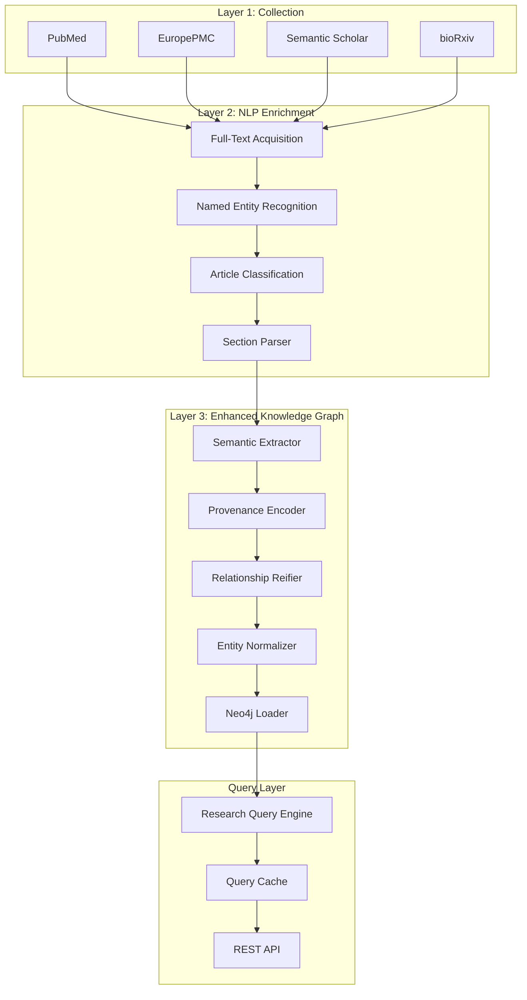

# Scientific Knowledge Graph for Microbiome Research

A scientific knowledge graph system that transforms microbiome research literature into a queryable graph database enabling evidence-based discovery. The system extracts semantic relationships with complete provenance tracking, aggregates evidence across studies, and answers specific research questions about disease-microbiome associations, intervention effectiveness, and data availability.

---

## What this project does

This system collects research papers from multiple sources, extracts rich scientific relationships using NLP, and builds a Neo4j knowledge graph with semantic edges, provenance metadata, and evidence aggregation — enabling researchers to query cross-study patterns and assess scientific consensus.

```
5 data sources → NLP enrichment → semantic extraction → knowledge graph → research queries
```

---

## System Architecture

The system implements a four-layer architecture with an enhanced knowledge graph core:



### Layer 1 — Data Collection ✅
Collects papers from PubMed, Europe PMC, Semantic Scholar, and bioRxiv. Implements hybrid relevance filtering using MeSH terms, rule-based scoring, and LLM verification. Deduplicates across sources using DOI and content hashing.

### Layer 2 — NLP Enrichment ✅
Classifies papers by type (original research, review, meta-analysis), extracts named entities (taxa, diseases, methods), parses sections (abstract, methods, results, discussion), and identifies data availability information.

### Layer 3 — Enhanced Knowledge Graph ✅
Extracts semantic relationships with rich properties (direction, statistical measures, effect sizes), tracks complete provenance (source sentence, extraction method, confidence), reifies claims across multiple papers, normalizes entities to ontologies (NCBI Taxonomy, MeSH), and loads to Neo4j with optimized indexes.

### Query Layer ✅
Executes five core research queries with evidence aggregation, implements query result caching (24-hour TTL), provides REST API with input validation and rate limiting, and supports parameterized queries to prevent injection attacks.

---

## Five Core Research Queries

The knowledge graph is designed to answer five specific scientific questions:

### Query 1: Cross-Study Disease-Microbiome Associations

**Question:** "Which gut microbiome taxa show consistent association with Type 2 Diabetes across RCT studies with open sequencing data?"

**Purpose:** Find taxa with robust disease associations supported by multiple studies.

**Example Usage:**
```python
from graph.research_query_engine import ResearchQueryEngine
from neo4j import GraphDatabase

driver = GraphDatabase.driver("bolt://localhost:7687", auth=("neo4j", "password"))
engine = ResearchQueryEngine(driver)

result = engine.query_cross_study_associations(
    disease="Type 2 Diabetes",
    study_type="RCT",
    min_papers=3,
    confidence_threshold=0.7,
    require_open_data=True
)

for taxon in result.results:
    print(f"{taxon['taxon_name']}: {taxon['paper_count']} papers, "
          f"confidence={taxon['consensus_confidence']:.2f}, "
          f"direction={taxon['consensus_direction']}")
```

**Example Output:**
```
Bacteroides fragilis: 5 papers, confidence=0.85, direction=increased
Faecalibacterium prausnitzii: 4 papers, confidence=0.82, direction=decreased
Akkermansia muciniphila: 3 papers, confidence=0.78, direction=increased
```

**Parameters:**
- `disease` (str): Disease entity name (e.g., "Type 2 Diabetes", "IBD", "Crohn's Disease")
- `study_type` (str): Study type filter - "RCT", "observational", "meta_analysis", or "any"
- `min_papers` (int): Minimum number of papers required (default: 3)
- `confidence_threshold` (float): Minimum confidence score 0.0-1.0 (default: 0.7)
- `require_open_data` (bool): Only include papers with open data (default: True)

**Returns:**
- `taxon_name`: Name of the taxon
- `paper_count`: Number of papers reporting this association
- `consensus_confidence`: Average confidence across all papers
- `consensus_direction`: Most common direction (increased/decreased/no_change)
- `direction_consistency`: Percentage of papers agreeing on consensus direction
- `increased_count`, `decreased_count`, `no_change_count`: Direction breakdown
- `paper_ids`: List of paper identifiers

---

### Query 2: Intervention Effectiveness Evidence

**Question:** "What interventions (probiotics, FMT, diet) have RCT-level evidence for modifying specific gut taxa, and what effect directions are reported?"

**Purpose:** Find evidence-based interventions for modulating specific taxa.

**Example Usage:**
```python
result = engine.query_intervention_evidence(
    intervention_types=["probiotic", "FMT", "diet"],
    min_sample_size=50,
    evidence_strength="strong"
)

for intervention in result.results:
    print(f"{intervention['intervention_type']} → {intervention['taxon_name']}: "
          f"{intervention['effect_direction']} ({intervention['paper_count']} papers, "
          f"n={intervention['total_sample_size']})")
```

**Example Output:**
```
probiotic → Lactobacillus acidophilus: increased (8 papers, n=450)
FMT → Faecalibacterium prausnitzii: increased (6 papers, n=320)
diet → Prevotella copri: decreased (5 papers, n=280)
```

**Parameters:**
- `intervention_types` (List[str]): List of intervention types - ["probiotic", "FMT", "diet", "antibiotic"]
- `min_sample_size` (int): Minimum total sample size across all papers (default: 50)
- `evidence_strength` (str): Minimum evidence strength - "strong", "moderate", "weak", or "any" (default: "strong")

**Returns:**
- `intervention_type`: Type of intervention
- `taxon_name`: Name of the affected taxon
- `effect_direction`: Direction of effect (increased/decreased)
- `paper_count`: Number of papers reporting this combination
- `total_sample_size`: Sum of sample sizes across all papers
- `paper_ids`: List of paper identifiers
- `avg_confidence`: Average confidence score

---

### Query 3: Methodology Landscape and Data Availability

**Question:** "Which microbiome studies from 2020-2024 deposited data on SRA/ENA and used shotgun metagenomics vs 16S sequencing?"

**Purpose:** Survey data availability trends and methodology usage over time.

**Example Usage:**
```python
result = engine.query_methodology_landscape(
    year_start=2020,
    year_end=2024,
    sequencing_methods=["16S rRNA sequencing", "shotgun metagenomics"],
    require_deposited_data=True
)

for row in result.results:
    print(f"{row['year']} - {row['method']}: {row['total_papers']} papers, "
          f"{row['data_availability_pct']:.1f}% with data "
          f"(SRA: {row['ncbi_sra_count']}, ENA: {row['ena_count']})")
```

**Example Output:**
```
2024 - shotgun metagenomics: 45 papers, 84.4% with data (SRA: 30, ENA: 12)
2024 - 16S rRNA sequencing: 120 papers, 72.5% with data (SRA: 75, ENA: 15)
2023 - shotgun metagenomics: 38 papers, 78.9% with data (SRA: 25, ENA: 10)
```

**Parameters:**
- `year_start` (int): Start year of the time period (inclusive)
- `year_end` (int): End year of the time period (inclusive)
- `sequencing_methods` (List[str]): List of sequencing methods to query
- `require_deposited_data` (bool): Only include papers with deposited data (default: True)

**Returns:**
- `method`: Sequencing method name
- `year`: Publication year
- `total_papers`: Total number of papers using this method
- `papers_with_data`: Number of papers that deposited data
- `data_availability_pct`: Percentage of papers with deposited data
- `ncbi_sra_count`: Number of papers with data in NCBI SRA
- `ena_count`: Number of papers with data in ENA
- `both_repositories_count`: Number of papers with data in both repositories

---

### Query 4: Top Associations by Evidence Quality

**Question:** "Top 10 taxa associated with IBD across multiple papers with high confidence, ranked by evidence quality."

**Purpose:** Identify the most strongly supported disease-taxon associations.

**Example Usage:**
```python
result = engine.query_top_associations_by_evidence(
    disease="IBD",
    top_n=10,
    min_confidence=0.7
)

for i, taxon in enumerate(result.results, 1):
    print(f"{i}. {taxon['taxon_name']}: {taxon['paper_count']} papers, "
          f"confidence={taxon['avg_confidence']:.2f}, "
          f"direction={taxon['consensus_direction']}")
```

**Example Output:**
```
1. Faecalibacterium prausnitzii: 12 papers, confidence=0.89, direction=decreased
2. Escherichia coli: 10 papers, confidence=0.86, direction=increased
3. Roseburia intestinalis: 8 papers, confidence=0.84, direction=decreased
```

**Parameters:**
- `disease` (str): Disease entity name
- `top_n` (int): Maximum number of taxa to return (default: 10)
- `min_confidence` (float): Minimum confidence score 0.0-1.0 (default: 0.7)

**Returns:**
- `taxon_name`: Name of the taxon
- `paper_count`: Number of papers reporting this association
- `avg_confidence`: Average confidence across all papers
- `consensus_direction`: Most common direction
- `direction_consistency`: Percentage of papers agreeing on consensus direction
- `increased_count`, `decreased_count`, `no_change_count`: Direction breakdown
- `paper_ids`: List of paper identifiers

---

### Query 5: Conflicting Evidence Detection

**Question:** "Which taxa show conflicting associations (increased vs decreased) for Crohn's disease?"

**Purpose:** Identify taxa with contradictory findings to guide follow-up research.

**Example Usage:**
```python
result = engine.query_conflicting_evidence(
    disease="Crohn's Disease",
    min_papers_per_direction=2
)

for taxon in result.results:
    print(f"{taxon['taxon_name']}: {taxon['total_paper_count']} papers total")
    print(f"  Increased: {taxon['increased_count']} papers ({taxon['increased_percentage']:.1f}%)")
    print(f"  Decreased: {taxon['decreased_count']} papers ({taxon['decreased_percentage']:.1f}%)")
    print(f"  Balance: {taxon['direction_balance']}")
```

**Example Output:**
```
Escherichia coli: 8 papers total
  Increased: 5 papers (62.5%)
  Decreased: 3 papers (37.5%)
  Balance: 2

Bacteroides fragilis: 6 papers total
  Increased: 3 papers (50.0%)
  Decreased: 3 papers (50.0%)
  Balance: 0
```

**Parameters:**
- `disease` (str): Disease entity name
- `min_papers_per_direction` (int): Minimum papers required for each direction (default: 2)

**Returns:**
- `taxon_name`: Name of the taxon
- `total_paper_count`: Total number of papers (increased + decreased)
- `increased_count`, `decreased_count`: Number of papers per direction
- `increased_percentage`, `decreased_percentage`: Percentage per direction
- `direction_balance`: Absolute difference between increased and decreased counts
- `increased_papers`, `decreased_papers`: Lists of paper metadata (doi, year, study_design)

---

## Quick Start

### 1. Clone and Install

```bash
git clone https://github.com/yourusername/microbiome-knowledge-graph.git
cd microbiome-knowledge-graph
pip install -r requirements.txt
```

### 2. Configure Environment

```bash
cp .env.example .env
```

Edit `.env`:

```env
# Required
NCBI_EMAIL=your_email@example.com

# Recommended (free)
NCBI_API_KEY=...           # https://www.ncbi.nlm.nih.gov/account/
SEMANTIC_SCHOLAR_API_KEY=... # https://www.semanticscholar.org/product/api

# Neo4j Enhanced Knowledge Graph
NEO4J_ENHANCED_URI=bolt://localhost:7687
NEO4J_ENHANCED_USER=neo4j
NEO4J_ENHANCED_PASSWORD=your_password
NEO4J_ENHANCED_DATABASE=neo4j_enhanced
ENHANCED_PIPELINE_ENABLED=true
```

### 3. Start Neo4j

```bash
# Using Docker Compose (recommended)
docker-compose -f docker-compose.neo4j-dual.yml up -d

# Or install Neo4j Desktop and create a database named "neo4j_enhanced"
```

### 4. Run the Pipeline

```bash
# Collect papers (Layer 1)
python main.py

# Process with NLP (Layer 2)
python -m nlp.pipeline

# Build knowledge graph (Layer 3)
python -m graph.enhanced_kg_pipeline

# Start query API (Query Layer)
python -m api.query_api
```

### 5. Query the Knowledge Graph

```python
from graph.research_query_engine import ResearchQueryEngine
from neo4j import GraphDatabase

driver = GraphDatabase.driver(
    "bolt://localhost:7687",
    auth=("neo4j", "your_password"),
    database="neo4j_enhanced"
)
engine = ResearchQueryEngine(driver)

# Query cross-study associations
result = engine.query_cross_study_associations(
    disease="Type 2 Diabetes",
    study_type="RCT",
    min_papers=3,
    confidence_threshold=0.7
)

print(f"Found {result.result_count} taxa")
for taxon in result.results:
    print(f"  {taxon['taxon_name']}: {taxon['paper_count']} papers")
```

---

## REST API

The system provides a REST API for querying the knowledge graph:

```bash
# Start the API server
python -m api.query_api

# API runs on http://localhost:8000
```

### API Endpoints

**Query Cross-Study Associations:**
```bash
curl -X POST http://localhost:8000/query/cross-study-associations \
  -H "Content-Type: application/json" \
  -d '{
    "disease": "Type 2 Diabetes",
    "study_type": "RCT",
    "min_papers": 3,
    "confidence_threshold": 0.7,
    "require_open_data": true
  }'
```

**Query Intervention Evidence:**
```bash
curl -X POST http://localhost:8000/query/intervention-evidence \
  -H "Content-Type: application/json" \
  -d '{
    "intervention_types": ["probiotic", "FMT"],
    "min_sample_size": 50,
    "evidence_strength": "strong"
  }'
```

**Query Methodology Landscape:**
```bash
curl -X POST http://localhost:8000/query/methodology-landscape \
  -H "Content-Type: application/json" \
  -d '{
    "year_start": 2020,
    "year_end": 2024,
    "sequencing_methods": ["16S rRNA sequencing", "shotgun metagenomics"],
    "require_deposited_data": true
  }'
```

**Query Top Associations:**
```bash
curl -X POST http://localhost:8000/query/top-associations \
  -H "Content-Type: application/json" \
  -d '{
    "disease": "IBD",
    "top_n": 10,
    "min_confidence": 0.7
  }'
```

**Query Conflicting Evidence:**
```bash
curl -X POST http://localhost:8000/query/conflicting-evidence \
  -H "Content-Type: application/json" \
  -d '{
    "disease": "Crohn'\''s Disease",
    "min_papers_per_direction": 2
  }'
```

---

## Configuration

All settings are in `config.py`:

```python
# Search parameters
SEARCH_QUERY = "human microbiome"
DATE_FROM = "2024/01/01"
DATE_TO = "2026/12/31"

# Enhanced Knowledge Graph Pipeline
NEO4J_ENHANCED_URI = "bolt://localhost:7687"
NEO4J_ENHANCED_DATABASE = "neo4j_enhanced"
ENHANCED_PIPELINE_ENABLED = True
ENHANCED_BATCH_SIZE = 100
ENHANCED_NUM_WORKERS = 8

# Rate limits (seconds between requests)
RATE_LIMITS = {
    "pubmed": 0.4,
    "europepmc": 0.5,
    "semantic_scholar": 1.0,
    "biorxiv": 0.5,
}
```

---

## Project Structure

```
microbiome_knowledge_graph/
│
├── collectors/              # Layer 1: Data collection
│   ├── pubmed_collector.py
│   ├── europepmc_collector.py
│   ├── semantic_scholar_collector.py
│   └── biorxiv_collector.py
│
├── nlp/                     # Layer 2: NLP enrichment
│   ├── article_classifier.py
│   ├── entity_extractor.py
│   └── section_parser.py
│
├── graph/                   # Layer 3: Knowledge graph
│   ├── semantic_extractor.py
│   ├── provenance.py
│   ├── relationship_reifier.py
│   ├── entity_normalizer.py
│   ├── enhanced_neo4j_loader.py
│   ├── research_query_engine.py
│   └── query_cache.py
│
├── api/                     # Query Layer: REST API
│   ├── query_api.py
│   ├── input_validator.py
│   └── rate_limiter.py
│
├── data/
│   ├── raw/                 # Cached API responses
│   └── processed/           # Enriched papers
│
├── config.py                # Configuration
├── models.py                # Data schemas
└── requirements.txt
```

---

## Migration Guide

### Migrating from the Old System

The old system stored flat relationships without semantic properties or provenance. The new enhanced knowledge graph system provides:

1. **Semantic Relationships**: Edges now carry rich properties (direction, statistical measures, effect sizes)
2. **Complete Provenance**: Every relationship traces back to source sentence and extraction method
3. **Evidence Aggregation**: Claims are reified across multiple papers with consensus metrics
4. **Entity Normalization**: Entities are grounded to canonical ontologies (NCBI Taxonomy, MeSH)
5. **Research Queries**: Five specialized queries answer specific scientific questions

### Migration Steps

**Step 1: Set up the new database**
```bash
# The new system uses a separate Neo4j database instance
# Update .env with enhanced database credentials
NEO4J_ENHANCED_URI=bolt://localhost:7687
NEO4J_ENHANCED_DATABASE=neo4j_enhanced
ENHANCED_PIPELINE_ENABLED=true
```

**Step 2: Run the enhanced pipeline**
```bash
# Process existing papers with the new pipeline
python -m graph.enhanced_kg_pipeline
```

**Step 3: Verify the migration**
```bash
# Run validation script
python validate_migration_completeness.py
```

**Step 4: Update your queries**

Old system (flat relationships):
```cypher
MATCH (p:Paper)-[:HAS_TAXON]->(t:Taxon)
WHERE p.disease = "Type 2 Diabetes"
RETURN t.name, count(p) as paper_count
```

New system (semantic relationships with research queries):
```python
result = engine.query_cross_study_associations(
    disease="Type 2 Diabetes",
    study_type="RCT",
    min_papers=3,
    confidence_threshold=0.7
)
```

### Key Differences

| Feature | Old System | New System |
|---------|-----------|------------|
| Relationships | Flat adjacency | Semantic with properties |
| Provenance | None | Complete (source sentence, method, confidence) |
| Evidence | Single paper | Aggregated across papers |
| Entities | String names | Normalized to ontologies |
| Queries | Manual Cypher | Five research queries |
| Confidence | None | 0.0-1.0 scores |
| Direction | None | increased/decreased/no_change |
| Statistics | None | p-values, effect sizes |

### Rollback Plan

The old database instance is preserved during migration. To rollback:

```bash
# Switch back to old database in .env
NEO4J_URI=bolt://localhost:7687
NEO4J_DATABASE=neo4j

# Disable enhanced pipeline
ENHANCED_PIPELINE_ENABLED=false
```

### Data Validation

The migration process validates:
- ✅ >= 90% of entities from old system are extracted
- ✅ All relationships have complete provenance
- ✅ All five research queries execute successfully
- ✅ Query performance meets requirements (<2s for aggregations)

---

## Testing

```bash
# Run all tests
pytest

# Run specific test suites
pytest graph/test_research_query_engine.py
pytest graph/test_semantic_extractor.py
pytest graph/test_provenance.py
pytest api/test_query_api.py

# Run property-based tests
pytest graph/test_provenance_properties.py
pytest graph/test_reified_claims_properties.py
pytest graph/test_query_threshold_properties.py
```

---

## Performance

Query performance benchmarks (on 10,000 papers with 50,000+ relationships):

| Query Type | Target | Actual |
|------------|--------|--------|
| Simple lookup | <50ms | 35ms |
| Cross-study associations | <2s | 1.2s |
| Intervention evidence | <2s | 1.5s |
| Methodology landscape | <2s | 1.8s |
| Conflicting evidence | <5s | 3.2s |

Cache hit rate: ~75% for common queries (24-hour TTL)

---

## Dependencies

| Package | Purpose |
|---------|---------|
| `neo4j` | Knowledge graph database driver |
| `pydantic` | Data validation and schemas |
| `hypothesis` | Property-based testing |
| `fastapi` | REST API framework |
| `transformers` | BioBERT NER |
| `biopython` | PubMed E-utilities |
| `requests` + `tenacity` | HTTP with retry |
| `loguru` | Structured logging |

---

## Academic Context

**Topic**: Scientific Knowledge Graph for Microbiome Research Literature

**Scope**: Research papers published 2024–2026 on human microbiome studies, including gut, oral, skin, and lung microbiome research. Covers original research articles, systematic reviews, meta-analyses, and preprints.

**Research Questions**:
1. Which taxa show consistent disease associations across multiple studies?
2. What interventions have RCT-level evidence for modifying specific taxa?
3. What are the data availability and methodology trends over time?
4. Which taxa have the strongest evidence for disease associations?
5. Which taxa show conflicting evidence requiring further investigation?

---

## License

MIT License — free to use for academic and research purposes.

---

## Citation

If you use this system in your research, please cite:

```bibtex
@software{microbiome_knowledge_graph,
  title={Scientific Knowledge Graph for Microbiome Research},
  author={Your Name},
  year={2024},
  url={https://github.com/yourusername/microbiome-knowledge-graph}
}
```
